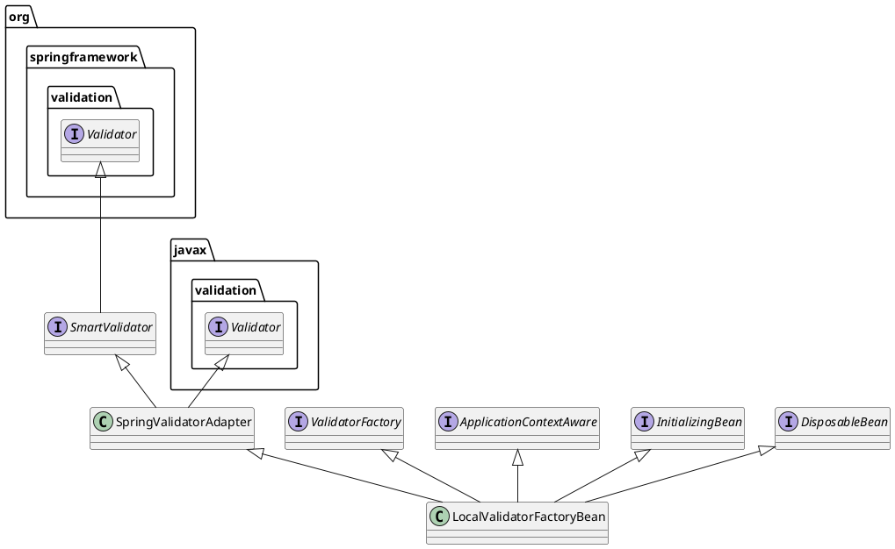

# Spring中Bean validation的使用
##简介

Bean Validation是Java定义的一套基于注解的数据校验规范

##依赖
```xml
     <dependency>
        <groupId>org.hibernate.validator</groupId>
        <artifactId>hibernate-validator</artifactId>
        <version>6.1.0.Alpha4</version>
    </dependency>
    <dependency>
        <groupId>com.google.code.findbugs</groupId>
        <artifactId>jsr305</artifactId>
        <version>3.0.2</version>
    </dependency>
```

## 1. Overview of the JSR-303 Bean Validation API

### 1. Configuring a Bean Validation Provider

通过配置，Spring可以把JSR-303或者JSR-349 Bean Validation provider配置为Spring Bean，并且在程序中注入一个 
<code>javax.validation.ValidatorFactory</code>或者<code>javax.validation.Validator</code>对象

一般通过定义一个<code>LocalValidatorFactoryBean</code>的Spring Bean来配置Validation Provider，前提是classPath
路径下有JSR-303或JSR-349 provider的jar包，比如 Hibernate Validator。
```xml
<bean id="validator"
    class="org.springframework.validation.beanvalidation.LocalValidatorFactoryBean">
    <!-- hibernate校验器 -->
    <property name="providerClass" value="org.hibernate.validator.HibernateValidator" />
    <!-- 指定校验使用的资源文件，在文件中配置校验错误信息，如果不指定则默认使用classpath下的ValidationMessages.properties -->
    <property name="validationMessageSource" ref="messageSource" />
</bean>
<!-- 校验错误信息配置文件 -->
<bean id="messageSource" class="org.springframework.context.support.ReloadableResourceBundleMessageSource">
    <!-- 资源文件名 -->
    <property name="basenames">
        <list>
            <!--可以忽略.properties后缀-->
            <value>classpath:ValidationMessages</value>
        </list>
    </property>
    <!-- 资源文件编码格式 -->
    <property name="defaultEncoding" value="UTF-8"/>
    <!-- 对资源文件内容缓存时间，单位秒 -->
    <property name="cacheSeconds" value="120" />
</bean>
```
#### Injecting a Validator

下面是LocalValidatorFactoryBean的类图，可以看到它实现了<code>javax.validation.ValidatorFactory</code>、
<code>javax.validation.Validator</code>, <code>org.springframework.validation.Validator</code>。所以你
可以根据自己的需求在程序里注入相应的Bean对象。

如果只使用Java Bean Validation API，那么可以注入一个<code>javax.validation.Validator</code>对象：
```java
import javax.validation.Validator;

@Service
public class MyService {

    @Autowired
    private Validator validator;
}
```

如果你想使用Spring Validation API，那么注入一个<code>org.springframework.validation.Validator</code>:
```java
import org.springframework.validation.Validator;

@Service
public class MyService {

    @Autowired
    private Validator validator;
}
```
#### 自定义约束Configuring Custom Constraints

每个Bean Validation约束由两部分组成：

- <code>@Constraint</code>注释，用来申明约束，以及配置属性
- <code>javax.validation.ConstraintValidator</code>的实现类，用来实现约束条件的具体逻辑

上面两个组成部分还需要使用<code>@Constraint</code>注释来建立关联。在程序运行时，<code>ConstraintValidatorFactory</code>
实例会自动实例化<code>ConstraintValidator</code>实现类。

默认情况下<code>LocalValidatorFactoryBean</code>使用<code>SpringConstraintValidatorFactory</code>来
实例化<code>ConstraintValidator</code>的实现类。这也就意味着实现类可以和其他的Spring bean一样可以使用依赖注入。

下面是一个例子：
```java
@Target({ElementType.METHOD, ElementType.FIELD})
@Retention(RetentionPolicy.RUNTIME)
@Constraint(validatedBy=MyConstraintValidator.class)
public @interface IPV4 {
        String message() default "{cn.com.message}"; //校验不通过时的消息。中括号表示占位，消息从配置文件获取
        Class<?>[] groups() default {}; //用来标记分组
        Class<? extends Payload>[] payload() default {}; //用来携带一些元数据信息，默认的两种Payload实现：Unwrap,Skip。也可以自定义自己的实现逻辑
}
```
```java
import javax.validation.ConstraintValidator;

public class MyConstraintValidator implements ConstraintValidator<IPV4, String> {
    private Pattern pattern = Pattern.compile("([1-9]|[1-9]\\d|1\\d{2}|2[0-4]\\d|25[0-5])(\\.(\\d|[1-9]\\d|1\\d{2}|2[0-4]\\d|25[0-5])){3}");
    @Autowired //依赖注入
    private Foo aDependency;
    private Class<?>[] groups;
    @Override
    public void initialize(IPV4 constraintAnnotation) {
        groups = constraintAnnotation.groups();
    }

    @Override
    public boolean isValid(String ip, ConstraintValidatorContext constraintValidatorContext) {
        //根据groups执行一些逻辑
        if (Objects.isNull(s)) {
            return false;
        }
        return pattern.matcher(s).matches();
    }
}
```

#### Spring驱动的方法级别校验 Spring-driven Method Validation

通过在Spring Context中定义一个<code>MethodValidationPostProcessor</code> Bean来使用Bean Validation 1.1
规范（Hibernate Validator 4.3实现）定义的方法级别校验特性。
```xml
<bean class="org.springframework.validation.beanvalidation.MethodValidationPostProcessor"/>
```
需要注意的是，为了让Spring驱动的方法级别校验生效，需要在类上面注释上Spring的<code>org.springframework.validation.annotation.Validated</code>
，而且这个类的实例还必须是Spring的Bean。下面是一个简单的例子：
```java
import org.springframework.web.bind.annotation.*;
import org.springframework.validation.annotation.Validated;
import javax.validation.constraints.NotNull;

@RestController
@RequestMapping("/main")
@Validated
public class MyController{

    @GetMapping("/welcome")
    public void activePreset(@NotNull String greeting, BindingResult result) { //非空校验
        
    }
    
    @PostMapping("/submit")
    public void activePreset(@Validated Resume resume, BindingResult result) { //@Validated标记在方法级别上，意思是校验Resume内部属性
        
    }
}
```

### Configuring a DataBinder

从Spring 3开始，可以使用一个<code>Validator</code>来配置<code>DataBinder</code>。配置后可以直接使用<code>validate()</code>
方法来校验属性，所有校验的<code>Errors</code>都会自动添加到<code>DataBinder</code>实例的<code>BindingResult</code>结果中。
```java
Foo target = new Foo();
DataBinder binder = new DataBinder(target);
binder.setValidator(new FooValidator());

// bind to the target object
binder.bind(propertyValues);

// validate the target object
binder.validate();

// get BindingResult that includes any validation errors
BindingResult results = binder.getBindingResult();
```

### Spring MVC 3 Validation

默认情况下，如果classpath路径下有<a href="https://docs.spring.io/spring/docs/5.1.9.RELEASE/spring-framework-reference/core.html#validation-beanvalidation-overview">Bean Validation</a>
(比如Hibernate Validator)，<code>LocalValidatorFactoryBean</code>对象会被注册为全局的<a href="https://docs.spring.io/spring/docs/5.1.9.RELEASE/spring-framework-reference/core.html#validator">Validator</a>,
以此来支持在controller方法上使用<code>@Valid</code>和<code>@Validated</code>。

下面的配置可以自定义一个全局的Validator:
```java
@Configuration
@EnableWebMvc
public class WebConfig implements WebMvcConfigurer {

    @Override
    public Validator getValidator() {
        // ...
    }
}
```
等效的XML配置为：
```xml
<?xml version="1.0" encoding="UTF-8"?>
<beans xmlns="http://www.springframework.org/schema/beans"
    xmlns:mvc="http://www.springframework.org/schema/mvc"
    xmlns:xsi="http://www.w3.org/2001/XMLSchema-instance"
    xsi:schemaLocation="
        http://www.springframework.org/schema/beans
        https://www.springframework.org/schema/beans/spring-beans.xsd
        http://www.springframework.org/schema/mvc
        https://www.springframework.org/schema/mvc/spring-mvc.xsd">

    <mvc:annotation-driven validator="globalValidator"/>

</beans>
```

在Controller中使用自定义的Validator
```java
@Controller
public class MyController {

    @InitBinder //每次请求都会调用这个方法
    protected void initBinder(WebDataBinder binder) {
        binder.addValidators(new FooValidator());
    }

}
```

# Spring Validator使用注意事项：
```java

@Service
public class RangeValidator implements Validator {
    @Autowired
    private SmartValidator globalValidator;
    @Override
    public boolean supports(Class<?> clazz) {
        return true;
    }

    @Override
    public void validate(Object target, Errors errors) {
        if (Objects.isNull(target) || !target.getClass().equals(Range.class)) {
            return;
        }
        globalValidator.validate(target, errors);
        if (!errors.hasErrors()) {
            Range o = (Range)target; //自定义对象
            Double lowerLimit = o.getLowerLimit();
            Double upperLimit = o.getUpperLimit();
    
            if (Objects.nonNull(lowerLimit) && Objects.nonNull(upperLimit) && lowerLimit >= upperLimit) {
                errors.reject("cn.com.wrongRangeOfThreshold", "错误的阈值范围");
            }
            if (Objects.isNull(lowerLimit) && Objects.isNull(upperLimit)) {
                errors.reject("cn.com.cannotBeNull", "请输入正确的阈值范围");
            }
        }
    }
}

@Controller
public class MyController {
    @Autowired
    private RangeValidator rangeValidator;
    @InitBinder //每次请求都会调用这个方法
    protected void initBinder(WebDataBinder binder) {
        binder.addValidators(rangeValidator);
    }
    
    @GetMapping("/hello")
    public void hello(@Validated Foo foo, BindingResult result) {
         // 如果RangeValidator的supports方法返回false, 
         // 那么在使用WebDataBinder进行参数校验的时候就会报错。
         // 所以在这个例子中supports方法永远返回true
    }
}

```