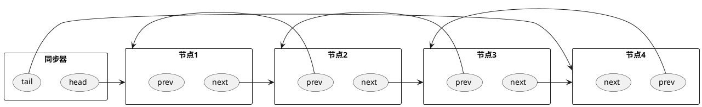
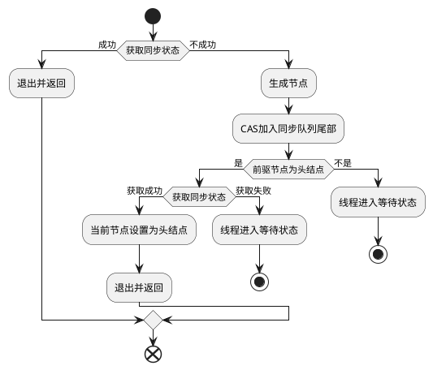
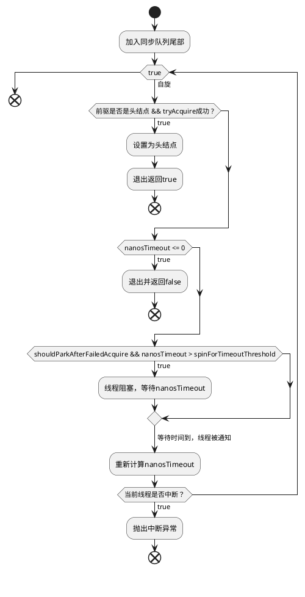

# AbstractQueuedSynchronizer 队列同步器
队列同步器大家都简称AQS，内部使用int变量表示同步状态（线程共享资源），线程通过获取同步状态来实现加锁和释放锁的语义。同步器内部使用FIFO队列来管理线程，如线程排队、等待、唤醒等操作。

作者Doug Lea期望它能够成为实现大部分同步需求的基础。所以AQS被实现为一种模板，子类通过继承并实现其同步方法来实现自定义的同步状态管理器。我们熟知的ReentrantLock、ReentrantReadWritLock和CountDownLatch等都使用AQS来管理同步状态。

## AQS接口
AQS提供了三个访问/修改同步状态的方法：
```java
private volatile int state;//共享变量，使用volatile修饰保证线程可见性

//返回同步状态的当前值
protected final int getState() {  
        return state;
}
 // 设置同步状态的值
protected final void setState(int newState) { 
        state = newState;
}
//原子地（CAS操作）将同步状态值设置为给定值update如果当前同步状态的值等于expect（期望值）
protected final boolean compareAndSetState(int expect, int update) {
        return unsafe.compareAndSwapInt(this, stateOffset, expect, update);
}
```

- 同步器可重写的方法如下：

方法 | 描述 |
---------|----------
 protected boolean tryAcquire(int arg) | 独占式获取同步状态，实现该方法的步骤：1.查询当前状态;2.判断同步状态是否符合预期;3.CAS设置同步状态
 protected boolean tryRelease(int arg) | 独占式释放同步状态，等待获取同步状态的线程将有机会获取同步状态
 protected int tryAcquireShared(int arg) | 共享式获取同步状态，返回>=0的值，表示获取成功，反之获取失败
 protected boolean tryReleaseShared(int arg) | 共享式释放同步状态
 protected boolean isHeldExclusively() | 当前同步器是否在独占模式下被线程占用，一般该方法表示是否被当前线程占用

- 实现自定义组件的时候需要用到一些AQS提供的模板方法，如：

方法名称 | 描述
---------|----------
 void acquire(int arg) | 独占式获取同步状态，如果当前线程获取同步状态成功，则由该方法返回，否则线程进入同步队列等待，当前线程阻塞。该方法内部调用重写的tryAcquire(int arg)方法。
 void acquireInterruptibly(int arg) | 与acquire(int arg)方法相同，但该方法可以响应中断。当线程未获取到同步状态而进入同步队列，如果当前线程被中断，则该方法会抛出interruptedException并返回
boolean tryAcquireNanos(int arg, long nanos) | 在acquireInterruptibly(int arg)的基础上增加了超时等待时间。如果当前线程在超时等待时间内没有获取到同步状态，那么方法返回false,否则返回true
void acquireShared(int arg) | 共享式获取同步状态，如果当前线程未获取同步状态，线程进入同步队列等待，当前线程阻塞。与独占式获取的区别是在同一时刻可以有多个线程获取同步状态
void acquireSharedInterruptibly(int arg) | 与acquireShared(int arg)方法相同，但该方法响应中断。
boolean tryAcquireSharedNanos(int arg, long nanos) | 在acquireSharedInterruptibly(int arg)的基础上增加了超时限制
boolean release(int arg) | 独占式地释放同步状态，该方法会在释放同步状态之后，将同步队列中第一个节点包含的线程唤醒
boolean releaseShared(int arg) | 共享式地释放同步状态
Collection&lt;Thread&gt; getQueuedThreads() | 获取等待在同步队列上的线程的集合。

### 同步队列结构


同步队列使用CAS方法：compareAndSetTail(Node expect, Node update)设置尾结点。而设置头节点则不需要使用CAS，因为同步队列遵循FIFO，首节点是获取同步状态成功的节点，首节点在释放同步状态时，会唤醒后继节点，而后继节点将会在获取同步状态成功时将自己设置为首节点。由于只有一个线程能够获取同步状态，所以设置首节点时不需要使用CAS。

### 独占式同步状态获取与释放
下图为独占式获取同步状态的流程。在获取同步状态时，同步器维护一个同步队列，获取同步状态失败的线程都会被包装成Node加入同步队列中，并在队列中进行自旋。移除队列（或停止自旋）的条件是前驱节点为头结点且成功获取了同步状态。

线程自旋做了什么？
1. 检查前驱是否为头结点，如果是进入步骤2，不是则线程进入等待状态；
2. 获取同步状态，如果获取成功则将当前节点设置为头结点，表明线程获取了锁，此时结束自旋。如果获取失败则线程进入等待状态；

进入等待状态的线程会被其前驱节点在合适的时候唤醒。


### 独占式超时获取同步状态
同步器doAcquireNanos(int arg, long nanosTimeout)方法可以超时获取同步状态。其运行逻辑见下图：



### 自定义同步组件
设计一个同步工具：该工具在同一时刻，只允许至多两个线程同时访问，超过两个线程的访问将被阻塞，我们将这个同步工具命名为TwinsLock。
——方腾飞; 魏鹏; 程晓明. Java并发编程的艺术 (Java核心技术系列) (Kindle 位置 2682-2684). 机械工业出版社. Kindle 版本. 

下面为演示代码，有个一个问题是，下面的代码没有实现锁重入：
```java
public class TwinsLock implements Lock {
    private final Sync sync = new Sync(2);
    
    public void lock() {
        sync.acquireShared(1); //阻塞地获取同步状态
    }
    public void unlock() {
        sync.releaseShared(1); //阻塞地释放同步状态
    }
    private static final class Sync extends AbstractQueuedSynchronizer{
        Sync(int count) {
            if(count <= 0) {
                throw new IllegalArgumentsException("Count must larger than zero.");
            }
            setState(count);
        }
        public int tryAcquireShared(int reduceCount) {
            for(;;){
                int current = getState();
                int newCount = current - reduceCount;
                if(newCount < 0 || compareAndSetState(current,  newCount)) {
                    return newCount; //返回大于等于0的数表示获取成功，返回小于0的数表示获取失败
                }
            }
        }

        public boolean tryReleaseShared(int returnCount) {
            for(;;) {
                int current = getState();
                int newCount = current + returnCount;
                if(compareAndState(current, newCount)) {
                    return true;
                }
            }
        }

    }
}

```

### AQS组件
#### Semaphore(信号量)
用于限制获取共享资源的线程数量，也即流量控制。
**应用场景**：
对于一个有限的公共资源，比如数据库连接，限制能够获取数据库连接的线程数量。
下面是使用Semaphore做流量控制的示例：
```java
public class SemaphoreTest{
    private final static int THREAD_COUNT = 30;
    private final static ExecutorService threadPool = Executors.newFixedThreadPool(THREAD_COUNT);
    private static Semaphore s = new Semaphore(10); //只允许最大10个并发执行。

    public static void main(String[] args) {
       for(int i = 0; i<THREAD_COUNT; i++) {
           threadPool.execute(() -> {
               try {
                   s.acquire();
                   System.out.println("save data");
                   s.release();
               } catch(InterruptedException e){}
           });
       }
       threadPool.shutdown();
    }
}
```

2. CountDownLatch(倒计时器)
可以让一个或多个线程在其他线程运行完成后得到通知并唤醒。CountDownLatch的构造函数接收一个int类型的参数(倒计时起始数N)，调用countDown方法时，计数器N减1。await方法会阻塞当前线程，直到N为0。CountDownLatch实例无法重置，也就是说倒计时计数器只能减，不能重新初始化。

使用示例：
```java
public class CountDownLatchTest{
    static CountDownLatch c = new CountDownLatch(2);
    public static void main(String[] args) throws Exception {
        new Thread(()->{
            System.out.println(1);
            c.countDown();
            System.out.println(2);
            c.countDown();
        }).start();
        c.await();
        System.out.println(3);
    }
}
```
3. CyclicBarrier(循环栏栅)
让一组线程到达一个屏障/同步点时阻塞线程，直到最后一个线程到达屏障时，屏障打开，所有被屏障拦截的线程继续执行。

使用示例：
```java
public class CyclicBarrierTest {
    static CyclicBarrier c = new CyclicBarrier(2);

    public static void main(String[] args) {
        new Thread(new Runnable() {
            @Override
            public void run() {
                try {
                    c.await();
                } catch(Exception e){}
                System.out.println(1);
            }
        }).start();
        try {
           c.await();
        } catch(Exception e){}
        System.out.println(2);
    }
}
```