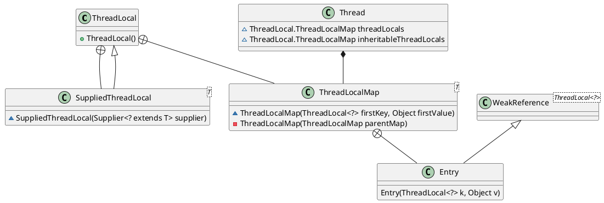

ThreadLocal让每个线程都拥有自己专属的本地变量
# ThreadLocal示例
```java
import java.text.SimpleDateFormat;
import java.util.Random;

public class ThreadLocalExample implements Runnable{

     // SimpleDateFormat 不是线程安全的，所以每个线程都要有自己独立的副本
    private static final ThreadLocal<SimpleDateFormat> formatter = ThreadLocal.withInitial(() -> new SimpleDateFormat("yyyyMMdd HHmm"));

    public static void main(String[] args) throws InterruptedException {
        ThreadLocalExample obj = new ThreadLocalExample();
        for(int i=0 ; i<10; i++){
            Thread t = new Thread(obj, ""+i);
            Thread.sleep(new Random().nextInt(1000));
            t.start();
        }
    }

    @Override
    public void run() {
        System.out.println("Thread Name= "+Thread.currentThread().getName()+" default Formatter = "+formatter.get().toPattern());
        try {
            Thread.sleep(new Random().nextInt(1000));
        } catch (InterruptedException e) {
            e.printStackTrace();
        }
        //formatter pattern is changed here by thread, but it won't reflect to other threads
        formatter.set(new SimpleDateFormat());

        System.out.println("Thread Name= "+Thread.currentThread().getName()+" formatter = "+formatter.get().toPattern());
    }

}
```

# ThreadLocal原理


从上图可以看出，Thread类中有一个threadLocals和inheritableThreadLocals实例变量，这两个变量的默认值都是null，只有当调用ThreadLocal的get或set方法时才初始化他们。下面是ThreadLocal的get和set方法：

```java
    public void set(T value) {
        Thread t = Thread.currentThread();
        ThreadLocalMap map = getMap(t);
        if (map != null)
            map.set(this, value);
        else
            createMap(t, value);
    }
    ThreadLocalMap getMap(Thread t) {
        return t.threadLocals;
    }
```

从上可知，使用ThreadLocal保存变量时，变量最终保存在当前线程的threadLocals（ThreadLocal.ThreadLocalMap内部类）中。ThreadLocal.ThreadLocalMap可以存储以ThreadLocal为key的键值对。一个ThreadLocal实例只能在当前线程保存一个变量，声明多个ThreadLocal实例变量就可以在一个线程保存多个变量，因为ThreadLocalMap是以ThreadLocal作为key的。

# ThreadLocal 内存泄露问题
ThreadLocalMap底层使用Entry存储键值对，而Entry中key为 ThreadLocal的弱引用,value是强引用。所以，如果ThreadLocal没有被外部强引用的情况下，在垃圾回收的时候会key会被清理掉，而value不会被清理掉。这样一来，ThreadLocalMap 中就会出现key为null的Entry。假如我们不做任何措施的话，value永远无法被GC回收，这个时候就可能会产生内存泄露。ThreadLocalMap实现中已经考虑了这种情况，在调用set()、get()、remove()方法的时候，会清理掉key为null的记录。使用完 ThreadLocal方法后最好手动调用remove()方法
```java
    static class Entry extends WeakReference<ThreadLocal<?>> {
        /** The value associated with this ThreadLocal. */
        Object value;

        Entry(ThreadLocal<?> k, Object v) {
            super(k);
            value = v;
        }
    }
```