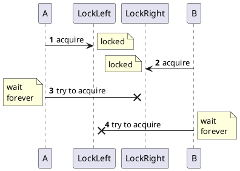
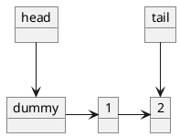
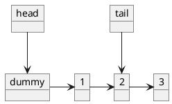
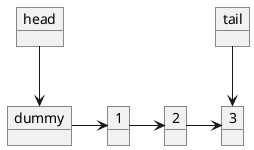
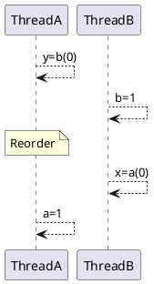
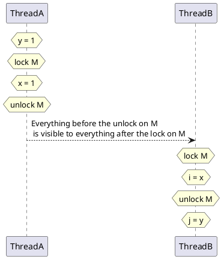

## 2.1 What is Thread safe?
- Definition:
A class is thread-safe when it continues to behave correctly when accessed from multiple thread, regardless of scheduling or interleaving of the execution of those threads by the runtime environment, and with no additional synchronization or other coordination on the part of the calling code.

- Stateless objects are always thread safe.

## 2.2 Atomicity
### count++
It's a shorthand for a sequence of three discrete operations:
1. fetch the current value;
2. add one to it;
3. write the new value back.

count++ is an example of a read-modify-write operations.

### race conditions
A race condition occurs when the correctness of a computation depends on the relative timing or interleaving of multiple threads by the runtime. In other words, when getting right answer relies on lucky timing.[4] 

Using a potentially stale observation to make a decision or perform a computation. This type of race condition is called **check-then-act**: you observe something to be true(file X doesn't exist) and then take action based on that observation (create X). But in fact the observation could have become invalid between the time you observe it and the time you acted on it (someone else created X in the meantime), causing a problem (unexpected exception, overwritten data, file corruption).

> [4] The term race condition is often confused with the related term data race, which arises when synchronization is not used to coordinate all  access to a shared non‐final field. You risk a data race whenever a thread writes a variable that might next be read by another thread or reads a  variable that might have last been written by another thread if both threads do not use synchronization; code with data races has no useful  defined semantics under the Java Memory Model. Not all race conditions are data races, and not all data races are race conditions, but they both  can cause concurrent programs to fail in unpredictable ways. UnsafeCountingFactorizer has both race conditions and data races. See Chapter  16 for more on data races. 

> :warning:
> The most common type of race condition is check-then-action, where a potentially stale observation is used to make a decision on what to do next.

**Read-modify-write** operations, like incrementing a counter, define a transformation of an object's state in terms of previous state

### compound actions
To avoid race conditions, there must be a way to prevent other threads from using a variable while we're in the middle of modifying it, so we can ensure that other threads can observe or modify the state only before we start or after we finish, but not in the middle.

## 2.3 Locking
:warning:
To preserve state consistency, update related state variables in a single atomic operation.

## 2.4 Guarding State with Locks
:warning:
For each mutable state variable that may be accessed by more than one thread, **all accesses** to that variable must be performed with the same lock held. In this case, we can say that the variable is guarded by that lock.

:warning:
Every shared, mutable variable should be guarded by exactly one lock. Make it clear to maintainers which lock that is.

## 2.5 Liveness and Performance
:warning:There is frequently a tension between simplicity and performance. When implementing a synchronization policy, resist the temptation to prematurely sacrifice simplicity (potentially compromising safety) for the sake of performance.

## 3.1 Visibility
### 3.1.2 Non-atomic 64-bit Operations
When a thread reads a variable without synchronization, it may see a stale value, but at least it sees a value that was actually placed there by some thread rather than some random value. This safety guarantee is called **out-of-thin-air safety**.

Out-of-thin-air safety applies to all variables, with on exception: 64-bit numeric variables(double and long) that are not declared volatile. The Java Memory Model requires fetch and store operations to be at atomic, but for nonvolatile long and double variables, the JVM is permitted to treat a 64-bit read or write as two separate 32-bit operations. If the reads and writes occur in different threads, it is therefore possible to read a nonvolatile long and get back the high 32 bits of one value and the low 32 bits of of another. Thus, even if you don't care about stale values, it is not safe to use shared mutable long and double variables in multi-threaded programs unless they are declared volatile or guarded by a lock. 

### 3.1.3 Locking and Visibility
:zap: Locking is not just about mutual exclusion; it is also about memory visibility. To ensure that all threads see the most up-to-date values of shared mutable variables, the reading and writing threads must synchronize on a common lock.

### 3.1.4 Volatile Variables
#### Two effects of using volatile
1. Ensure visibility: ensure that updates to a variable are propagated predictably to other threads.
2. Same memory semantic as synchronized block.(Not recommend):
     When thread A writes to a volatile variable and subsequently thread B reads that same variable, that values of all variables that were visible to A prior to writing to the volatile variable become visible to B after reading the volatile variable. So from a memory visibility perspective, writhing a volatile variable is like exiting a synchronized block and reading a volatile variable is like entering a synchronized block. 

     :warning: However, we do not recommend relying too heavily on volatile variables for visibility; code that relies on volatile variables for visibility of arbitrary state is more fragile and harder to understand than code that uses locking.

#####:key:Debugging tip
> For server applications, be sure to always specify the -server JVM command line switch when invoking the JVM, even for  development and testing. The server JVM performs more optimization than the client JVM, such as hoisting variables out of a loop that are not  modified in the loop; code that might appear to work in the development environment (client JVM) can break in the deployment environment  (server JVM). For example, had we "forgotten" to declare the variable asleep as volatile in Listing 3.4, the server JVM could hoist the test out  of the loop (turning it into an infinite loop), but the client JVM would not. An infinite loop that shows up in development is far less costly than one  that only shows up in production.  

####:key: Locking can guarantee both visibility and atomicity; volatile variables can only guarantee visibility.

## 3.3 Thread Confinement线程封闭
Thread confinement is an element of your program's 
design that must be enforced by its implementation.
Java language and core libraries provide mechanisms
that help in maintaining thread confinement —— local
variables and the ThreadLocal class —— but even with
these, it is still the programmer's responsibility
to ensure that thread-confined objects do not escape from their intended thread.
### 3.3.1 Ad-hoc Thread Confinement
Ad Hoc源自于拉丁语，意思是“for this”引申为“for this purpose only”，即“为某种目的设置的，特别的”意思，即Ad hoc网络是一种有特殊用途的网络。

Ad-hoc thread confinement describes when the responsibility for maintaining thread confinement falls entirely on the implementation.(也就是变量的线程封闭性的维护完全由代码实现来保障)

A special case of thread confinement applies to volatile variables. It is safe to perform read-modify-write operations on shared volatile variables as long as you ensure that the volatile variable is only written from a single thread. In this case, you are confining the modification to a single thread to prevent race conditions, and the visibility guarantees for volatile variables ensure that other threads see the most up-to-date value.

### 3.3.2 Stack Confinement栈封闭
也就是使用本地变量来实现对变量访问权限的封闭，但是要防止本地变量溢出（被公开）

### 3.3.3 ThreadLocal
ThreadLocal allows you to associate a per-thread value with a value-holding object.

**Using ThreadLocal to ensure thread confinement**
```java
private static ThreadLocal<Connection> connectionHolder = new ThreadLocal<>() {
     public Connection initialValue() {
          return DriverManager.getConnection(DB_URL);
     }
};

public static Connection getConnection() {
     return connectionHolder.get();
}
```

## 3.4 Immutability

:warning: An object is immutable if:
- Its state cannot be modified after construction;
- All its fields are final; and
- It is properly constructed (the this reference does not escape during construction)

### Example: Using Volatile to Publish Immutable Objects
:warning:
Whenever a group of related data items must be acted on atomically, consider creating an immutable **holder class** for them, such as OneValueCache below.

```java
@Immutable
public class OneValueCache {
     private final BigInteger lastNumber;
     private final BigInteger[] lastFactors;

     public OneValueCache(BigInteger i, BigInteger[] factors) {
          lastNumber = i;
          lastFactors = Arrays.copyOf(factors, factors.length);
     }

     public BigInteger[] getFactors(BigInteger i) {
          if (lastNumber == null || !lastNumber.equals(i)) {
               return null;
          }
          return Arrays.copyOf(lastFactors, lastFactors.length);
     }
}
```

Racing conditions in accessing or updating multiple related variables(eg. lastFactors) can be eliminated by using an immutable object(OneValueCache) to hold all the variables. With a mutable holder object, you would have to use locking to ensure atomicity; with an immutable one, once a thread acquires a reference to it, it need never worries about another thread modifying its state. If the variables are to be update, a new holder object(an OneValueCache instance) is created, but any threads working with the previous holder still see it in a consistent state. 

The cache-related operations cannot interfere with each other because OneValueCache is immutable and the cache field is accessed only once in each of the relevant code paths. This combination of an immutable holder object(**OneValueCache**) for multiple state variables(**lastFactors**) related by an invariant(**lastNumber**), and a volatile reference used to ensure its timely visibility, allows VolatileCachedFactorizer to be thread-safe even though it does no explicit locking.

```java 
@ThreadSafe
public class VolatileCachedFactorizer implements Servlet{
     private volatile OneValueCache cache = new OneValueCache(null, null);

     public void service(ServletRequest req, ServletResponse res) {
          BigInteger i = extractFrom(req);
          BigInteger[] factors = cache.getFactors(i);
          if(factors == null) {
               factors = factor(i);
               cache = new OneValueCache(i, factors);
          }
          encodeIntoResponse(res, factors);
     }
}

```

## 3.5 Safe Publication

### 3.5.3 Safe Publication Idioms
Objects that are not immutable must be safely published, which usually entails synchronization by both the publishing and the consuming thread. For the moment, let's focus on ensuring that the consuming thread can see the object in its as published state; we'll deal with visibility of modifications made after publication soon.

:warning: To publish an object safely, both the reference to the object and the object's state must be made visible to other threads at the same time. A properly constructed object can be safely published by:
- Initializing an object reference from a static initializer;
- Storing a reference to it into a volatile field or AtomicReference;
- Storing a reference to it into a final field of a properly constructed object; or
- Storing a reference to it into a field that is properly guarded by a lock.

### 3.5.5 Mutable objects
:warning: The publication requirements of an object depend on its mutability:
- Immutable objects can be published through any mechanism;
- Effectively immutable objects must be safely published;
- Mutable objects mush be safely published, and must be either thread-safe or guarded by a lock.

### 3.5.6 Sharing Objects Safely
:warning:The most useful policies for using and sharing objects in a concurrent program are:  
- Thread‐confined. A thread‐confined object is owned exclusively by and confined to one thread, and can be modified by  its owning thread.  
- Shared read‐only. A shared read‐only object can be accessed concurrently by multiple threads without additional  synchronization, but cannot be modified by any thread. Shared read‐only objects include immutable and effectively  immutable objects.  
- Shared thread‐safe. A thread‐safe object performs synchronization internally, so multiple threads can freely access it  through its public interface without further synchronization.  
- Guarded. A guarded object can be accessed only with a specific lock held. Guarded objects include those that are  encapsulated within other thread‐safe objects and published objects that are known to be guarded by a specific lock.  


# Chapter 4 Composing Objects
## 4.1 Designing a Thread-safe Class
:warning:The design process for a thread-safe class should include these three basic elements:
- Identify the variables that form the object's state;
- Identify the invariants that constrain the state variables;
- Establish a policy for managing concurrent access to the object's state.
### 4.1.1 Gathering Synchronization Requirements
### State-dependent Operations
### State Ownership

## 4.2 Instance Confinement
:warning:
- Encapsulating data within an object confines access to the data to the object's methods, making it easier to ensure that the data is always accessed with the appropriate lock held.
- Confinement makes it easier to build thread-safe classed because a class that confines its state can be analyzed for thread safety without having to examine the whole program.

### 4.2.1 The Java Monitor Pattern
- Java Monitor Pattern: encapsulating all mutable state and guarding it with the object's own intrinsic lock.

```java
public class PrivateLock{
     private final Object myLock = new Object();
     @GuardedBy("myLock")
     Widget widget;

     void someMethod() {
          synchronized(myLock) {
               //Access or modify the state of widget
          }
     }
}
```
Making the lock object private encapsulates the lock so that client code cannot acquire it, whereas a publicly accessible lock allows client code participate in its synchronization policy - correctly or incorrectly.

## 4.3 Delegating Thread Safety

###:cry: Number Range Class that does Not Sufficiently Protect Its Invariants. Don't Do this

```java
public class NumberRange{
     //INVARIANT: lower <= upper
     private final AtomicInteger lower = new AtomicInteger(0);
     private final AtomicInteger upper = new AtomicInteger(0);

     public void setLower(int i) {
          //warning -- unsafe check-then-act
          if(i > upper.get()){
               throw new IllegalArgumentException("can't set lower to " +i+" > upper");
          }
          lower.set(i);
     }

     public void setUpper(int i) {
          //warning -- unsafe check-then-act
          if(i < lower.get()){
               throw new IllegalArgumentException("can't set upper to " +i+" < lower");
          }
          upper.set(i);
     }

     public boolean isInRange(int i) {
          return (i >= lower.get() && i<=upper.get());
     }
}
```

:warning:
If a class is composed of multiple independent thread-safe state variables and has no operations that have any invalid state transitions, then it can delegate thread safety to the underlying state variables.

### 4.3.4 Publishing Underlying State Variables
:warning: If a state variable is thread-safe, does not participate in any invariants that constrain its value, and has no prohibited state transitions for any of its operations, then it can safely be published.

# 5 Chapter 5 Building Blocks
## 5.1 Synchronized Collections

### Problems with Synchronized Collections
Compound actions need client-side locking to guarantee
safety. 
:warning: The synchronized collection classes guard each method with the lock on the synchronized collection object itself. So, by acquiring the collection lock we can make a compound action atomic, like below:
```java
public static Object getLast(Vector list) {
     synchronized(list) {
          int lastIndex = list.size() - 1;
          return list.get(lastIndex);
     }
}

public static void deleteLast(Vector list) {
     synchronized(list) {
          int lastIndex = list.size() - 1;
          list.remove(lastIndex);
     }
}
```

### 5.1.2 Iterators and Concurrent modification exception
:warning: The iterators returned by the synchronized collections are not designed to deal with concurrent modification, and they are fail-fast - meaning that if they detect that the collection has changed since iteration began, they throw the unchecked *ConcurrentModificationException*.

:warning: *ConcurrentModificationException* can arise in single-threaded code as well; this happens when objects are removed from the collection directly rather than through iterator.remove.

An alternative to locking the collection during iteration is to clone the collection and iterate the copy instead. Since the clone is thread-confined, no other thread can modify it during iteration, eliminating the possibility of ConcurrentModificationException. (The collection still must be locked during the clone operation itself.) Cloning the collection has an obvious performance cost.

### 5.1.3 Hidden Iterators
:cry::b::a:d: Iteration Hidden within String Concatenation. *Don't Do this*
```java
public class HiddenIterator {
     @GuardedBy("this")
     private final Set<Integer> set = new HashSet<Integer>();

     public synchronized void add(Integer i) {
          set.add(i);
     }

     public synchronized void remove(Integer i) {
          set.remove(i);
     }

     public void addTenThings() {
          Random r = new Random();
          for (int i = 0; i < 10; i++) {
               add(r.nextInt());
          }
           //implicitly call set collection's 
           //toString method. Could throw 
           //ConcurrentModificationException here.
          System.out.println("Debug: added then elements to " + set)
     }
}
```

## 5.2 Concurrent Collections
###🤓:
> Replacing synchronized collection with concurrent collections can offer dramatic scalability improvements with little risk.

### 5.2.1 ConcurrentHashMap
The one feature offered by the synchronized map implementations but not by ConcurrentHashMap is the ability to lock the map for exclusive access. With HashTable and synchronizedMap, acquiring the Map lock prevents any other thread from accessing it. On the whole, though, this is a reasonable tradeoff: **concurrent collections should be expected to change their contents continuously**. 

### 5.2.3 CopyOnWriteArrayList
CopyOnWriteArrayList implement mutability by creating and republishing a new copy of the collection every time it is modified. The iterators returned by the copy-on-write collections do not throw *ConcurrentModificationException* and return the elements exactly as they were at the time the iterator was created, regardless of subsequent modifications.

The copy-on-write collections are reasonable to use only when iteration is far more common than modification. This collection is a very good candidate for event-notification systems as in most cases registering or unregistering an event listener is far less common than receiving an event notification.

## 5.3 Blocking Queues and the Producer-consumer Pattern
:warning: Blocking queues provide an *offer* method, which returns a failure status if the item cannot be enqueued. This enables you to create more flexible polices for dealing with overload, such as **shedding load, serializing excess work items and writing them to disk, reducing the number of producer threads, or throttling producers in some other manner.**

:warning: Bounded queues are a powerful resource management tool for building reliable applications: they make your program more robust to overload by throttling activities that threaten to produce more work than can be handled.

### 5.3.3 Deques and Work Stealing
Just as blocking queues lend themselves to the producer-consumer pattern, deques lend themselves to a related pattern called work stealing. In a work stealing design, every consumer has its own deque. If a consumer exhausts the work in its own deque, it cam steal work from the tail of someone else's deque.

Work stealing is well suited to problems in which consumers are also producers - when performing a unit of work is likely to result in the identification of more work. For example, processing a page in a web crawler usually results in the identification of new pages to be crawled.

## 5.4 Blocking an Interruptible Methods
Threads may block, ore pause for several reasons:
> waiting for I/O completion
> waiting to acquire a lock
> waiting to wake up form *Thread.sleep*
> waiting for the result of a computation in another thread

When a thread blocks, it is usually suspended and placed in one of the blocked thread states: **BLOCKED, WAITING, or TIMED_WAITING**

:warning: The *put* and *take* methods of *BlockingQueue* throw the checked *InterruptedException*, as do a number of other library methods such *Thread.sleep*.
**When a method can throw *InterruptedException*, it is telling you that it is a blocking method, and further that if it is interrupted, it will make an effort to stop blocking early.**

Interruption is a cooperative mechanism. The most sensible use for interruption is to cancel an activity. **Blocking methods that are responsive to interruption make it easier to cancel long-running activities on a timely basis**.

When your code calls a method that throws *InterruptedException*, then your method is blocking method too, and must have a plan for responding to interruption. For library code, there are basically two choices:

1. Propagate the *InterruptedException*. This could involve not catching *InterruptedException*, or catching it and throwing it again after performing some brief activity-specific cleanup.
2. Restore the interrupt. Sometimes you cannot throw *InterruptedException*, for instance when your code is part of a *Runnable*. In these situations, you must catch *InterruptedException* and restore the interrupted status by calling *interrupt* on the current thread, so that code higher up the call stack can see that interrupt was issued, as demonstrated below:

**Restoring the Interrupted Status so as Not to Swallow the Interrupt**
```java
public class TaskRunnable implements Runnable {
     BlockingQueue<Task> queue;
     public void run() {
          try {
               processTask(queue.take());
          } catch(InterruptedException e) {
               //restore interrupted status
               Thread.currentThread().interrupt();
          }
     }
}
```

You can get much more sophisticated with interruption, but these two approaches should work in the vast majority of situations. But there is one thing you should not do with *InterruptionException* - catch it and do nothing in response. This deprives code higher up on the call stack of the opportunity to act on the interruption, because the evidence that the thread was interrupted is lost. The only situation in which it is acceptable to swallow an interrupt is when you are extending Thread and therefore control all the code higher up on the call stack.

### 5.5.2 Future Task
**Using *FutureTask* to Preload Data that is needed later.**
```java
public class Preloader {
     private final FutureTask<ProductInfo> future = new FutureTask<>(new Callable<>(){
          public ProductInfo call() throws DataLoadException {
               return loadProductInfo();
          }
     });

     private final Thread thread = new Thread(future);

     public void start() {
          thread.start();
     }

     public ProductInfo get() throws DataLoadException, InterruptedException{
          try {
               return future.get();
          } catch(ExecutionException e) {
               Throwable cause = e.getCause();
               if(cause instance of DataLoadException) {
                    throw (DataLoadException) cause;
               } else {
                    throw launderThrowable(cause);
               }
          }
     }
}
```

*Preloader* creates a FutureTask that describes the task of loading product information from a database and a thread in which the computation will be performed. It provides a start method to start the thread, since it is inadvisable to start a thread from a constructor or static initializer. When the program later needs the *ProductInfo*, it can call get, which returns the loaded data if it is ready, or waits for the load to complete if not.

Tasks described by Callable can throw checked and unchecked exceptions, and any code can throw an *Error*. Whatever the task code my throw, it is wrapped in an *ExecutionException* and rethrown from *Future.get*. This complicates code that calls get, not only because it must deal with the possibility of ExecutionException (and the unchecked CancellationException), but also because the cause of the ExecutionException is returned as a Throwable, which is inconvenient to deal with.

When get throws an *ExecutionException* in *Preloader*, the cause will fall into on of three categories: 
- a checked exception thrown by the *Callable*,
- a *RuntimeException*,
- or an *Error*.

We must handle each of these cases separately, but we will us the *landerThrowable* utility method in below to encapsulate some of the **messier** exception-handling logic. Before calling *launderThrowable*, *Preloader* tests for the known checked exceptions and rethrows them. That leaves only unchecked exceptions, which *Preloader* handles by calling *launderThrowable* and throwing the result. If the *Throwable* passed to *launderThrowable* is an *Error*, *launderThrowable* rethrows it directly; if it is not a *RuntimeException*, it throws and *IllegalStateException* to indicate a logic error. That leaves only *RuntimeException*, which *launderThrowable* returns to its caller, and which the caller generally rethrows.

***Coercing and Unchecked *Throwable* to a *RuntimeException***
```java
/**
 * If the Throwable is an Error, throw it;
 * If it is a RuntimeException return it,
 * otherwise throw IllegalStateException.
 */
 public static RuntimeException launderThrowable(Throwable t) {
      if(t instanceof RuntimeException) {
           return (RuntimeException) t;
      } else if (t instanceof Error) {
           throw (Error)  t;
      } else {
           throw new IllegalStateException("Not unchecked", t);
      }
 }
```

### 5.5.3 Semaphores
Counting semaphores are used to control the number of activities that can access a certain resource or perform a given action at the same time. Counting semaphores can be used to implement resource pools or to impose a bound on a collection.


A degenerate case of a counting semaphore is a binary semaphore, a Semaphore with an initial count of one. A binary semaphore can be used as a mutex with non-reentrant locking semantics; whoever holds the sole permit holds the mutex.

Uses of semaphores:
1. implementation of resource pools such as database connection pools. See the example used in the bounded buffer class in **Chapter 12**(An easier way to construct a blocking objet pool would be to use a *BlockingQueue* to hold the pooled resources.).
2. Turn any collection into a blocking bounded collection, as illustrated by *BoundedHashSet* in Listing **5.14**.


**Listing 5.14 Using Semaphore to Bound a Collection.**
```java
public class BoundedHashSet<T> {
     private final Set<T> set;
     private final Semaphore sem;

     public BoundHashSet(int bound) {
          this.set = Collections.synchronizedSet(new HashSet<T>());
          sem = new Semaphore(bound);
     }

     public boolean add(T o) throws InterruptedException {
          sem.acquire();
          boolean wasAdded = false;
          try {
               wasAdded = set.add(o);
               return wasAdded;
          } finally {
               if(!wasAdded) {
                    sem.release();
               }
          }
     }

     public boolean remove(Object o) {
          boolean wasRemoved = set.remove(o);
          if (wasRemoved) {
               sem.release();
          }
          return wasRemoved;
     }
}
```

### 5.5.4 Barriers

*CyclicBarrier* allows a fixed number of parties to rendezvous repeatedly at a barrier point and is useful in parallel iterative algorithms that break down a problem into a fixed number of independent subproblems. If a call to await times times out or a thread blocked in await is interrupted, then the barrier is considered broken and all outstanding calls to await terminate with *BrokenBarrierException*.

*CellularAutomata* in Listing 5.15 demonstrates using a barrier to compute a cellular automata simulation, such as Conway's Life game(Gardner, 1970).


**Coordinating Computation in a Cellular Automaton with CyclicBarrier**
```java
public class CellularAutomata {
     private final Board mainBoard;
     private final CyclicBarrier barrier;
     private final Worker[] workers;

     public CellularAutomata(Board board) {
          this.mainBoard = board;
          int count = Runtime.getRuntime().availableProcessors();
          this.barrier = new CyclicBarrier(count, new Runnable() {
               public void run() {
                    mainBoard.commitNewValues();
               }
          });
          this.workers = new Worker[count];
          for (int i = 0; i < count; i++) {
               workers[i] = new Work(mainBoard.getSubBoard(count, i));
          }
     }

     private class Worker implements Runnable {
          private final Board board;

          public Worker(Board board) {
               this.board = board;
          }

          public void run() {
               while(!board.hasConverged()) {
                    for (int x = 0; x <board.getMaxX(); x++) {
                         for (int y =0; y< board.getMaxY(); y++) {
                              board.setNewValue(x, y, computeValue(x, y));
                         }
                    }
                    try {
                         barrier.await();
                    } catch (InterruptedException ex) {
                         return ;
                    } catch (BrokenBarrierException ex) {
                         return ;
                    }
               }
          }
     }

     public void start() {
          for(int i =0; i< workers.length; i++) {
               new Thread(workers[i]).start();
          }
          mainBoard.waitForConvergence();
     }
}
```

## 5.6 Building an Efficient, Scalable Result Cache

Caching a Future instead of a value creates the possibility of cache pollution: if a computation is cancelled ore fails, future attempts to compute the result will also indicate cancellation or failure. To avoid this, *Memorizer* removes the Future from the cache if it detects that the computation was cancelled; it might also be desirable to remove the Future upon detecting a *RuntimeException* if the computation might succeed on a future attempt. *Memorizer* also does not address cache expiration, but this could be accomplished by suing a subclass of *FutureTask* that associates an expiration time with each result and periodically scanning the cache for expired entires.(Similarly, it does not address cache eviction, where old entires are removed to make room for new ones so that the cache does not consume too much memory.)

**Final Implementation of Memorizer**
```java
public class Memorizer<A, V> implements Computable<A,V> {
     private final ConcurrentMap<A, Future<V> cache> = new ConcurrentHashMap<>();
     private final Computable<A, V> c;

     public V compute(final A arg) throws InterruptedException {
          while(true) {
               Future<V> f = cache.get(arg);
               if (f == null) {
                    Callable<V> eval = new Callable<V>() {
                         public V call() throws InterruptedException {
                              return c.compute(arg);
                         }
                    };
                    FutureTask<V> ft = new FutureTask<>(eval);
                    f = cache.putIfAbsent(arg, ft);
                    if(f == null) {
                         f == ft;
                         ft.run();
                    }
               }
               try {
                    return f.get();
               } catch (CancellationException e) {
                    cache.remove(arg, f);
               } catch (ExecutionException e) {
                    throw launderThrowable(e.getCause());
               }
          }
     }
}
```

**Factorizing Servlet that Caches Results Using Memorizer**
```java 
@ThreadSafe
public class Factorizer implements Servlet {
     private final Computable<BigInteger, BigInteger[]> c = new Computable<>(){
          public BigInteger[] compute(BigInteger arg) {
               return factor(arg);
          }
     };

     private final Computable<BigInteger, BigInteger[]> cache = new Memorizer<>(c);

     public void service(ServletRequest req, ServletResponse resp) {
          try {
               BigInteger i = extractFromRequest(req);
               encodeIntoResponse(resp, cache.compute(i));
          } catch(InterruptedException e) {
               encodeError(resp, "Factorization Interrupted");
          }
     }
}
```

# Summary of Part I
- It's the mutable state, stupid.
All concurrency issues boil down to coordinating access to mutable state. The less mutable state, the easier it is to ensure thread safety.
- Make fields final unless they need to be mutable.
- Immutable objects are automatically thread-safe.
Immutable objects simplify concurrent programming tremendously. They are simpler and safer, and can be shared freely without locking or defensive copying.
- Encapsulation makes it practical to manage the complexity.
You could write a thread-safe program with all data stored in global variables, but why would you want to? Encapsulating date within objects makes it easier to preserve their invariants; encapsulating synchronization within objects makes it easier to comply with their synchronization policy.
- Guard each mutable variable with a lock.
- Guard all variables in an invariant with the same lock.
- Hold locks for the duration of compound actions.
- A program that accesses a mutable variable from multiple threads without synchronization is a broken program.
- Don't rely on clever reasoning about why you don't need to synchronize.
- Include thread safety in the design processor explicitly document that your class is not thread-safe.
- Document your synchronization policy.

#
### 6.2.4 Executor Life cycle
JVM can't exit until all the (non-daemon) threads have terminated, so failing to shut down an Executor could prevent the JVM from exiting.

In shutting down an application, there is a **spectrum** from graceful shutdown (finish what you've started but don't accept any new work) to **abrupt** shutdown (turn off the power to the machine room), and various points in between. Since Executors provide a service to applications, they should be able to be shut down as well, both gracefully and abruptly, and feedback information to the application about the status of tasks that were affected by the shutdown.

To address the issue of execution service lifecycle, the *ExecutorService* interface extends *Executor*, adding a number of methods for lifecycle management (as wll as some convenience methods for task submission). The lifecycle management methods of *ExecutorService*  are shown in Listing 6.7

**Listing 6.7 Lifecycle Methods in ExecutorService**
```java
public interface ExecutorService extends Executor {
     void shutdown();
     List<Runnable> shutdownNow();
     boolean isShutdown();
     boolean isTerminated();
     boolean awaitTermination(long timeout, TimeUnit unit) throw InterruptedException;
     // ... additional convenience methods for task submission.
}
```

The lifecycle implied by *ExecutorService* has three states:
- running (ExecutorServices are initially created in the running state),
- shutting down (the graceful *shutdown* method, or the abrupt *shutdownNow* method),
- and terminated (Once all tasks have completed, the *ExecutorService* transitions to the terminated state).

:warning: You can wait for an ExecutorService to reach the terminated state with *awaitTermination*, or poll for whether it has ye terminated with *isTerminated*. It is common to follow *shutdown* immediately by *awaitTermination*, creating the effect of synchronously shutting down the *ExecutorService*.

### 6.2.5 Delayed and Periodic Tasks
The *Timer* facility manages the execution of deferred("run this task in 100ms") and periodic("run this task every 10ms") tasks. However, Timer has some drawbacks, and *ScheduledThreadPoolExecutor* should be thought of as its replacement.
> *Timer* does have support for scheduling based on absolute, not relative time, so that tasks can be sensitive to changes in the system clock; *ScheduledThreadPoolExecutor* supports only relative time.

The *Timer*'s drawbacks are:
1.  A *Timer* creates only a single thread for executing timer tasks. If a timer task takes too long to run, the timing accuracy of other *TimerTasks* can suffer.
     > Scheduled thread pools address this limitation by letting you provide multiple threads for executing deferred and periodic tasks.
2. A *Timer* behaves poorly if a *TimerTask* throws an unchecked exception. An unchecked exception thrown from a *TimerTask* terminates the timer thread. *Timer* also doesn't resurrect the thread in this situation; instead, it erroneously assumes the entire *Timer* was cancelled. In this case, *TimerTasks* that are already scheduled but not yet executed are never run, and new tasks cannot be scheduled.(This problem is called "thread leakage")

OutOfTime in Listing 6.9 illustrates how a *Timer* can become confused in this manner. You might expect the program to run for six seconds and exit, but what actually happens is that it terminates after on second with an *IllegalStateException* whose message text is "Timer already cancelled".

:cry:**Listing 6.9 Class Illustrating Confusing Timer Behavior**
```java
public class OutOfTime{
     public static void main(String[] args) throw Exception {
          Timer timer = new Timer();
          timer.schedule(new ThrowTask(), 1);
          SECONDS.sleep(1);
          timer.schedule(new ThrowTask(), 1);
          SECONDS.sleep(5);
     }

     static class ThrowTask extends TimerTask{
          public void run() {
               throw new RuntimeException();
          }
     }
}
```

### 6.3.4 Limitations of Parallelizing Heterogeneous Tasks

:cry: **Listing 6.13 Waiting for Image Download with Future**
```java
public class FutureRenderer {
     private final ExecutorService executor = ...;

     void renderPage(CharSequence source) {
          final List<ImageInfo> imageInfos = scanForImageInfo(source);
          Callable<List<ImageData>> task = new Callable<>(){
               public List<ImageData> call() {
                    List<ImageData> result = new ArrayList<>();
                    for (ImageInfo imageInfo : imageInfos) {
                         result.add(imageInfo.downloadImage());
                    }
                    return result;
               }
          };

          Future<List<ImageData>> future = executor.submit(task);
          renderText(source);

          try {
               List<ImageData> imageData = future.get();
               for(ImageData data : imageData) {
                    renderImage(data);
               }
          } catch (InterruptedException e) {
               // Re-assert the thread's interrupted status
               Thread.currentThread().interrupt();
               // We don't need the result, so cancel the task too
               future.cancel(true);
          } catch( ExecutionException e) {
               throw launderThrowable(e.getCause());
          }
     }
}
```
:imp: In the last example, we tried to execute two different types of tasks in parallel - downloading the images and rendering the page. But obtaining significant performance improvements by trying to parallelize sequential heterogeneous tasks can be tricky.  Try to increase concurrency by parallelizing heterogenous activities can be a lot of work, and there is a limit to how much additional concurrency you can get out of it.

🍖:The real performance **payoff** of dividing a program's workload into tasks comes when there are a large number of independent, **homogeneous**  tasks that can be processed concurrently. 

### 6.3.5 *CompletionService* : Executor Meets *BlockingQueue*
*CompletionService* combines the functionality of an *Executor* and a *BlockingQueue*. You can submit *Callable* tasks to it for execution and use the queue-like methods *take* and *poll* to retrieve completed results, packaged as Futures, as they become available.

The implementation of *ExecutorCompletionService* is quite straightforward. The constructor creates a *BlockingQueue* to hold the completed results. Future-Task has a done method that is called when the computation completes. When a task is submitted, it is wrapped with a *QueueingFuture*, a subclass of *FutureTask* that overrides done to place the result on the BlockingQueue, as shown in Listing 6.14. The take and poll methods delegate to the BlockingQueue, blocking if results are not yet available.
**Listing 6.14 QueueingFuture Class Used By ExecutorCompletionService**
```java
private class QueueingFuture<V> extends FutureTask<V> {
     QueueingFuture(Callable<V> c) {
          super(c)；
     }
     QueueingFuture(Runnable t, V r) {
          super(t, v);
     }

     protected void done() {
          //BlockingQueue hold the result.
          completionQueue.add(this);
     }
}
```

### 6.3.6 Example: Page Renderer with CompletionService
:smile:We can use a *CompletionService* to improve the performance of the page renderer in two ways:
- shorter total runtime:
     > Create a separate task for downloading each image and execute them in a thread pool, turing the sequential download into a parallel one: this reduces the amount of time to download all the images.
- improved responsiveness:
     > By fetching results from the CompletionService and rendering each image as soon as it is available, we can give the user a more dynamic and responsive user interface.


**Listing 6.15 Using CompletionService to Render Page Elements as they become available**
```java
public class Renderer {
     private final ExecutorService executor;

     Renderer(ExecutorService executor) {
          this.executor = executor;
     }

     void renderPage(CharSequence source) {
          final List<ImageInfo> info = scanForImageInfo(source);
          CompletionService<ImageData> completionService = new ExecutorCompletionService<>(executor);
          for (ImageInfo imageInfo : info) {
               completionService.submit(new Callable<>{
                    public ImageData call() {
                         return imageInfo.downloadImage();
                    }
               });
          }
          renderText(source);

          try {
               for (int t = 0, n = info.size(); t < n; t++) {
                    Future<ImageData> f = completionService.take();
                    ImageData imageData = f.get();
                    renderImage(imageData);
               }
          } catch (InterruptedException e) {
               Thread.currentThread().interrupt();
          } catch (ExecutionException e) {
               throw launderThrowable(e.getCause());
          }
     }
}
```

---

# Chapter 7. Cancellation and shutdown
Getting tasks and threads to stop safely, quickly, and reliably is not always easy. Java does not provide any mechanism for safely forcing a thread to stop what it is doing. Instead, it provides interruption, a cooperative mechanism that lets one thread ask another to stop what it is doing.

The cooperative approach is required because we rarely want a task, thread, or service to stop immediately, since that could leave shared data structures in an inconsistent state. Instead, tasks and services can be coded so that, when requested, they clean up any work currently in progress and then terminate. This provides greater flexibility, since the task code itself is usually better able to assess the cleanup required than is the code requesting cancellation.

## 7.1 Task Cancellation
### 7.1.1 Interruption
:warning: There is nothing in the API or language specification that ties interruption to any specific cancellation semantics, but in practice, using interruption for anything but cancellation is fragile and difficult to sustain in larger applications.

Each thread has a boolean interrupted status; interrupting a thread sets its interrupted status to true. Thread contains methods for interrupting a thread and querying the interrupted status of a thread.

**Interruption Methods in Thread**
```java
public class Thread {
     public void interrupt(){...}
     public boolean isInterrupted() {...}
     
     //返回线程状态，然后重置线程的中断状态为false. 这是唯一的可以清除线程中断状态的方法
     public static boolean interrupted() {...}
}
```

Blocking library methods like Thread.sleep and Object.wait try to detect when a thread has been interrupted and return early. They respond to interruption by clearing the interrupted status and throwing InterruptedException, indicating that the blocking operation completed early due to interruption. The JVM makes no guarantees on how quickly a blocking method will detect interruption, but in practice this happens reasonably quickly.

If a thread is interrupted when it is not blocked, its interrupted status is set, and it is up to the activity being cancelled to poll the interrupted status to detect interruption. **:warning: In this way interruption is "sticky" if it doesn't trigger an *InterruptedException*, evidence of interruption persists until someone  deliberately clears the interrupted status.**

🐵Calling interrupted does not necessarily stop the target thread from doing what it is doing; it merely delivers the message that interruption has been requested.

A good way to think about interruption is that it does not actually interrupt a running thread; it just requests that the thread interrupt itself at the next convenient opportunity. (These opportunities are called cancellation points.) Some methods, such as *wait*, *sleep*, and *join*, take such requests seriously, throwing an exception when they receive an interrupt request or encounter an already set interrupt interrupt status upon entry. 
- Well behaved methods my totally ignore such requests so long as they leave the interruption request in place so that calling code can do something with it. 
- Poorly behaved methods **swallow**  the interrupt request, thus denying code further up the call stack the opportunity to act on it.

:pencil: The static interrupted method should be used with caution, because it clears the current thread's interrupted status. If you call interrupted and it returns True, unless you are planning to swallow the interruption, you should do something with it -- either throw *InterruptedException* or restore the interrupted status by calling *interrupt* again.

:pill: Interruption is usually the most sensible way to implement cancellation.

### 7.1.2 Interruption Policies
It is important to distinguish between how tasks and threads should react to interruption. A single interrupt request my have more than one desired recipient interrupting a worker thread in a thread pool can mean both "cancel the current task" and "shut down the worker thread".

Tasks do not execute in threads they own; they borrow threads owned by a service such as a thread pool. Code that doesn't own the thread (for a thread pool, and code outside of the thread pool implementation) should be careful to preserve the interrupted status so that the owning code can eventually act on it, even if the "guest" code acts on the interruption as well. (If you are house-sitting for someone, you don't throw out the mail that comes while they're away. You save it and let them deal with it when they get back, even if you do read their magazines.)

This is why most blocking library method simply throw *InterruptedException* in response to an interrupt. They will never execute in a thread they own, so they implement the most reasonable cancellation policy for task or library code: get out of the way as quickly as possible and communicate the interruption back to caller so that code higher up on the call stack can take further action.

Whether a task interprets interruption as cancellation or takes some other action on interruption, it should take care to preserve the executing thread's interruption status. If it is not simply going to propagate *InterruptedException* to its caller,  it should restore the interruption status after catching *InterruptedException*：
```java
//restore the interruption status after catching InterruptedException
Thread.currentThread().interrupt(); 
```

:pill: Because each thread has its own interruption policy, you should not interrupt a thread unless you know what interruption means to that thread.

### 7.1.3 Responding to Interruption
Two practical strategies for handling *InterruptedException*:
- Propagate the exception (possibly after some task-specific cleanup), making your method an interruptible blocking method, too; or
- Restore the interruption status so that code higher up on the call stack can deal with it.

:key: Only code that implements a thread's interruption policy may swallow an interruption request. General-purpose task and library code should never swallow interruption requests.

**Activities that do not support cancellation but still can interruptible blocking methods will have to call them in a loop, retrying when interruption is detected.** In this case, they should save the interruption status locally and restore it just before returning, as shown in Listing 7.7, rather than immediately upon catching *InterruptedException*. Setting the interrupted status too early could result in an infinite loop, because most interruptible blocking methods check the interrupted status on entry and throw *InterruptedException* immediately if it is set. (Interruptible methods usually pool for interruption before blocking or doing any significant work, so as to be responsive to interruption as possible.)

**List 7.7 Non-cancelable Task that Restores Interruption before exit**
```java
public Task getNextTask(BlockingQueue<Task> queue) {
     boolean interrupted = false;
     try {
          while (true) {
               return queue.take();
          } catch(InterruptedException e) {
               interrupted = true;
               // fall through and retry
          }
     } finally {
          if (interrupted) {
               Thread.currentThread().interrupt();
          }
     }
}
```

If your code does not call interruptible blocking methods, it can still be made responsive to interruption by polling the current thread's interrupted status throughout the task code. Choosing a polling frequency is a tradeoff between efficiency and responsiveness.

### 7.1.4 Example: Timed Run
:cry: **Listing 7.8 Scheduling an Interrupt on a Borrowed Thread.** Don't do this.
```java
private static final ScheduledExecutorService cancelExec =  ...;

public static void timedRun(Runnable r, long timeout, TimeUnit unit) {
     final Thread taskThread = Thread.currentThread();
     cancelExec.schedule(new Runnable() {
          public void run() {
               taskThread.interrupt();
          }
     }, timeout, unit);
     r.run();
}
```
We can't do this because:
- it violates the rules: you should know a thread's interruption policy before interrupting it.
- we don't know when would the task complete. If the task completes before the timeout, the cancellation task that interrupts the thread in which timedRun was called could go off after timedRun has returned to its caller.
- We don't know if the task is responsive to interruption. If the task is not responsive to interruption, timedRun will not return until the task finishes.

### 7.1.5 Cancellation Via Future
:smiley: Listing 7.10 Cancelling a Task Using Future
```java
public static void timeRun(Runnable r, long timeout, TimeUnit unit) throws InterruptedException {
     Future<?> task = taskExec.submit(r);
     try {
          task.get(timeout, unit);
     } catch (TimeoutException e) {
          // task will be cancelled below
     } catch (ExecutionException e) {
          // exception thrown in task; rethrow
          throw launderThrowable(e.getCause());
     } finally {
          // Harmless if task already completed
          task.cancel(true); // interrupt if running
     }
}
```

### 7.1.6 Dealing with Non-interruptible Blocking
Many blocking library methods respond to interruption by returning early and throwing *InterruptedException*, which makes it easier to build tasks that are responsive to cancellation. However, not all blocking methods or blocking mechanisms are responsive to interruption; if a thread is blocked performing synchronous socket I/O or waiting to acquire an intrinsic lock, interruption has no effect other than setting the thread's interrupted status. We can sometimes convince threads blocked in non-interruptible activities to stop by means similar to interruption, but this requires greater awareness of why the thread is blocked.

Synchronous socket I/O in java.io. The common form of blocking I/O in server applications is reading or writing to a socket. Unfortunately, the read and write methods in **InputStream** and **OutputStream** are not responsive to interruption, but closing the underlying socket makes any threads blocked in read or write throw a **SocketException**.

Synchronous I/O in java.nio. Interrupting a thread waiting on an **InterruptibleChannel** causes it to throw **ClosedByInterruptException** and close the channel (and also causes all other threads blocked on the channel to throw **ClosedByInterruptException**). Closing an **InterruptibleChannel** causes threads blocked on channel operations to throw **AsynchronousCloseException**. Most standard Channels implement **InterruptibleChannel**.

Asynchronous I/O with Selector. If a thread is blocked in Selector.select (in java.nio.channels), wakeup causes it to return prematurely by throwing a **ClosedSelectorException**.

Lock acquisition. If a thread is blocked waiting for an intrinsic lock, there is nothing you can do to stop it, **short of** ensuring that it eventually acquires the lock and makes enough progress that you can get its attention some other way. However, the explicit Lock classes offer the **lockInterruptibly** method, which allows you to wait for a lock and still be responsive to interrupts.

ReaderThead in Listing 7.11 shows a technique for encapsulating nonstandard cancellation. ReaderThread manages a single socket connection, reading synchronously from the socket and passing any data received to processBuffer. To facilitate terminating a user connection or shutting down the server, ReaderThread overrides interrupt to both deliver a standard interrupt and close the underlying socket; thus interrupting a ReaderThread makes it stop what it is doing whether it is blocked in read or in an interruptible blocking method.

**List 7.11 Encapsulating Nonstandard Cancellation in a Thread by Overriding Interrupt**
```java
public class ReaderThread extends Thread {
     private final Socket socket;
     private final InputStream in;

     public ReaderThread(Socket socket) throws IOException {
          this.socket = socket;
          this.in = socket.getInputStream();
     }

     public void interrupt() {
          try {
               socket.close();
          } catch (IOException ignored) {}
          finally {
               super.interrupt();
          }
     }

     public void run() {
          try {
               byte[] buf = new byte[BUFSZ];
               while (true) {
                    int count = in.read(buf);
                    if(count < 0) {
                         break;
                    } else if (count > 0) {
                         processBuffer(buf, count);
                    }
               } catch (IOException e) {
                    // Allow thread to exit
               }
          }
     }
}
```
### 7.1.7 Encapsulating Nonstandard Cancellation with Newtaskfor
CancellableTask in Listing 7.12 defines a CancellableTask interface that extends Callable and adds a cancel method and a newTask factory method for constructing a RunnableFuture. CancellingExecutor extends ThreadPoolExecutor, and overrides newTaskFor to let a CancellableTask create its own Future.

**Listing 7.12 Encapsulating Nonstandard Cancellation in a Task with Newtaskfor**
```java
public interface CancellableTask<T> extends Callable<T> {
     void cancel();
     RunnableFuture<T> newTask();
}

@ThreadSafe
public class CancellingExecutor extends ThreadPoolExecutor {
     ...
     protected<T> RunnableFuture<T> newTaskFor(Callable<T> callable) {
          if (callable instanceof CancellableTask){
               return ((CancellableTask<T>) callable).newTask();
          } else {
               return super.newTaskFor(callable);
          }
     }
}

public abstract class SocketUsingTask<T> implements CancellableTask<T> {
     @GuardedBy("this")
     private Socket socket;
     protected synchronized void setSocket(Socket s) {
          socket = s;
     }

     public synchronized void cancel() {
          try {
               if (socket != null) {
                    socket.close();
               }
          } catch (IOException ignored){}
     }

     public RunnableFuture<T> newTask() {
          return new FutureTask<T>(this) {
               public boolean cancel(boolean mayInterruptIfRunning) {
                    try {
                         SocketUsingTask.this.cancel();
                    } finally {
                         return super.cancel(mayInterruptIfRunning);
                    }
               }
          }
     }
}
```

## 7.2 Stopping a Thread-based Service
Sensible encapsulation practices dictate that you should not manipulate a thread - interrupt it, modify its priority, etc. - unless you own it. The thread API has no formal concept of thread ownership: a thread is represented with a Thread object that can be freely shared like an other object. However, it makes sense to think of a thread as having an owner, and this is usually the class that created the thread. So a thread pool owns its worker threads, and if those threads need to be interrupted, the thread pool should take care of it.

:pill: Provide lifecycle methods whenever a thread-owning service has a lifetime longer than that of the method that created it.

### 7.2.2 ExecutorService Shutdown
More sophisticated programs are likely to encapsulate an ExecutorService behind a higher-level service that provides its own lifecycle methods, such as the variant of LogService in Listing 7.16 that delegates to an ExecutorService instead of managing its own threads.
**Listing 7.16 Logging Service that Uses an ExecutorService**
```java
public class LogService {
     private final ExecutorService exec = newSingleThreadExecutor();
     ...
     public void start() {}

     public void stop() throws InterruptedException {
          try {
               exec.shutdown();
               exec.awaitTermination(TIMEOUT, UNIT);
          } finally {
               writer.close();
          }
     }

     public void log(String msg) {
          try {
               exec.execute(new WriteTask(msg));
          } catch (RejectedExecutionException ignored) {

          }
     }
}
```

### 7.2.3 Poison Pills
Another way to convince a producer-consumer service to shut down is with a poison pill: a recognizable object placed on the queue that means "when you get this, stop." With a FIFO queue, poison pills ensure that consumers finish the work on their queue before shutting down, since any work submitted prior to submitting the poison pill will be retrieved before the pill; producers should not submit any work after putting a poison pill on the queue.

### 7.2.4 Example: A One-shot Execution Service
If a method needs to process a batch of tasks and does not return until all the tasks are finished, it can simplify service lifecycle management by using a private Executor whose lifetime is bounded by that method.(The invokeAll and invokeAny methods can often be useful in such situations.)

**Listing 7.20 Using a Private Executor Whose Lifetime is Bounded by a Method Call**
```java
boolean checkMail(Set<String> hosts, long timeout, TimeUnit unit) throws InterruptedException {
     ExecutorService exec = Executors.newCachedThreadPool();
     final AtomicBoolean hasNewMail = new AtomicBoolean(false);
     try {
          for(String host : hosts) {
               exec.execute(() -> {
                    if (checkMail(host)) {
                         hasNewMail.set(true);
                    }
               });
          }
     } finally {
          exec.shutdown();
          exec.awaitTermination(timeout, unit);
     }
     return hasNewMail.get();
}
```
### 7.2.5 Limitations of shutdownnow
There is no general way of knowing the state of the tasks in progress at shutdown time unless that tasks themselves perform some sort of checkpointing.

TrackingExecutor in Listing 7.21 shows a technique for determining which tasks were in progress at shutdown time.

TrackingExecutor has an unavoidable race condition that could make it yield **false positives**: tasks that are identified as cancelled but actually completed. This arises because the thread pool could be shut down between when the last instruction of the task executes and when the pool records the task as complete. This is not a problem if tasks are idempotent (if performing them twice has the same effect as performing them once), as they typically are in a web crawler. Otherwise, the application retrieving the cancelled tasks must be aware of this risk and be prepared to deal with false positives.

**List 7.21 ExecutorService that Keeps Track of cancelled tasks after shutdown**
```java
public class TrackingExecutor extends AbstractExecutorService {
     private final ExecutorService exec;
     private final Set<Runnable> taskCancelledAtShutdown = Collections.synchronizedSet(new HashSet<>());
     ...

     public List<Runnable> getCancelledTasks() {
          if(!exec.isTerminated()) {
               throw new IllegalStateException(...);
          }
          return new ArrayList<>(taskCancelledAtShutdown);
     }

     public void execute(Runnable runnable) {
          exec.execute(() -> {
               try {
                    runnable.run();
               } finally {
                    if (isShutdown()
                    && Thread.currentThread().isInterrupted()) {
                         taskCancelledAtShutdown.add(runnable);
                    }
               }
          });
     }

     //delegate other ExecutorService methods to exec
}
```

**List 7.22 Using TrackingExecutorService to Save unfinished tasks for later execution**
```java
public abstract class WebCrawler {
     private volatile TrackingExecutor exec;
     @GuardedBy("this")
     private final Set<URL> urlsToCrawl = new HashSet<>();
     ...

     public synchronized void start() {
          exec = new TrackingExecutor(Executors.newCachedThreadPool());
          for (URL url : urlsToCrawl) {
               submitCrawTask(url);
          }
          urlsToCraw.clear();
     }

     public synchronized void stop() throws InterruptedException {
          try {
               saveUncrawled(exec.shutdownNow());
               if(exec.awaitTermination(TIMEOUT, UNIT)) {
                    saveUncrawled(exec.getCancelledTasks());
               }
          } finally {
               exec = null;
          }
     } 

     protected abstract List<URL> processPage(URL url);

     private void saveUncrawled(List<Runnable> uncrawled) {
          for (Runnable task : uncrawled) {
               urlsToCraw.add(((CrawTask) task).getPage());
          }
     }
     private void submitCrawTask(URL u) {
          exec.execute(new CrawTask(u));
     }

     private class CrawTask implements Runnable {
          private final URL url;
          ...
          public void run() {
               for (URL link : processPage(url)) {
                    if (Thread.currentThread().isInterrupted()) {
                         return;
                    }
                    submitCrawTask(link);
               }
          }

          public URL getPage() {
               return url;
          }
     }
}
```

## 7.3 Handling Abnormal Thread Termination
:pill: Just about any code can throw a _RuntimeException_. Whenever you call another method, you are taking a leap of faith that it will return normally or throw one of the checked exceptions its signature declares. **The less familiar you are with the code being called, the more skeptical you should be about its behavior.** Always call tasks within a try-catch block that catches unchecked exceptions, or within a try-finally block to take corrective action. 

### 7.3.1 Uncaught Exception Handlers
The Thread API also provides the _UncaughtExceptionHandler_ facility, which lets you detect when a thread dies due to an uncaught exception.

When a thread exits due to an uncaught exception, the JVM reports this event to an application-provided _UncaughtExceptionHandler_; if no handler exists, the default behavior is print the stack trace to System.err.
```java
public interface UncaughtExceptionHandler {
     void uncaughtException(Thread t, Throwable e);
}
```

To set an _UncaughtExceptionHandler_ for pool threads, provide a _ThreadFactory_ to the _ThreadPoolExecutor_ constructor.

Somewhat confusingly, exceptions thrown from tasks make it to the uncaught exception handler only for tasks submitted with execute; for tasks submitted with submit, any thrown exception, checked or not, is considered to be part of the task's return status. If a task submitted with submit terminates with an exception, it is rethrown by Future.get, wrapped in an _ExecutionException_.

## 7.4 JVM Shutdown
Two ways that can shut down JVM:
1. **An orderly shutdown**
An orderly shutdown is initiated when **the last "normal" (non-daemon) thread terminates**, someone calls **System.exit**, or by other platform-specific means (such as sending a **SIGINT** or hitting **Ctrl-C**). This is the standard and preferred way for the JVM to shut down.
2. **Abrupt shutdown**
JVM can also be shut down abruptly by calling **Runtime.halt** or by **killing the JVM process through the operation** system(such as sending a **SIGKILL**).

### 7.4.1 Shutdown Hooks
#### Orderly shutdown
In an orderly shutdown:
1. The JVM first starts all registered shutdown hooks.
Shutdown hooks are unstarted threads that are registered with **Runtime.addShutdownHook**. The JVM makes no guarantees on the order in which shutdown hooks are started.
2. If any **application threads** (daemon or nondaemon) are still running at shutdown time, they continue to **run concurrently with the shutdown process**.
3. When all shutdown hooks have completed, the JVM may choose to run finalizers if **runFinalizerOnExit** is true, and then halts.
The JVM makes no attempt to stop or interrupt any application threads that are still running at shutdown time; they are abruptly terminated when the JVM eventually halts.
4. If the shutdown hooks or finalizers don't complete within a certain time (_if you ask me how long does this process takes, I don't know..._ 我自己加的), then the orderly shutdown process "hangs" and the JVM must be shutdown abruptly.

#### Abrupt shutdown
In an abrupt shutdown, the JVM is not required to do anything other halt the JVM; **shutdown hooks will not run**.

#### Summary
:pill: Tips:
1. Shutdown hooks should be thread-safe;
2. They should not make assumptions about the state of the application (such as whether other services have shut down already or all normal threads have completed) or about why the JVM is shutting down, and must therefore be coded extremely defensively;
3. They should exit as quickly as possible.

:book: Usage scenarios:
1. Service or application cleanup, such as **deleting temporary files** or **cleaning up resources** that are not automatically cleaned up by the OS.
2. 停止日志服务
3. 内存数据写到磁盘
4. **use a single shutdown hook for all services**, rather than one for each service, and have it call a series of shutdown actions. This ensures that shutdown actions execute sequentially in a single thread, thus avoiding the possibility of race conditions or deadlock between shutdown actions.  

### 7.4.2 Daemon Threads
Two types of threads:
1. normal threads
2. daemon threads

:book: When the JVM starts up, **all the threads it creates (such as garbage collector and other housekeeping threads) are daemon thread, exception the main thread**. When a new thread is created, it **inherits the daemon status of the thread that created it**, so by default any threads created by the main thread are also normal threads.

:key: Normal threads and daemon threads differ only in what happens when they exit. **When a thread exits**, the JVM performs an inventory of running threads, and if the only threads that are left are daemon threads, it initiates an orderly shutdown. **When the JVM halts**, any remaining daemon threads are abandoned - finally blocks are not executed, stacks are not unwound - the JVM just exits.

:pill: Daemon threads should be used sparingly - few processing activities can be safely abandoned at any time with on cleanup. In particular, it is dangerous to use daemon threads for tasks that might perform any sort of I/O. Daemon threads are best saved for "housekeeping" tasks, such as a background thread that periodically removes expired entries form an in-memory cache.

### 7.4.3 Finalizers
In most cases, the combination of finally blocks and explicit close methods does a better job of resource management than finalizers; the sole exception is when you need to manage objects that hold resources acquired by native methods. For these reasons and others, work hard to avoid writing or using classes with finalizers (other than the platform library classes).
:pill: Avoid finalizers


# Chapter 8. Applying Thread Pools
## 8.1 Implicit Couplings Between Tasks and Execution Policies
Types of tasks that require specific execution policies include:
1. Dependent tasks. When you submit tasks that depend on other tasks to a thread pool, you implicitly create constraints on the execution policy that must be carefully managed to avoid liveness problems.
2. Tasks that exploit thread confinement. Single-threaded executors make stronger promises about concurrency than do arbitrary thread pools. They guarantee that tasks are not executed concurrently. This forms an implicit coupling between the task and the execution policy - the tasks require their executor to be single-threaded. In this case, if you changed the Executor from a single-threaded one to a thread pool, thread safety could be lost.
3. Response-time-sensitive tasks. Submitting a long-running task to a single-threaded executor, or submitting several long-running tasks to a thread pool with a small number of threads, may **impair** the responsiveness of the service managed by that Executor. 
4. **Tasks that use ThreadLocal**. The standard Executor implementations may reap idle threads when demand is low and add new ones when demand is high, and also replace a worker thread with a fresh on if an unchecked exception is thrown from a task. **ThreadLocal makes sense to use in pool threads only if the thread-local value has a lifetime that is bounded by that of a task; Thread-Local should not be used in pool threads to communicate values between tasks**.
5. Thread pools work best when tasks are homogeneous and independent. Mixing long-running and short-running tasks risks "clogging" the pool unless it is very large; submitting tasks that depend on other tasks risks deadlock unless the pool is unbounded.

:pill: Some tasks have characteristics that require or preclude a specific execution policy. **Tasks that depend on other tasks require that the thread pool be large enough** that tasks are never queued or rejected; tasks that exploit thread confinement require sequential execution. Document these requirements so that future maintainers do not undermine safety or liveness by substituting an incompatible execution policy.

### 8.1.1 Thread Starvation Deadlock(线程饥饿死锁：就是没有可用的线程了，导致死锁)
If tasks that depend on other tasks execute in a thread pool, they can deadlock. 
1. **In a single-threaded executor, a task that submits another task to the same executor and waits for its results will always deadlock**. 
The second task sits on the work queue until the first task completes, but the first will not complete because it is waiting for the result of the second task.
2. In a larger thread pool, if all threads are executing tasks that are blocked waiting for other tasks still on the work queue. This is called **thread starvation deadlock**, and can occur whenever a pool task initiates an unbounded blocking wait for some resource or condition that can succeed only through the action of another pool task, such waiting for the return value or side effect of another task, unless you can guarantee that the pool is large enough.

:book: Whenever you submit to an Executor tasks that are not independent, be aware of the possibility of thread starvation deadlock, and document any pool sizing or configuration constraints in the code or configuration file where the Executor is configured.

ThreadDeadLock in Listing 8.1 illustrates thread starvation deadlock.

:cry:**List 8.1 Tak that Deadlocks in a Single-threaded Executor. Don't do this**
```java
public class ThreadDeadLock {
     ExecutorService exec = Executors.newSingleThreadExecutor();

     public class RenderPageTask implements Callable<String> {
          public String call() throws Exception {
               Future<String> header, footer;
               header = exec.submit(new LoadFileTask("header.html"));
               footer = exec.submit(new LoadFileTask("footer.html"));
               String page = renderBody();
               //will deadlock - task waiting for result of subtask
               return header.get() + page + footer.get();
          }
     }
}
```

**In addition to** any explicit bounds on the size of a thread pool, there may also be implicit limits because of constraints on other resources. If your application uses a JDBC connection pool with ten connections and each task needs a database connection, it is as if your thread pool only has ten threads because tasks in excess of ten will block waiting for a connection.

### 8.1.2 Long-running Tasks
Thread pools can have responsiveness problems if tasks can block for extended periods of time, even if deadlock is not a possibility. One technique that can mitigate the ill effects of long-running tasks is for tasks to use timed resource waits instead of unbounded waits. 

## 8.2 Sizing Thread Pools
The ideal size for a thread pool depends on the types of tasks that will be submitted and the characteristics of the deployment system. Thread pool sizes should rarely be hard-coded; instead pool sizes should be **2).provided by a configuration mechanism** or **1).computed dynamically by consulting Runtime.availableProcessors**.

Sizing thread pools is not an exact science, but fortunately you need only avoid the extremes of "too big" and "too small". If a thread pool is too big, then threads compete for scarce CPU and memory resources, resulting in higher memory usage and possible resource exhaustion. If it is too small, throughput suffers as processors go unused despite available work.

To size a thread pool properly, 
- you need to understand your computing environment,
- your resource budget,
- and the nature of your tasks.
- How many processors does the deployment system have?
- How much memory?
- Do tasks perform mostly computation, I/O, or some combination?
- Do they require a scarce resource, such as a JDBC connection?

If you have different categories of tasks with very different behaviors, consider using multiple thread pools so each can be tuned according to its workload.

- :pill: **For compute-intensive tasks**, an $N_{cpu}$-processor system usually achieves optimum utilization with  **a thread pool of $N_{cpu} + 1$ threads**. (Even compute-intensive threads occasionally take a page fault or pause for some other reason, so an "extra" runnable thread prevents CPU cycles from going unused when this happens.)

- :pill: **For tasks that also include I/O or other blocking operations**, you want a larger pool, since not all of the threads will be schedulable at all times. In order to size the pool properly, you must **estimate the ratio of waiting time to compute time for your tasks**; this estimate need not be precise and can be obtained through pro-filing or instrumentation. **Alternatively, the size of the thread pool can be tuned by running the application using several different pool sizes under a benchmark load and observing the level of CPU utilization.**

### Given these definitions:
> $N_{cpu} = $ number of CPUs
> $U_{cpu} = $ target CPU utilization, 0 <= $U_{cpu}$ <= 1
> $W/C = $ ratio of wait time to compute time

the optimal pool size for keeping the processors at the desired utilization is:
> $N_{threads} = N_{cpu} * U_{cpu} * (1 + W/C)$

You can determine the number of CPUs using _Runtime_:
```java
int N_cpus = Runtime.getRuntime().availableProcessors();
```

Of course, CPU cycles are not the only resource you might want to manage using thread pools. Other resources that can contribute to sizing constraints are memory, file handles, socket handles, and database connections. Calculating pool size constraints for these types of resources is easier: **just add up how much of the resource each task requires and divide that into the total quantity available. The result will be an upper bound on the pool size.**

> Here is an example:
> If we have 10GB of memory available, and each thread requires at most 1GB of memory. We can have this equation:
> $$number\ of\ tasks = \frac{Total\ Quantity\ Available}{Resources\ Per\ Task} = \frac{10GB}{1GB} = 10$$
> As a result, we can only have at most 10 threads.

When tasks require a pooled resource such as database connections, thread pool size and resource pool size affect each other. If each task requires a connection, the effective size of the thread pool is limited by the connection pool size. Similarly, when the only consumers of connections are pool tasks, the effective size of the connection pool is limited by the thread pool size.

### 8.3.1 Thread Creation and Teardown
:one: **core pool size**: is the target size; the implementation of thread pool attempts to maintain the pool at this size even when there are no tasks to execute[<sup>1</sup>](#8.3.1.1), and will not create more threads than this unless the work queue is full [<sup>2</sup>](#8.3.1.2).

:two: **Maximum pool size** is the upper bound on how many pool threads can be active at once.

:three: **keep-alive time**: A thread that has been idle for longer than the keep-alive time becomes a candidate for reaping and can be terminated if the current pool size exceeds the core size.

><span id="8.3.1.1" style='color:blue;'>[1]</span> When a ThreadPoolExecutor is initially created, the core threads are not started immediately but instead as tasks are submitted, unless you call prestartAllCoreThreads.
><span id="8.3.1.2" style='color:blue;'>[2]</span> Developers are sometimes tempted to set the core size to zero so that the worker threads will eventually be torn down and therefore won't prevent the JVM from exiting, but this can cause some strange-seeming behavior in thread pools that don't use a **SynchronousQueue** for their work queue (as newCachedThreadPool does). If the pool is already at the core size, **ThreadPoolExecutor** creates a new thread only if the work queue is full. So tasks submitted to a thread pool with a work queue that has any capacity and a core size of zero will not execute until the queue fills up, which is usually not what is desired. In Java 6, **allowCoreThreadTimeOut** allows you to request that all pool threads be able to time out; enable this feature with a core size of zero if you want a bounded thread pool with a bounded work queue but still have all the threads torn down when there is no work to do.

### 8.3.2 Managing Queued Tasks
:sheep: The newCachedThreadPool factory is a good default choice for an Executor, providing better queuing performance than a fixed thread pool [<sup>[1]</sup>](#8.3.2.1). A fixed size thread pool is a good choice when you need to limit the number of concurrent tasks for resource-management purposes, as in a server application that accepts requests from network clients and would otherwise be vulnerable to overload.

> <span id='8.3.2.1' style='color:blue;'>[1]</span>: This performance difference comes from the use of SynchronousQueue instead of LinkedBlocking-Queue. SynchronousQueue was replaced in Java 6 with a new non-blocking algorithm that improved throughput in Executor benchmarks by a factor of three over the Java 5.0 SynchronousQueue implementation.

Bounding either the thread pool or the work queue is suitable only when tasks are independent. With tasks that depend on other tasks, bounded thread pools or queues can cause thread starvation deadlock; instead, use an unbounded pool configuration like newCachedThreadPool.[<sup>[2]</sup>](#8.3.2.2)

> <span id='8.3.2.2' style='color:blue'>[2]</span>: An alternative configuration for tasks that submit other tasks and wait for their results is to use a bounded thread pool, a SynchronousQueue as the work queue, and the caller-runs saturation policy.


### 8.3.3 Saturation Policies 
When a bounded work queue fills up, the saturation policy comes into play. The saturation policy for a ThreadPoolExecutor can be modified by calling _setRejectedExecutionHandler_. (The saturation policy is also used when a task is submitted to an Executor that has been shut down.) Several implementations of _RejectedExecutionHandler_ are provided, each implementing a different saturation policy: **AbortPolicy**, **CallerRunsPolicy**, **DiscardPolicy**, and **DiscardOldestPolicy**.

- The default policy, abort, causes execute to throw the unchecked Rejected-ExecutionException;
- The discard policy silently discards the newly submitted task if it cannot be queued for execution;
- The discard-oldest policy discards the task that would otherwise be executed next and tries to resubmit the new task. (If the work queue is a priority queue, this discards the highest-priority element, so the combination of a discard-oldest saturation policy and a priority queue is not a good one.)
- The caller-runs policy implements a form of throttling that neither discards tasks nor throws an exception, but instead tries to slow down the flow of new tasks by pushing some of the work back to the caller. It executes the newly submitted task not in a pool thread, but in the thread that calls execute.

**There is no predefined saturation policy to make execute block when the work queue is full**. However, the same effect can be accomplished by using a Semaphore to bound the task injection rate, as shown in BoundedExecutor in Listing 8.4. In such an approach, use an unbounded queue (there's no reason to bound both the queue size ant the injection rate) and set the bound on the semaphore to be equal to the pool size plus the number of queued tasks you want to allow, since the semaphore is bounding the number of tasks both currently executing and awaiting execution.

**Listing 8.4 Using a Semaphore to Throttle Task Submission**
```java
@ThreadSafe
public class BoundedExecutor {
     private final Executor exec;
     private final Semaphore semaphore;

     public BoundedExecutor(Executor exec, int bound) {
          this.exec = exec;
          this.semaphore = new Semaphore(bound);
     }

     public void submitTask(Runnable command) {
          semaphore.acquire();
          try {
               exec.execute(() -> {
                    try {
                         command.run();
                    } finally {
                         semaphore.release();
                    }
               })
          } catch (RejectedExecutionException e) {
               semaphore.release();
          }
     }
}
```

### 8.3.4 Thread Factories
Whenever a thread pool needs to create a thread, it does so through a thread factory (see Listing 8.5). The default thread factory creates a new, nondaemon thread with no special configuration. Specifying a thread factory allows you to customize the configuration of pool threads. ThreadFactory has a single method, newThread, that is called whenever a thread pool needs to create a new thread.

**Listing 8.5 ThreadFactory Interface**
```java
public interface ThreadFactory {
     Thread newThread(Runnable r);
}
```

If your application takes advantage of security policies to grant permissions to particular code bases, you may want to use the **PrivilegedThreadFactory** factory method in Executors to construct your thread factory. It creates pool thread that have the same permissions, **AccessControlContext**, and **contextClassLoader** as the thread creating the **privilegedThreadFactory**. Otherwise, threads created by the thread pool inherit permissions from whatever client happens to be calling execute or submit ath the time a new thread is needed, which could cause confusing security-related exceptions.

### 8.3.5 Customizing ThreadPoolExecutor After Construction
- Most of the options passed to the ThreadPoolExecutor constructors can also be modified after construction via setters (such as the core thread pool size, maximum thread pool size, keep-alive time, thread factory, and rejected execution handler).
- If you will be exposing an ExecutorService to code you don't trust not to modify it, you can wrap it by using Executors' unconfigurableExecutorService method which returns an unconfigurable ExecutorService instance.

## 8.4 Extending ThreadPoolExecutor
Hooks that ThreadPoolExecutor provided for subclassed to override:
- protected void beforeExecute(Thread t, Runnable r) { }
- protected void afterExecute(Runnable r, Throwable t) { }
- protected void terminated() { }

## 8.5 Parallelizing Recursive Algorithms

If we have a loop whose iterations are independent and we don't need to wait for all of them to complete before proceeding, we can use an Executor to transform a sequential loop into a parallel one, as shown in processSequentially and processInParallel in Listing 8.10
**Listing 8.10 Transforming Sequential Execution into Parallel Execution**
```java
void processSequentially(List<Element> elements) {
     for (Element e : elements) {
          process(e);
     }
}

void processInParallel(Executor exec, List<Element> elements) {
     for (final Element t : elements) {
          exec.execute(() -> {
               process(e);
          });
     }
}
```

:pill: Sequential loop iterations are suitable for parallelization when each iteration is independent of the others and the work done in each iteration of the loop body is significant enough to offset the cost of managing a new task.

Loop parallelization can also be applied to some recursive designs; there are often sequential loops within the recursive algorithm that can be parallelized in the same manner as Listing 8.10. The easier case is when each iteration does not require the results of the recursive iterations it invokes. For example, sequentialRecursive in List 8.11 does a depth-first traversal of a tree, performing a calculation on each node and placing the result in a collection. The transformed version, parallelRecursive, also does a depth-first traversal, but instead of computing the result as each node is visited, it submits a task to compute the node result.

**Listing 8.11 Transforming Sequential Tail-recursion into Parallelized Recursion**
```java
public <T> void sequentialRecursive(List<Node<T>> nodes, Collection<T> results) {
     for (Node<T> n : nodes) {
          results.add(n.compute());
          sequentialRecursive(n.getChildren(), results);
     }
}

public <T> void parallelRecursive(final Executor exec, List<Node<T>> nodes, final Collection<T> results) {
     for (final Node<T> n : nodes) {
          exec.execute(() -> {
               results.add(n.compete());
          });
          parallelRecursive(exec, n.getChildren(), results);
     }
}
```

When parallelRecursive returns, each node in the tree has been visited (the traversal is still sequential: only the calls to compute are executed in parallel) and the computation for each node has been queued to the Executor. Callers of parallelRecursive can wait for all the results by creating an Executor specific to the traversal and using _shutdown_ and _awaitTermination_, as shown in Listing 8.12

Listing 8.12 Waiting for Results to be Calculated in Parallel.
```java
public <T> Collection<T> getParallelResults(List<Node<T>> nodes) throws InterruptedException {
     ExecutorService exec = Executors.newCachedThreadPool();
     Queue<T> resultQueue = new ConcurrentLinkedQueue<T>();
     parallelRecursive(exec, nodes, resultQueue);
     exec.shutdown();
     exec.awaitTermination(Long.MAX_VALUE, TimeUnit.SECONDS);
     return resultQueue;
}
```

:question: Is it a good practice for waiting results by creating a dedicated Executor and using shutdown and awaitTermination? It depends.

### 8.5.1 Example: A Puzzle Framework

**Listing 8.13 Abstraction for Puzzles Like the "Sliding Blocks Puzzle".**
```java
public interface Puzzle<P, M> {
     P initialPosition();
     boolean isGoal(P position);
     Set<M> legalMoves(P position);
     P move(P position, M move);
}
```

**Listing 8.14 Link Node for the Puzzle Solver Framework**
```java
@Immutable
static class Node<P, M> {
     final P pos;
     final M move;
     final Node<P, M> prev;
     Node(P pos, M move, Node<P, M> prev){...}

     List<M> asMoveList() {
          List<M> solution = new LinkedList<M>();
          for (Node<P, M> n = this; n.move != null; n = n.prev) {
               solution.add(0, n.move);
          }
          return solution;
     }
}
```

**Listing 8.15 Sequential Puzzle Solver**
```java
public class SequentialPuzzleSolver<P, M> {
     private final Puzzle<P, M> puzzle;
     private final Set<P> seen = new HashSet<>();

     public SequentialPuzzleSolver(Puzzle<P, M> puzzle) {
          this.puzzle = puzzle;
     }

     public List<M> solve() {
          P pos = puzzle.initialPosition();
          return search(new Node<P, M>(pos, null, null));
     }

     private List<M> search(Node<P, M> node) {
          if (!seen.contains(node.pos)) {
               seen.add(node.pos);
               if(puzzle.isGoal(node.pos)) {
                    return node.asMoveList();
               }

               for (M move : puzzle.legalMoves(node.pos)) {
                    P pos = puzzle.move(node.pos, move);
                    Node<P, M> child = new Node<P, M>(pos, move, node);
                    List<M> result = search(child);
                    if(result != null) {
                         return result;
                    }
               }
          }
          return null;
     }

     static class Node<P, M> { /*Listing 8.14 */}
}
```
**Listing 8.16 Concurrent Version of Puzzle Solver**
```java
public class ConcurrentPuzzleSolver<P, M> {
     private final Puzzle<P, M> puzzle;
     private final ExecutorService exec;
     private final ConcurrentMap<P, Boolean> seen;
     final ValueLatch<Node<P, M>> solution = new ValueLatch<>();
     ...

     public List<M> solve() throws InterruptedException {
          try {
               P p = puzzle.initialPosition();
               exec.execute(newTask(p, null, null));

               //block until solution found
               Node<P, M> solnNode = solution.getValue();
               return (solnNode == null) ? null : solnNode.asMoveList();
          } finally {
               exec.shutdown();
          }
     }

     protected Runnable newTask(P p, M m, Node<P, M> n) {
          return new SolverTask(p, m, n);
     }

     class SolverTask extends Node<P, M> implements Runnable {
          ...
          public void run() {
               if (solution.isSet() 
               || seen.putIfAbsent(pos, true) != null) {
                    return; //already solved or seen this position
               }
               if (puzzle.isGoal(pos)) {
                    solution.setValue(this);
               } else {
                    for (M m : puzzle.legalMoves(pos)) {
                         exec.execute(newTask(puzzle.move(pos, m), m, this));
                    }
               }
          }
     }
}

```

**Listing 8.17 Result-bearing Latch Used by ConcurrentPuzzleSolver**
```java
@ThreadSafe
public class ValueLatch<T> {
     @GuardedBy("this")
     private T value = null;
     private final CountDownLatch done = new CountDownLatch(1);

     public boolean isSet() {
          return done.getCount() == 0;
     }

     public synchronized void setValue(T newValue) {
          if (!isSet()) {
               value = newValue;
               done.countDown();
          }
     }

     public T getValue() throws InterruptedException {
          done.await();
          synchronized (this) {
               return value;
          }
     }
}
```

ConcurrentPuzzleSolver does not deal well with the case where there is no solution: if all possible moves and positions have been evaluated and no solution has been found, solve waits forever in the call to getSolution. The sequential version terminated when it had exhausted the search space, but getting concurrent programs to terminate can sometimes be more difficult. On possible solution is to keep a count of active solver tasks and set the solution to null when the count drops to zero, as in Listing 8.18.

Finding the solution may also take longer than we are willing to wait; there are several additional termination conditions we could impose on the solver. One is a time limit; this is easily done by implementing a timed getValue in ValueLatch (which would use the timed version of await), and shutting down the Executor and declaring failure if getValue times out. Another is some sort of puzzle-specific metric such as searching on to a certain number of positions. Or we can provide a cancellation mechanism and let the client make its own decision about when to stop searching.

**Listing 8.18 Solver that Recognizes when No Solution Exists**
```java
public class PuzzleSolver<P, M> extends ConcurrentPuzzleSolver<P, M> {
     ...
     private final AtomicInteger taskCount = new AtomicInteger(0);

     protected Runnable newTask(P p, M m, Node<P, M> n) {
          return new CountingSolverTask(p, m, n);
     }

     class CountingSolverTask extends SolverTask {
          CountSolverTask(P pos. M move, Node<P, M> prev) {
               super(pos, move, prev);
               taskCount.incrementAndGet();
          }

          public void run() {
               try {
                    super.run();
               } finally {
                    if (taskCount.decrementAndGet() == 0) {
                         solution.setValue(null);
                    }
               }
          }
     }
}
```


---

# Chapter 10 Avoiding Liveness Hazards
## 10.1 Deadlock
When a thread holds a lock forever, other threads attempting to acquire that lock will block forever wait. When thread A holds lock L and tries to acquire lock M, but at the same time thread B holds M and tries to acquire L, both threads will wait forever.

Database system are designed to detect and recover form deadlock. A transaction may acquire many locks, and locks are held until the transaction commits. So it is quite possible, and in fact not uncommon, for two transactions to deadlock. Without intervention, they would wait forever (holding locks that are probably required by other transactions as well). But the database server is not going to let this happen. When it detects that a set of transaction is deadlocked (which it does by searching the is-waiting-for graph for cycles), it picks a victim and aborts that transaction. This releases the locks held by the victim, allowing the other transactions to proceed. The application can then retry the aborted transaction, which may be able to complete now that any competing transactions have completed.

### 10.1.1 Lock-ordering Deadlocks

**Figure 10.1 Unlucky Timing in LeftRightDeadLock**


The deadlock in LeftRightDeadLock came about because the two threads attempted to acquire the same locks in a different order. **If they asked for the locks in the same order, there would be no cyclic locking dependency and therefore no deadlock.** If you can guarantee that every thread that needs locks L and M at the same time always acquires L and M in the same order, there will be no deadlock.

:gun: A program will be free of lock-ordering deadlocks if all threads acquire the locks they need in a fixed global order.

:cry:**Listing 10.1 Simple Lock-ordering Deadlock. Don't do this**
```java
//Warning: deadlock-prone
public class LeftRightDeadlock {
     private final Object left = new Object();
     private final Object right = new Object();

     public void leftRight() {
          synchronized(left) {
               synchronized(right) {
                    doSomething();
               }
          }
     }

     public void rightLeft() {
          synchronized(right) {
               synchronized(left) {
                    doSomethingElse();
               }
          }
     }
}
```

### 10.1.2 Dynamic Lock Order Deadlocks
How can TransferMoney deadlock? It may appear as if all the threads acquire their locks in the same order, but in fact the lock order depends on the order of arguments passed to transferMoney, and these in turn might depend on external inputs. Deadlock can occur if two threads call transferMoney at the same time, one transferring from X to Y, and the other doing the opposite:

:cry:**Listing 10.2 Dynamic Lock-ordering Deadlock. Don't to this.**
```java
//Warning: deadlock-prone
public void transferMoney(Account from Account, Account toAccount, DollarAmount amount) throws InsufficientFundsException {
     synchronized(fromAccount) {
          synchronized(toAccount) {
               if (fromAccount.getBalance().compareTo(amount) < 0>) {
                    throw new InsufficientFundsException();
               } else {
                    fromAccount.debit(amount);
                    toAccount.credit(amount);
               }
          }
     }
}
```

```java
A: transferMoney(myAccount, yourAccount, 10);
B: transferMoney(yourAccount, myAccount, 20);
```

With unlucky timing, A will acquire the lock on myAccount and wait for the lock on yourAccount, while B is holding the lock on yourAccount and waiting for the lock on myAccount.

Deadlocks like this one can be spotted the same way as in Listing 10.1 look for nested lock acquisitions. Since the order arguments is out of our control, to fix the problem we must induce an ordering on the locks and acquire them according to the induced ordering consistently throughout the application.

One way to induce an ordering on objects is to use **System.identityHashCode**, which returns the value that would be returned by **Object.hashCode**. Listing 10.3 shows a version of transferMoney that uses **System.identityHashCode** to induce a lock ordering. It involves a few extra lines of code, but eliminates the possibility of deadlock.

**Listing 10.3 Inducing a Lock Ordering to Avoid Deadlock**
```java
private static final Object tieLock = new Object();

public void transferMoney(Account fromAcct, Account toAcct, DollarAmount amount) throws InsufficientFundsException {
     class Helper {
          public void transfer() throws InsufficientFundsException {
               if (fromAcct.getBalance().compareTo(amount) < 0) {
                    throw new InsufficientFundsException();
               } else {
                    fromAcct.debit(amount);
                    toAcct.credit(amount);
               }
          }
     }

     int fromHash = System.identityHashCode(fromAcct);
     int toHash = System.identityHashCode(toAcct);

     if (fromHash < toHash) {
          synchronized (fromAcct) {
               synchronized(toAcct) {
                    new Helper().transfer();
               }
          }
     } else if (fromHash > toHash) {
          synchronized(toAcct) {
               synchronized (fromAcct) {
                    new Helper().transfer();
               }
          }
     } else {
          // In the rare case that two objects have the same 
          // hash code. To prevent inconsistent lock ordering in 
          // this case, a third "tie breaking" lock is used.
          synchronized(tieLock) {
               synchronized (fromAcct) {
                    synchronized(toAcct) {
                         new Helper().transfer();
                    }
          }
          }
     }
}
```

If Account has a unique, immutable, comparable key such as an account number, inducing a lock ordering is even easier: order objects by their key, thus eliminating the need for the tie-breaking lock.

### 10.1.3 Deadlocks Between Cooperating Objects
:book: **Alien Method**_(From 3.2 Publication and Escape)_: From the perspective of a class C, an alien method is one whose behavior is not fully specified by C. This includes methods in other classes as well as overrideable methods (neither private nor final) in C itself. Passing an object to an alien method must also be considered publishing that object. Since you can't know what code will actually be invoked you don't know that the alien method won't publish the object or retain a reference to it that might later be used from
another thread.

:pill: Invoking an alien method with a lock held is asking for liveness trouble. The alien method might acquire other locks(risking deadlock) or block for an unexpectedly long time, stalling other threads that need the lock you hold.

:cry:**Listing 10.5 Lock-ordering Deadlock Between Cooperating Objects. Don't do this**
```java
//Warning: deadlock-prone!
class Taxi {
     @GuardedBy("this")
     private Point location, destination;
     private final Dispatcher dispatcher;
     public Taxi(Dispatcher dispatcher) {
          this.dispatcher = dispatcher;
     }

     public synchronized Point getLocation() {
          return location;
     }

     public synchronized void setLocation(Point location) {
          this.location = location;
          //alien method
          if (location.equals(destination)) {
               //alien method
               dispatcher.notifyAvailable(this);
          }
     }
}

class Dispatcher {
     @GuardedBy("this") private final Set<Taxi> taxis;
     @GuardedBy("this") private final Set<Taxi> availableTaxis;

     public Dispatcher() {
          taxis = new HashSet<>();
          availableTaxis = new HashSet<>();
     }

     public synchronized void notifyAvailable(Taxi taxi) {
          availableTaxis.add(taxi);
     }
     
     public synchronized Image getImage() {
          Image image = new Image();
          for (Taxi t : taxis) {
               //invoke alien method
               Point p = t.getLocation();
               image.drawMarker(p);
          }
          return image;
     }
}
```

### 10.1.4 Open Calls
**Calling a method with no locks held is called an open call [CPJ 2.4.1.3]**, and classes that rely on open calls are more well-behaved and composable than classes that make calls with locks held. Using open calls to avoid deadlock is analogous to using encapsulation to provide thread safety: while one can certainly construct a thread-safe program without any encapsulation, the thread safety analysis of a program that makes effective use of encapsulation is far easier than that of one that does not. Similarly, the liveness analysis of a program that relies exclusively on open calls is far easier than that of one that does not. Restricting yourself to open calls makes it far easier to identify the code paths that acquire multiple locks and therefore to ensure that locks are acquired in a consistent order.[<sup>[1]</sup>](#10.1.4.1)

<span id="10.1.4.1" style='color: blue'>[1]</span>: The need to rely on open calls and careful lock ordering reflects the fundamental messiness of composing synchronized objects rather than synchronizing composed objects.

Taxi and Dispatcher in Listing 10.5 can be easily refactored to use open calls and thus eliminate the deadlock risk. This involves shrinking the synchronized blocks to guard only operations that involve shared state, as in Listing 10.6.

:pill: Strive to use open calls throughout your program. Programs that rely on open calls are far easier to analyze for deadlock-freedom than those that allow calls to alien methods with locks held.

**Listing 10.6 Using Open Calls to Avoiding Deadlock Between Cooperating Objects**
```java
@ThreadSafe
class Taxi {
     @GuardedBy("this") private Point location, destination;
     ...
     public synchronized Point getLocation() {
          return location;
     }

     public void setLocation(Point location) {
          boolean reachedDestination;
          synchronized(this) {
               this.location = location;
               reachedDestination = location.equals(destination);
          }
          if (reachedDestination) {
               dispatcher.notifyAvailable(this);
          }
     }
}

@ThreadSafe
class Dispatcher {
     @GuardedBy("this") private final Set<Taxi> taxis;
     @GuardedBy("this") private final Set<Taxi> availableTaxis;
     ...
     public synchronized void notifyAvailable(Taxi taxi) {
          availableTaxis.add(taxi);
     }

     public Image getImage() {
          Set<Taxi> copy;
          synchronized(this) {
               copy = new HashSet<>(taxis);
          }
          Image image = new Image();
          for (Taxi t : copy) {
               image.drawMarker(t.getLocation());
          }
          return image;
     }
}
```

Restructuring a synchronized block to allow open calls can sometimes have undesirable consequences, since it takes an operation that was atomic and makes it not atomic. In many cases, the loss of atomicity is perfectly acceptable; there's no reason that updating a taxi's location and notifying the dispatcher that it is ready for a new destination need be an atomic operation. In other cases, the loss of atomicity is noticeable but the semantic changes are still acceptable. In the deadlock-prone version, _getImage_ produces a complete snapshot of the fleet locations at that instant; in the refactored version, it fetches the location of each taxi at slightly different times.

In some cases, however, the loss of atomicity is a problem, and here you will have to use another technique to achieve atomicity. One such technique is to structure a concurrent object so that only one thread can execute the code path following the open call.

### 10.1.5 Resource Deadlocks
**Just as threads can deadlock when they are each waiting for a lock that the other holds and will not release, they can also deadlock when waiting for resources.**

Say you have two pooled resources, such as connection pools for two different databases. If a task requires connections to both databases and the two resources are not always requested in the same order, thread A could be holding a connection to database D1 while waiting for a connection to database D2, and thread B could be holding a connections to D2 while waiting for a connection to D1. (The larger the pools are, the less likely this is to occur; if each pool has N connections, deadlock requires N sets of cyclically waiting threads and a lot of unlucky timing.)

Another form of resource-based deadlock is **thread-starvation deadlock**. We saw an example of the hazard in Section 8.1.1.

## 10.2 Avoiding and Diagnosing Deadlocks
**A program that never acquires more than on lock at a time cannot experience lock-ordering deadlock.** If you must acquire multiple locks, lock ordering must be a part of your design: try to minimize the number of potential locking interactions, and follow and document a lock-ordering protocol for locks that may be acquired together.

In programs that use fine-grained locking, audit your code for deadlock freedom using a two-part strategy:
1. Identify where multiple locks could be acquired (try to make this a small set)
2. and then perform a global analysis of all such instances to ensure that lock ordering is consistent across your entire program. 

### 10.2.1 Timed Lock Attempts
**Another technique for detecting and recovering from deadlocks is to use the timed **tryLock** feature of the explicit Lock classes (see Chapter 13) instead of intrinsic locking.** Using timed lock acquisition to acquire multiple locks can be effective against deadlock even when timed locking is not used consistently throughout the program. If a lock acquisition times out, you can release the locks, back off and wait for a while, an try again, possibly clearing the deadlock condition and allowing the program to recover. (**This technique works only when the two locks are acquired together; if multiple locks are acquired due to the nesting of method calls, you cannot just release the outer lock, even if you know you hold it.**)

### 10.2.2 Deadlock Analysis with Thread Dumps
While preventing deadlocks is mostly your problem, the JVM can help identify them when they do happen using thread dumps. Thread dumps include locking information, such as which locks are held by each thread, in which stack frame they were acquired, and which lock a blocked thread is waiting to acquire.[<sup>[1]</sup>](#10.2.2.1) Before generating a thread dump, the JVM searches the is-waiting-fro graph for cycles to find deadlocks. If it finds one, it includes deadlock information identifying which locks and threads are involved, and where in the program the offending lock acquisitions are.

> <span id='10.2.2.1' style='color:blue'>[1]</span>: This information is useful for debugging even when you don't have a deadlock; periodically triggering thread dumps lets you observe your program's locking behavior.
 
To trigger a thread dump, you can send the JVM process a SIGQUIT signal (kill -3) on Unix platforms, or press the **Ctrl - \\** key on Unix or **Ctrl-Break** on Windows platforms. Many IDEs can request a thread dump as well. 

If you are using the explicit Lock classes instead of intrinsic locking, Java 5.0 has no support for associating Lock information with the thread dump; explicit Locks do not show up at all in thread dumps. Java 6 does include thread dump support and deadlock detection with explicit Locks, but the information on where Locks are acquired is necessarily less precise than for intrinsic locks. Intrinsic locks are associated with the stack frame in which they were acquired; explicit Locks are associated only with the acquiring thread.

> :car: 获取thread dump文件: 
windows下执行：jstack 2576 > thread.txt
linux下执行：./jstack 2576 > thread.txt
windows/linux则会将命令执行结果转储到thread.txt，这就是thread dump文件。有了dump文件后，我们就能借助性能分析工具获取dump文件中的信息。

## 10.3 Other Liveness Hazards
While deadlock is the most widely encountered liveness hazard, there are several other liveness hazards you may encounter in concurrent programs including **starvation**, **missed signals**, and **livelock**. (Missed signals are covered in Section 14.2.3)

### 10.3.1 Starvation
Starvation occurs when a thread is perpetually denied access to resources it needs in order to make progress; the most commonly starved resource is CPU cycles. Starvation in Java applications can be caused by inappropriate use of thread priorities. It can also be caused by executing nonterminating constructs (infinite loops or resource waits that do not terminate) with a lock held, since other threads that need that lock will never be able to acquire it.

The thread priorities defined in the Thread API are merely scheduling hints. The Thread API defines ten priority levels that the JVM can map to operating system scheduling priorities as it sees fit. This mapping is platform-specific, so two Java priorities can map to the same OS priority on one system and different OS priorities on another. Some operating systems have fewer than ten priority levels, in which case multiple Java priorities map to the same OS priority.

Operating system schedulers go to great lengths to provide scheduling fairness and liveness beyond that required by the Java Language Specification. In most Java applications, all application threads have the same priority, **Thread.NORM_PRIORITY**. The thread priority mechanism is a blunt instrument, and it's not always obvious what effect changing priorities will have; boosting a thread's priority might to nothing or might always cause one thread to be scheduled in preference to the other, causing starvation. 

:cow: Avoid the temptation to use thread priorities, since they increase platform dependence and can cause liveness problems. Most concurrent applications can use the default priority for all threads.

10.3.2 Poor Responsiveness
Chapter 9 developed a framework for offloading long-running tasks onto background threads so as not to freeze the user interface. CPU-intensive background tasks can still affect responsiveness because they can compete for CPU cycles with the event thread. **This is on case where altering thread priorities make sense; when compute-intensive background computations would affect responsiveness.** If the work done by other threads are truly background tasks, lowering their priority can make the foreground tasks more responsive.

Poor responsiveness can also be caused by poor lock management. If a thread holds a lock for a long time (perhaps while iterating a large collection and performing substantial work for each element), other threads that need to access that collection may have to wait a very long time.

### 10.3.3 Livelock
:trumpet: **Livelock is a form of liveness failure in which a thread, while not blocked, still cannot make progress because it keeps retrying an operation that will always fail.**

:biohazard: **The poison message problem**: Livelock often occurs in transactional messaging applications, where the messaging infrastructure rolls back a transaction if a message cannot be processed successfully, and puts it back at the head of the queue. If a bug in the message handler for a particular type of message causes it to fail, every time the message is dequeued and passed to the buggy handler, the transaction is rolled back. Since the message is not back at the head of the queue, the handler is called over and over with the same result. This is sometimes called the poison message problem.

:warning: Livelock also occur when multiple cooperating threads change their state in response to the others in such a way that no thread can ever make progress. This is similar to what happens when two overly polite people are walking in opposite directions in a hallway: each steps out of the other's way, and now they are again in each other's way. So they both step aside again, and again, and again...

:star: The solution for this variety of livelock is to introduce some randomness into the retry mechanism. Retrying with random waits and back-offs can be equally effective for avoiding livelock in concurrent applications.

---

# Chapter 11. Performance and Scalability
## 11.1 Thinking about performance
Improving performance means doing more work with fewer resources. The meaning of "resources" can vary; for a given activity, some specific resource is usually in shortest supply, whether it is CPU cycles, memory, network bandwidth, I/O bandwidth, database requests, disk space, or any number of other resources. When the performance of an activity is limited by availability of a particular resource, we say it it bound by that resource: CPU-bound, database-bound, etc.

### 11.1.1 Performance Versus Scalability
Application performance can be measured in a number of ways, such as service time, latency, throughout, efficiency, scalability, or capacity. Some of these (service time, latency) are measures of "how fast" a given unit of work can be processed or acknowledged; others (capacity, throughput) are measures of "how fast" work can be performed with a given quantity of computing resources.

:snowflake: Scalability describes the ability to improve throughput or capacity when additional computing resources (such as additional CPUs, memory, storage, or I/O bandwidth) are added.  

Of the various aspects of performance, the "how much" aspects - scalability, throughput, and capacity - are usually of greater concern for server applications than the "how fast" aspects. (For interactive applications, latency tends to be more import.)

### 11.1.2 Evaluating Performance Tradeoffs
:snowflake: Avoid premature optimization. First make it right, then make it fast - if it is not already fast enough.

## 11.2 Amdahl's Law
:star: Amdahl's law describes how much a program can theoretically be sped up by additional computing resources, based on the proportion of parallelizable and serial components. If _F_ is the fraction of the calculation that must be executed serially, then Amdahl's lay says that on a machine with N processors, we an achieve a speedup of at most:
$$
Speedup \le \cfrac {1} {F + \cfrac {1-F} {N}}
$$
As _N_ approaches infinity, the maximum speedup converges to 1/F, meaning that a program in which fifty percent of the processing must be executed serially can be sped up only by a factor of two, regardless of how many processors are available, and a program in which ten percent must be executed serially can be sped up by at most a factor of ten.

Chapter 6 explored identifying logical boundaries for decomposing applications into tasks. But in order to predict what kind of speedup is possible from running your application on a multiprocessor system, **you also need to identify the sources of serialization in your tasks**.

Imagine an application where _N_ threads execute _doWork_ in Listing 11.1, fetching tasks from a shared work queue and processing them. At first glance, it may appear that the application is completely parallelizable. However there is a serial component as well - fetching the task from the work queue. The work queue is shared by all the worker threads, and it will require some amount of synchronization to maintain its integrity in the face of concurrent access. If locking is used to guard the state of the queue, then while one thread is dequeing a task, other threads that need to dequeue their next task must wait - and this is where task processing is serialized.

**This example also ignores another common source of serialization: result handling.** All useful computations produce some sort of result or side effect, if not, they can be eliminated as dead code. Since Runnable provides for no explicit result handling, these tasks must have some sort of side effect, say writing their results to a log file or putting them in a data structure. Log files and result containers are usually shared by multiple worker threads and therefore are also a source of serialization. If instead each thread maintains its own data structure for results that are merged after all the tasks are performed, then the final merge is a source of serialization.

**Listing 11.1 Serialized Access to a Task Queue**
```java
public class WorkThread extends Thread {
     private final BlockingQueue<Runnable> queue;

     public WorkThread(BlockingQueue<Runnable> queue) {
          this.queue = queue;
     }

     public void run() {
          while (true) {
               try {
                    Runnable task = queue.take();
                    task.run();
               } catch (InterruptedException e) {
                    break; //Allow thread to exit
               }
          }
     }
}
```

### 11.2.1 Example: Serialization Hidden in Frameworks
Amdahl's law quantifies the possible speedup when more computing resources are available, if we can accurately estimate the fraction of execution that is serialized. Although measuring serialization directly can be difficult, Amdahl's law can still be useful without such measurement.

When evaluating an algorithm, thinking "in the limit" about what would happen with hundreds or thousands of processors can offer some insight into where scaling limits might appear. For example, Sections 11.4.2 and 11.4.3 discuss two techniques for reducing lock granularity: lock splitting (splitting one lock into two) and lock striping (splitting one lock into many). Looking at them through the lens of Amdahl's law, we see that splitting a lock in two does not get us very far towards exploiting many processors, but lock striping seems much more promising because the size of the stripe set can be increased as processor count increases. (Of course, performance optimizations should always be considered in light of actual performance requirements; in some cases, splitting a lock in two may be enough to meet the requirements.)

## 11.3 Costs Introduced by Threads
Scheduling and interthread coordination have performance costs; for threads to offer a performance improvement, the performance benefits of parallelization must outweigh the costs introduced by concurrency.

### 11.3.1 Context Switching
If the main thread is the only schedulable thread, it will almost never be scheduled out. On the other hand, if there are more runnable threads than CPUs, **eventually the OS will preempt one thread so that another can use the CPU.（没懂这句话的意思）** This causes a context switch, which requires saving the execution context of the currently running thread and restoring the execution context of the newly scheduled thread.

Context switches are not free; **1). thread scheduling requires manipulating shared data structures in the OS and JVM**. The OS and JVM use the same CPUs your program does; more CPU time spent in JVM and OS code means less is available for your program. But OS and JVM activity is not the only cost of context switches. When a new thread switched in, the data it needs is unlikely to be in the local processor cache, so **2). a context switch causes a flurry of cache misses**, and thus threads run a little more slowly when they are first scheduled. This is one of the reasons that schedulers give each runnable thread a certain minimum time quantum even when many other threads are waiting: it amortizes the cost of the context switch and its consequences over more uninterrupted execution time, improving overall throughput (at some cost to responsiveness).

When a thread blocks because it is waiting for a contended lock, the JVM usually suspends the thread and allows it to be switched out. If threads block frequently, they will be unable to use their full scheduling quantum. A program that does more blocking (blocking I/O, waiting for contended locks, or waiting on condition variables) incurs more context switches than one that is CPU-bound, increasing scheduling overhead and reducing throughput. (Non-blocking algorithms can also help reduce context switches; see Chapter 15)

### 11.3.2 Memory Synchronization
The performance cost of synchronization comes from several sources. The visibility guarantees provided by:
- synchronized
- and volatile

many entail using special instructions called  memory barriers that can:
- flush or invalidate caches,
- flush hardware write buffers,
- and stall execution pipelines.

Memory barriers may also have indirect performance consequences because they inhibit other compiler optimizations; most operations cannot be reordered with memory barriers.
 
When assessing the performance impact of synchronization, it is important to distinguish between contended and uncontended synchronization. The synchronized mechanism is optimized for the uncontended case (volatile is always uncontended), and at this writing, the performance cost of a "fast-path" uncontended synchronization ranges from 20 to 250 clock cycles for most systems. While this is certainly not zero, the effect of needed, uncontended synchronization is rarely significant in overall application performance, and the alternative involves compromising safety and potentially signing yourself (or your successor) up for some very painful bug hunting later.

> The JVM has separate code paths for contended ("slow path") and uncontended ("fast path") lock acquisition.

Modern JVMs can reduce the cost of incidental synchronization by optimizing away locking that can be proven never to contend. If a lock object is accessible only to the current thread, the JVM is permitted to optimize away a lock acquisition because there is no way another thread could synchronize on the same lock. For example, the lock acquisition in Listing 11.2 can always be eliminated by the JVM.

:cry:**Listing 11.2 Synchronization that has No Effect. Don't do this**
```java
synchronized(new Object()) {
     //do something
}
```

More sophisticated JVMs can use escape analysis to identify when a local object reference is never published to the heap and is therefore thread-local. In getStoogeNames in Listing 11.3, the only reference to the List is the local variable stooges, and stack-confined variables are automatically thread-local. A naive execution of getStoogeNames would acquire and release the lock on the Vector four times, once for each call to add or toString. However, a smart runtime compiler can inline these calls and then see that stooges and its internal state never escape, and therefore that all four lock acquisitions can be eliminated.[<sup>[1]</sup>](#11.3.2.1)

> <span id ='11.3.2.1'>[1]</span>: This compiler optimization, called lock elision, is performed by the IBM JVM and is expected in HotSpot as of Java 7.

**Listing 11.3 Candidate for Lock Elision**
```java
public String getStoogeNames() {
     List<String> stooges = new Vector<>();
     stooges.add("Moe");
     stooges.add("Larry")；
     stooges.add("Curly");
     return stooges.toString();
}
```

Even without escape analysis, compilers can also perform lock coarsening, the merging of adjacent synchronized blocks using the same lock. For getStoogeNames, a JVM that performs lock coarsening might combine the three calls to add and the call to toString into a single lock acquisition and release, using heuristics on the relative cost of synchronization versus the instructions inside the synchronized block. [<sup>[2]</sup>](#11.3.2.2) Not only does this reduce the synchronization overhead, but it also gives the optimizer a much larger block to work with, likely enabling other optimizations.

> <span id='11.3.2'>[2]</span>: A smart dynamic compiler can figure out that this methods always return the same string, and after the first execution recompile getStoogeNames to simply return the value returned by the first execution.

:snowflake: Don't worry excessively about the cost of uncontended synchronization. The basic mechanism is already quite fast, and JVMs can perform additional optimizations that further reduce or eliminate the cost. Instead, focus optimization efforts or areas where lock contention actually occurs.

Synchronization by one thread can also affect the performance of other threads. Synchronization creates traffic on the shared memory bus; this bus has a limited bandwidth and is shared across all processors. If thread must compete for synchronization bandwidth, all threads using synchronization will suffer.[<sup>[3]</sup>](#11.3.2.3)

> <span id='11.3.2.3'>[3]</span>: This aspect is sometimes used to argue against the use of non-blocking algorithms without some sort of backoff, because under heavy contention, non-blocking algorithms generate more synchronization traffic than lock-based ones. See Chapter 15.

### 11.3.3 Blocking 
Uncontended synchronization can be handled entirely within the JVM; contended synchronization may require OS activity, which adds to the cost. When locking is contended, the losing thread(s) must block. The JVM can implement blocking either via **spin-waiting** (repeatedly trying to acquire the lock until it succeeds) or by suspending the blocked thread through the operating system. Which is more efficient depends on the relationship between context switch overhead and the time until the lock becomes available; spin-waiting is preferable for short waits and suspension is preferable for long waits. Some JVMs choose between the two adaptively based on profiling data of past wait times, but most just suspend threads waiting for a lock.

**Suspending a thread** because it could not get a lock, or because it blocked on a condition wait or blocking I/O operation, **entails two additional context switches and all the attendant OS and cache activity**:
- the locked thread is switched out before its quantum has expired, 
- and is then switched back in later after the lock or other resource becomes available.

Blocking due to lock contention also has a cost for the thread holding the lock: 
- when it releases the lock, it must then ask the OS to resume the blocked thread.

## 11.4 Reducing lock Contention
- Serialization hurts scalability
- Context switches hurt performance
- Contended locking causes both, so reducing lock contention can improve both performance and scalability.
- Persistent contention for a lock limits scalability

:warning: The principal threat to scalability in concurrent applications is the exclusive resource lock.

Two factors influence the likelihood of contention for a lock:
- how often that lock is requested
- and how long it is held once acquired[<sup>[1]</sup>](#11.4.1)

If the product of these factors is sufficiently small, then most attempts to acquire the lock will be uncontended, and lock contention will not pose a significant scalability **impediment**. If, however, the lock is in sufficiently high demand, threads will block waiting for it; in the extreme case, processors will sit idle even though there is plenty of work to do.

> <span id='11.4.1'>[1]</span>: This is a corollary of Little's law, a result form queuing theory that says "the average number of customers in a stable system is equal to their average arrival rate multiplied by their average time in the system". (Little, 1961)

<a style='font-size:35px;'>:gorilla:</a>There are three ways to reduce lock contention:
- Reduce the duration for which locks are held;
- Reduce the frequency with which locks are requested; or
- Replace exclusive locks with coordination mechanisms that permit greater concurrency.

### 11.4.1 Narrowing Lock Scope ("Get in, Get Out")
An effective way to reduce the likelihood of contention is to hold locks as briefly as possible. This can be done by moving code that doesn't require the lock out of synchronized blocks, especially for expensive operations and potentially blocking operations such as I/O.

**Listing 11.5 Reducing Lock Duration**
```java
@ThreadSafe
public class BetterAttributeStore{
     @GuardedBy("this")
     private final Map<String, String> attributes = new HashMap<>();

     public boolean userLocationMatches(String name, String regexp) {
          String key = "Users." + name + ".location";
          String location;
          synchronized(this) {
               location = attributes.get(key);
          }
          if(location = null) {
               return false;
          }else {
               return Pattern.matches(regexp, location);
          }
     }
}
```
Reducing the scope of the lock reduces the number of instructions that are executed with the lock held. By Amdahl's law, this removes an impediment to scalability because the amount of serialized code is reduced.

While shrinking synchronized blocks can improve scalability, a synchronized block can be too small operations that need to be atomic (such updating multiple variables that participate in a invariant) must be contained in a single synchronized block. And because the cost of synchronization is nonzero, breaking one synchronized block into multiple synchronized blocks (correctness permitting) at some point becomes counterproductive in terms of performance.[<sup>[2]</sup>](#11.4.1.1) The ideal balance is of course platform-dependent, but in practice it makes sense to worry about the size of a synchronized block only when you can move "substantial" computation or blocking operations out of it.

> <span id='11.4.1.1'>[2]</span>: If the JVM performs lock coarsening, it may undo the splitting of synchronized blocks anyway.

### 11.4.2 Reducing Lock Granularity
The other way to reduce the fraction of time that a lock is held (and therefore the likelihood that it will be contended) is to have threads ask for it less often. This can be accomplished by lock splitting and lock striping, which involve using separate locks to guard multiple independent state variables previously guarded by a single lock. These techniques reduce the granularity at which locking occurs, potentially allowing greater scalability but using more locks also increases the risk of deadlock.

🍖If a lock guards more than one independent state variable, you may be able to improve scalability by splitting it into multiple locks that each guard different variables. This results in each lock being requested less often.
**Listing 11.7 ServerStatus Refactored to Use Split Locks**
```java
@ThreadSafe
public class ServerStatus{
     @GuardedBy("users")
     public final Set<String> users;
     @GuardedBy("queries")
     public final Set<String> queries;
     ...
     public void addUser(String u) {
          synchronized(users) {
               users.add(u);
          }
     }

     public void addQuery(String q) {
          synchronized (queries) {
               queries.add(q);
          }
     }
}
```

### 11.4.3 Lock Striping
Splitting a heavily contended lock into two is likely result in two heavily contended locks. While this will produce a small scalability improvement by enabling two threads to execute concurrently instead of one, it still does not dramatically improve prospects for concurrency on a system with many processors. The lock splitting example in the **ServerStatus** classes does not offer any obvious opportunity for splitting the locks further.

Lock splitting can sometimes be extended to partition locking on a set of independent objects, in which case it is called **lock striping(分段锁）**.
One of the downsides of lock striping is that locking the collection for exclusive access is more difficult and costly than with a single lock. Usually an operation can be performed by acquiring at most on lock, but occasionally you need to lock the entire collection, as when ConcurrentHashMap(Java 1.7版本) needs to expand the map and rehash the values into a larger set of buckets. This is typically done by acquiring all of the locks in the stripe set.[<sup>[1]</sup>](#11.4.3.1)

> <span id='11.4.3.1'>[1]</span>: The only way to acquire an arbitrary set of intrinsic locks is via recursion

**Listing 11.8 Hash-based Map Using Lock Striping**
```java
@ThreadSafe
public class StripedMap{
     //Synchronization policy: buckets[n] guarded by locks[n%N_LOCKS]
     private static final int N_LOCKS = 16;
     private final Node[] buckets;
     private final Object[] locks;
     private static class Node{...}

     public StripedMap(int numBuckets) {
          buckets = new Node[numBuckets];
          locks = new Object[N_LOCKS];
          for (int i = 0; i < N_LOCKS; i++) {
               locks[i] = new Object();
          }
     }

     private final int hash(Object key) {
          return Math.abs(key.hashCode() % buckets.length);
     }

     public Object get(Object key) {
          int hash = hash(key);
          synchronized(locks[hash % N_LOCKS]) {
               for (Node m = buckets[hash]; m != null; m = m.next) {
                    if(m.key.equals(key)) {
                         return m.value;
                    }
               }
          }
          return null;
     }

     public void clear() {
          for(int i =0; i < buckets.length; i++) {
               synchronized(locks[i % N_LOCKS]) {
                    buckets[i] = null;
               }
          }
     }
     ...
}
```

### 11.4.4 Avoiding Hot Fields
Lock splitting and lock striping can improve scalability because they enable different threads to operate on different data (or different portions of the same data structure) without interfering with each other. A program that would benefit from lock splitting necessarily exhibits contention for a lock more often than for the data guarded by that lock.(受益于锁分割的程序必然会比受锁保护的数据更频繁地出现对锁的竞争。) If a lock guards two independent variables X and Y, and thread A wants to access X while B wants to access Y, then the two threads are not contending for any data, even though they are contending for a lock.

Lock granularity cannot be reduced when there are variables that are required for every operation. This is yet another area where raw performance and scalability are often **at odds with each other;** common optimizations such as caching frequently computed values can introduce "hot fields" that limit scalability.

If you were implementing **HashMap**, you would have a choice of how _size_ computes the number of entries in the Map. The simplest approach is to count the number of entries every time it is called. A common optimization is to update a separate counter as entries are added or removed; this slightly increases the cost of a put or remove operation to keep the counter up-to-date, but reduces the cost of the _size_ operation from O(n) to O(1).

Keeping a separate count to speed up operations like _size_ and _isEmpty_ works fine for a single-threaded or fully synchronized implementation, but makes it much harder to improve the scalability of the implementation because every operation that modifies the map must now update the shared counter. Even if you use lock striping for the hash chains, synchronizing access to the counter reintroduces the scalability problems of exclusive locking. What looked like a performance optimization - caching the results of the size operation - has turned into a scalability liability. In this case, the counter is called a hot field because every mutative operation needs to access it.

ConcurrentHashMap(1.7) avoids this problem by having _size_ enumerate the stripes and add up the number of elements in each stripe, instead of maintaining a global count. To avoid enumerating every element, ConcurrentHashMap maintains a separate count field for each stripe, also guarded by the stripe lock.

### 11.4.5 Alternatives to Exclusive Locks
**A third technique for mitigating the effect of lock contention is to forego the use of exclusive locks in favor of a more concurrency-friendly means of managing shared states.** These include:
- using the concurrent collections,
- read-write locks,
- immutable objects (for read-only data structures, immutability can eliminate the need for locking entirely)
- and atomic variables.

:pill: Changing your algorithm to have fewer hot fields might improve scalability even more - atomic variables reduce the cost of updating hot fields, but they don't eliminate it.

### 11.4.6 Monitoring CPU Utilization
When testing for scalability, the goal is usually to keep the processors fully utilized. Tools like **vmstat** and **mpstat** on Unix systems or **perfmon** on Windows systems can tell you just how "hot" the processors are running.

:dog:If the CPUs are asymmetrically utilized (some CPUs are running hot but others are not), your first goal should be to find increased parallelism in your program. Asymmetric utilization indicates that most of the computation is going on in a small set of threads, and your application will not be able to take advantage of additional processors.

:chestnut: If the CPUs are not fully utilized, you need to figure out why. There are several likely causes:
1. Insufficient load. It may be that the application being tested is just not subjected to enough load. You can test for this by increasing the load and measuring changes in utilization, response time, or service time. Generating enough load to saturate an application can require substantial computer power; the problem may be that the client systems, not the system being tested, are running at capacity.
2. I/O-bound. You can determine whether an application is disk-bound using **iostat** or **perfmon**, and whether it is bandwidth-limited by monitoring traffic levels on your network.
3. Externally bound. If your application depends on external services such as a database or web service, the bottleneck may not be in your code. You can test for this by using a profiler or database administration tools to determine how much time is being spent waiting for answers from the external service.
4. Lock contention. Profiling tools can tell you how much lock contention your application is experiencing and which locks are "hot". You can often get the same information without a profiler through random sampling, triggering a few thread dumps and looking for threads contending for locks. If a thread is blocked waiting for a lock, the appropriate stack frame in the thread dump indicates "waiting to lock monitor ..." Locks that are mostly uncontended rarely show up in a thread dump; a heavily contended lock will almost always have at least on thread waiting to acquire it and so will frequently appear in thread dumps.

If your application is keeping the CPUs sufficiently hot, you can use monitoring tools to infer whether it would benefit from additional CPUs. A program with only four threads may be able to keep a 4-way system fully utilized, but is unlikely to see a performance boost if moved to an 9-way system since there would need to be waiting runnable threads to take advantage of the additional processors. (You may also be able to reconfigure the program to divide its workload over more threads, such as adjusting a thread pool size.) One of the columns reported by **vmstat** is the number of threads that are runnable but not currently running because a CPU is not available; if CPU utilization is high and there are always runnable threads waiting for a CPU, your application would probably benefit from more processors.

### 11.4.7 Just Say No to Object Pooling
<span style='font-size:35px'>:icecream:</span> Allocating objects is usually cheaper than synchronizing.

#:unicorn:Summary
Because one of the most common reasons to use threads is to exploit multiple processors, in discussing the performance of concurrent applications, we are usually more concerned with throughput or scalability than we are with raw service time. Amdahl's law tells us that the scalability of an application is driven by the proportion of code that must be executed serially. Since the primary source of serialization in Java programs is the exclusive resource lock, scalability can often be improved by spending less time holding locks, either by reducing lock granularity, reducing the duration for which locks are held, or replacing exclusive locks with nonexclusive or non-blocking alternatives.

---
# Chapter 12 Testing Concurrent Programs
Most tests of concurrent classes fall into one or both of the classic categories of safety and liveness. In Chapter 1, we defined **safety as "nothing bad ever happens" and liveness are "something good eventually happens."**

Tests to safety, which verify that a class's behavior conforms to its specification, usually take the form of testing invariants. For example, in a linked list implementation that caches the size of the list every time it is modified, one safety test would be to compare the cached count against the actual number of elements in the list.

Liveness tests include tests of progress and non-progress, which are hard to quantify - how do you verify that a method is blocking and not merely running slowly? Similarly, how do you test that an algorithm does not deadlock? How long should you wait before you declare it to have failed?

Related to liveness tests are performance tests. Performance can be measured in a number of ways, including:
- Throughput: the rate at which a set of concurrent tasks is completed;
- Responsiveness: the delay between a request for and completion of some action (also called latency); or
- Scalability: the improvement in throughput (or lack thereof) as more resources (usually CPUs) are made available.

## 12.1 Testing for Correctness
posit

---
# Chapter 13 Explicit Locks
## 13.1 Lock and ReentrantLock
**Listing 13.1 Lock Interface**
```java
public interface Lock {
     void lock();
     void lockInterruptibly() throw InterruptedException;
     boolean tryLock();
     boolean tryLock(long timeout, TimeUnit unit) throw InterruptedException;
     void unlock();
     Condition newCondition();
}
```

**ReentrantLock** implements Lock, providing the same mutual exclusion and memory-visibility  guarantees as synchronized. Acquiring a ReentrantLock has the same memory semantics as entering a synchronized block, and releasing a ReentrantLock has the same memory semantics as exiting a synchronized block. And, like synchronized, ReentrantLock offers reentrant locking semantics. 

Why create a new locking mechanism that is so similar to intrinsic locking? Intrinsic locking works fine in most situations but has some functional limitations:
- it is not possible to interrupt a thread waiting to acquire a lock
- or to attempt to acquire a lock without being willing to wait for it forever. 
- Intrinsic locks also must be released in the same block of code in which they are acquired; this simplifies coding and interacts nicely with exception handling, but makes non-block-structured locking disciplines impossible.
None of these are reasons to abandon synchronized, but in some cases a more flexible locking mechanism offers better liveness or performance.
### 13.1.1 Polled and Timed Lock Acquisition
The timed and polled lock-acquisition modes provided by **TryLock** allow more sophisticated error recovery than unconditional acquisition. With intrinsic locks, a deadlock is fatal - the only way to recover is to restart the application, and the only defense is to construct your program so that inconsistent lock ordering is impossible. Timed and polled locking offer another option: probabilistic deadlock avoidance.

Timed locks are also useful in implementing activities that manage a time budget.(by using the timed version of tryLock method.)

Using an exclusive lock to guard access to a resource can ensure the access serialized.

### 13.1.2 Interruptible Lock Acquisition
Interruptible lock acquisition allows locking to be used within cancellable activities.
### 13.1.3 Non-block-structured Locking
With intrinsic locks, acquire-release pairs are block-structured. A lock is always released in the same basic block in which it was acquired, regardless of how control exits the block. Automatic lock release simplifies analysis and prevents potential coding errors, but sometimes a more flexible locking discipline is need.

## 13.3 Fairness
Threads acquire a fair lock in the order in which they requested it, whereas a non-fair lock permits barging: threads requesting a lock can jump ahead of the queue of waiting threads if the lock happens to be available when it is requested. Non-fair ReentrantLocks do not go out of their way to promote barging, they simply don't prevent a thread from barging if it shows up at the right time. With a fair lock, a newly requesting thread is queued if the lock is held by another thread or if threads are queued waiting for the lock; with a non-fair lock, the thread is queued only if the lock is currently held.[<sup>[1]</sup>](#13.3.1)
> <span id ='13.3.1'>[1]</span>: The polled tryLock always barges, even for fair locks.

One reason barging locks perform so much better than fair locks under heavy contention is that there can be a significant delay between when a suspended thread is resumed and when it actually runs.

## 13.4 Choosing Between Synchronized and ReentrantLock
ReentrantLock provides the same locking and memory semantics as intrinsic locking, as well as additional features such as **timed lock waits, interruptible lock waits, fairness, and the ability to implement non-block-structured locking**.

:cat: ReentrantLock is an advanced tool for situations where intrinsic locking is not practical. Use is if you need its advanced features: timed, polled, or interruptible lock acquisition, fair queuing, or non-block-structured locking. Otherwise, prefer synchronized.

Under Java 5.0, intrinsic locking has another advantage over ReentrantLock: thread dumps show which call frames acquired which locks and can detect and identify deadlocked threads. The JVM knows nothing about which threads hold ReentrantLocks and therefore cannot help in debugging threading problems using ReentrantLock. This disparity is addressed in Java 6 by providing a management and monitoring interface with which locks can register, enabling locking information for ReentrantLocks to appear in thread dumps and through other management and debugging interfaces. The availability of this information for debugging is a substantial, if mostly temporary, advantage for synchronized. The non-block-structured nature of ReentrantLock means that lock acquisitions cannot be tied to specific stack frames, as they can with intrinsic locks. 

Future performance improvements are likely to favor synchronized over ReentrantLock. Because synchronized is built into the JVM, it can perform optimizations such as lock elision for thread-confined lock objects and lock coarsening to eliminate synchronization with intrinsic locks; doing this with library-based locks seems far less likely. 

## 13.5 Read-write Locks
A resource can be accessed by multiple readers or single writer at a time, but not both.

The interaction between the read and write locks allows for a number of possible implementations. Some of the implementation options for a ReadWriteLock are:
- Release preference. When a writer releases the write lock and both readers and writers are queued up, who should be given preference - readers, writers, or whoever asked first?
- Reader barging. If the lock is held by readers but there are waiting writers, should newly arriving readers be granted immediate access, or should they wait behind the writers? Allowing readers to barge ahead of writers enhances concurrency but runs the risk of starving writers.
- Reentrancy. Are the read and write locks reentrant?
- Downgrading. If a thread holds the write lock, can it acquire the read lock without releasing the write lock? This would let a writer "downgrade" to a read lock without letting other writers modify the guarded resource in the meantime.
- Upgrading. Can a read lock be upgraded to a write lock in preference to other waiting readers or writers? Most read-write lock implementations do not support upgrading, because without(作者这里写的是without, 但是好像有点说不通) an explicit operation it is deadlock-prone. (If two readers simultaneously attempt to upgrade to a write lock, neither will release the read lock.)

**ReentrantReadWriteLock** provides reentrant locking semantics for both locks. Like ReentrantLock, a ReentrantReaderWriteLock can be constructed as non-fair(the default) or fair. With a fair lock, preference is given to the thread that has been waiting the longest; if the lock is held by readers and a thread requests the write lock, no more readers are allowed to acquire the read lock until the writer has been serviced and releases the write lock.(也就是write锁的获取优先于read锁的获取) With a non-fair lock, the order in which threads are granted access is unspecified. Downgrading from writer to reader is permitted; upgrading from reader to writer is not (attempting to do so results in deadlock).

---
# Chapter 14 - Building Custom Synchronizers
## 14.1 Managing State Dependence
### 14.1.3 Condition Queues to the Rescue
Just as each Java Object can act as a lock, each object can also act as a condition queue, and the wait, notify, and notifyAll methods in Object constitute the API for intrinsic condition queues. An object's intrinsic lock and its intrinsic condition queue are related: in order to call any of the condition queue methods on object X, you must hold the lock on X.

BoundedBuffer in Listing 14.6 implements a bounded buffer using wait and notifyAll. This is efficient (waking up less frequently if the buffer state does not change) and responsive (waking up promptly when an interesting state change happens).

**Listing 14.6 Bounded Buffer Using Condition Queues**
```java
@ThreadSafe
public class BoundedBuffer<V> extends BaseBoundedBuffer<V> {
     public BoundedBuffer(int size) {
          super(size);
     }

     public synchronized void put(V v) throws InterruptedException {
          while(isFull()){
               wait();
          }
          doPut(v);
          notifyAll();
     }
     public synchronized V take() throws InterruptedException {
          while (isEmpty()) {
               wait();
          }
          V v = doTake();
          notifyAll();
          return v;
     }
}
```

## 14.2 Using Condition Queues
### 14.2.1 The Condition Predicate
:pill: Document the condition predicate(s) associated with a condition queue and the operations that wait on them

There is an important three-way relationship in a condition wait involving locking, the wait method, and a condition predicate. The condition predicate involves state variables, and the state variables are guarded by a lock, so before testing the condition predicate, we must hold that lock. The lock object and condition queue object (the object on which wait and notify are invoked) must also be the same object.

:dog: Every call to **wait** is implicitly associated with a specific condition predicate. When calling **wait** regarding a particular condition predicate, the caller must already hold the lock associated with the condition queue, and that lock must also guard the state variables from which the condition predicate is composed.

### 14.2.2 Waking Up Too Soon
**Wait** returns does not necessarily mean that the condition predicate the thread is waiting for has become true.

A single intrinsic condition queue may be used with more than one condition predicate. When your thread is awakened because someone called **notifyAll**, that doesn't mean that the condition predicate you were waiting for is now true. (This is like having your toaster and coffee maker share a single bell; when it rings, you still have to look to see which device raised the signal.) Additionally, **wait** is even allowed to return "spuriously" not in response to any thread calling **notify**.[<sup>[1]</sup>](#14.2.2.1)
> <span id='14.2.2.1'>[1]</span>: To push the breakfast analogy way too far, this is like a toaster with a loose connection that makes the bell go off when the toast is ready but also sometimes when it is not ready.

When control re-enters the code calling **wait**, it has reacquired the lock associated with the condition queue. Is the condition predicate now true? Maybe. It might have been true at the time the notifying thread called **notifyAll**, but could have become false again by the time you reacquire the lock. Other threads may have acquired the lock and changed the object's state between when your thread was awakened and when wait reacquired the lock. Or maybe it hasn't been true at all since you called **wait**. You don't know why another thread called **notify** or **notifyAll**; maybe it was because another condition predicate associated with the same condition queue became true. Multiple condition predicates per condition queue are quite common - BoundedBuffer uses the same condition queue for both the "not full" and "not empty" predicates.[<sup>[2]</sup>](#14.2.2.2)
> <span id ='14.2.2.2'>[2]</span>: It is actually possible for threads to be waiting for both "not full" and "not empty" at the same time! This can happen when the number of producers/consumers exceeds the buffer capacity.

For all these reasons, when you wake up from **wait** you must test the condition predicate again, and go back to waiting (or fail) if it is not yet true. Since you can wake up repeatedly without your condition predicate being true, you must therefore always call wait from within a loop, testing the condition predicate in each iteration. The canonical form for a condition **wait** is shown in Listing 14.7.

**Listing 14.7 Canonical Form for State-dependent Methods**
```java
void stateDependentMethod() throws InterruptedException{
     //condition predicate must be guarded by lock
     synchronized(lock) {
          while(!conditionPredicate()) {
               lock.wait();             
          }
            //object is now in desired state
     }
}
```
:cat: When using condition waits (**Object.wait** or **Condition.await**):
- Always have a condition predicate —— some test of object state that must hold before proceeding;
- Always test the condition predicate before calling **wait**, and again after returning from **wait**;
- Always call **wait** in a loop;
- Ensure that the sate variables making up the condition predicate are guarded by the lock associated with the condition queue;
- Hold the lock associated with the condition queue when calling **wait**, **notify**, or **notifyAll**; and
- Do not release the lock after checking the condition predicate but before acting on it.

### 14.2.3 Missed Signals
Chapter 10 discussed liveness failures such as deadlock and livelock. Another form of liveness failure is missed signals. A missed signal occurs when a thread must wait for a specific condition that is already true(看Listing 14.7，当断言条件为true时，应该退出循环), but fails to check the condition predicate before waiting. Now the thread is waiting to be notified of an event that has already occurred. This is like starting the toast, going out to get the newspaper, having the bell go off while you are outside, and then sitting down at the kitchen table waiting for the toast bell. You could wait a long time - potentially forever. Unlike the marmalade for your toast, notification is not "sticky", if thread A notifies on a condition queue and thread B subsequently waits on that same condition queue, B does not immediately wake up, another notification is required to wake B. Missed signals are the result of coding errors like those warned against in the list above, such as failing to test the condition predicate before calling wait. If you structure your condition waits as in Listing 14.7, you will not have problems with missed signals.

### 14.2.4 Notification
:+1: Whenever you wait on a condition, make sure that someone will perform a notification whenever the condition predicate becomes true.

There are two notification methods in the condition queue API —— **notify** and **notifyAll**. Because you must hold the lock on the condition queue object when calling notify or notifyAll, and waiting threads cannot return from **wait** without reacquiring the lock, **the notifying thread should release the lock quickly to ensure that the waiting threads are unblocked as soon as possible.**

Because multiple threads could waiting on the same condition queue for different condition predicates, using **notify** instead of **notifyAll** can be dangerous, primarily because single notification is prone to a problem akin to missed signals.

:panda_face: Single notify can be used instead of notifyAll only when both of the following conditions hold:
- Uniform waiters. Only one condition predicate is associated with the condition queue, and each thread executes the same logic upon returning from wait; and
- One-in, one-out. A notification on the condition variable enables at most one thread to proceed.

BoundedBuffer meets the one-in, one-out requirement, but does not meed the uniform waiter requirement because waiting threads might be waiting for either the "not full" and "not empty" condition.

Most classes don't meet these requirements, so the prevailing wisdom[<sup>[1]</sup>](#14.2.4.1) is to use notifyAll in preference to single notify. While this may be inefficient, it is much easier to ensure that your classed behave correctly when using notifyAll instead of notify.

> <span id='14.2.4.1'>[1]</span>: This prevailing wisdom makes some people uncomfortable, and for good reason. Using notifyAll when only one thread can make progress is inefficient, sometimes a little, sometimes grossly so. If ten threads are waiting on a condition queue, calling notifyAll causes each of them to wake up and contend for the lock; then most or all of them will go right back to sleep. This means a lot of context switches and a lot of contended lock acquisitions for each event that enables (maybe) a single thread to make progress.
In the worst case, using notifyAll results in $O(n^2)$ wakeups where $n$ would suffice. —— 也就是说一次性唤醒太多的线程可能存在性能问题

The notification done by **put** and **take** in BoundedBuffer is conservative: a notification is performed every time an object is put into or removed from the buffer. This could be optimized by observing that a thread can be released from a wait only if the buffer goes from empty to not empty or from full to not full, and notifying only if a put or take effected one of these state transitions. This is called conditional notification. While conditional notification can improve performance, it is tricky to get right (and also complicates the implementation of subclasses) and so should be used carefully. Listing 14.8 illustrates using conditional notification in BoundedBuffer.put.

**Listing 14.8 Using Conditional Notification in BoundedBuffer.put**
```java
public synchronized void put(V v) throws InterruptedException {
     while(isFull()) {
          wait();
     }
     boolean wasEmpty = isEmpty();
     doPut(v);
     if (wasEmpty) {
          notifyAll();
     }
}
```

### 14.2.5 Example: A Gate Class
It is easy to develop a re-closeable ThreadGate Class using condition waits, as shown in Listing 14.9. ThreadGate lets the gate be opened and closed, providing an **await** method that blocks until the gate is opened. The open method uses **notifyAll** because the semantics of this class fail the "one-in, one-out" test for single notification.

**Listing 14.9 Re-closeable Gate Using wait and notifyAll.**
```java
@ThreadSafe
public class ThreadGate {
     // CONDITION-PREDICATE: opened-since(n) (isOpen || generation > n)
     @GuardedBy("this")
     private boolean isOpen;
     @GuardedBy("this")
     private int generation;

     public synchronized void close() {
          isOpen = false;
     }

     public synchronized void open() {
          ++ generation;
          isOpen = true;
          notifyAll();
     }

     //BLOCKS-UNTIL: opened-since(generation on entry)
     public synchronized void await() throws InterruptedException {
          int arrivalGeneration = generation;
          while(!isOpen && arrivalGeneration == generation) {
               wait();
          }
     }
}
```

The condition predicate used by await is more complicated than simply testing **isOpen**. This is because if $N$ threads are waiting at the gate at the time it is opened, they should all be allowed to proceed. But, if the gate is opened and closed in rapid succession, all threads might not be released if **await** examines only **isOpen**: by the time all the threads receive the notification, reacquire the lock, and emerge from wait, the gate may have closed again. So ThreadGate uses a somewhat more complicated condition predicate: every time the gate is opened, a "generation" counter is incremented, and a thread may pass **await** if the gate is open now or if the gate has opened since this thread arrived at the gate. 

Since ThreadGate only supports waiting for the gate to open, it performs notification only in open; to support both "wait for open" and "wait for close" operations, it would have to notify in both open and close. This illustrates why state-dependent classes can be fragile to maintain —— the addition of a new state dependent operation may require modifying many code paths that modify the object state so that the appropriate notifications can be performed.

### 14.2.6 Subclass Safety Issues
Using condition or single notification introduces constraints that can complicate subclassing [CPJ 3.3.3.3]. If you want to support subclassing at all, you must structure your class to subclasses can add the appropriate notification on behalf of the base class if it is subclassed in a way that violates one of the requirements for single or conditional notification.

A state-dependent class should either fully expose (and document) its waiting and notification protocols to subclasses, or prevent subclasses from participating in them at all. (This is an extension of "design and document for inheritance, or else prohibit it" [EJ Item 15.]) At the very least, designing a state-dependent class for inheritance requires exposing the condition queues and locks and documenting the condition predicates and synchronization policy; it may also require exposing the underlying state variables. (The worst thing a state-dependent class can do is expose its state to subclasses but not document its protocols for waiting and notification; this is like a class exposing its state variables but not documenting its invariants.)

One option for doing this is to effectively prohibit subclassing, either by making the class final or by hiding the condition queues, locks, and state variables from subclasses. Otherwise, if the subclass does something to undermine the way the base class use notify, it needs to be able to require the damage.

### 14.2.7 Encapsulating Condition Queues
It is generally best to encapsulate the condition queue so that it is not accessible outside the class hierarchy in which it is used. Otherwise, callers might be tempted to think they understand your protocols for waiting and notification and use them in a manner inconsistent with your design. (If alien code mistakenly waits on your condition queue, this could subvert your notification protocol and cause a hijacked signal.)

Unfortunately , this advice - to encapsulate objects used as condition queues - is not consistent with the most common design pattern for thread-safe classes, in which an object's intrinsic lock is used to guard its state.[<sup>[1]</sup>](#14.2.7.1) **BoundedBuffer** illustrates this common idiom, where the buffer object itself is the lock and condition queue. However, **BoundedBuffer** could be easily restructured to use a private lock object and condition queue; the only difference would be that is would no longer support any form of client-side locking.

> <span id ='14.2.7.1'>[1]</span>: 这个设计模式的不一致指的是：对于线程安全类BClass, 如果把一个对象B作为condition queue, 并且这个对象B的内置锁被用来guard它自己的状态，那么此时想要把用作condition queue的对象B封装起来就会改变BClass原有的设计模式。

### 14.2.8 Entry and Exit Protocols
Wellings (Wellings, 2004) characterizes the proper use of **wait** and **notify** in terms of **entry and exit protocols**. For each state-dependent operation and for each operation that modifies state on which another operation has a state dependency, you should define and document and entry and exit protocol. 
- **The entry protocol is the operation's condition predicate;**
- **the exit protocol involves examining any state variables that have been changed by the operation to see if they might have caused some other condition predicate to become true, and if so, notifying on the associated condition queue.**

## 14.3 Explicit Condition Objects
As we saw in Chapter 13, explicit Locks can be useful in some situations where intrinsic locks are too inflexible. Just as **Lock** is a generalization of intrinsic locks, **Condition** is a generalization of intrinsic condition queues.

Intrinsic condition queues have several drawbacks. Each intrinsic lock can have only one associated condition queue.

A Condition is associated with a single Lock, just as a condition queue is associated with a single intrinsic lock; to create a Condition, call Lock.newCondition on the associated lock.

List 14.10 Condition Interface
```java
public interface Condition {
     void await() throws InterruptedException;
     boolean await(long time, TimeUnit unit) throws InterruptedException;
     long awaitNanos(long nanosTimeout) throws InterruptedException;
     void awaitUninterruptibly();
     boolean awaitUntil(Date deadline) throws InterruptedException;

     void signal();
     void signalAll();
}
```
- Unlike intrinsic condition queues, you can have as many Condition objects per Lock as you want.
- Condition objects inherit the fairness setting of their associated Lock; for fair locks, threads are released from **Condition.await** in FIFO order.

:biohazard: **Hazard Warning**: The equivalents of wait, notify, and notifyAll for Condition objects are await, signal, and signalAll. However, Condition extends Object, which means that is also has wait and notify methods. Be sure to use the proper versions - await and signal - instead!

Listing 14.11 shows yet another bounded buffer implementation, this time using two Conditions, **notFull** and **notEmpty**, to represent explicitly the "not full" and "not empty" condition predicates.

**Listing 14.11 Bounded Buffer Using Explicit Condition Variables**
```java
@ThreadSafe
public class ConditionBoundedBuffer<T> {
     protected final Lock lock = new ReentrantLock();
     //CONDITION PREDICATE: notFull (count < items.length)
     private final Condition notFull = lock.newCondition();
     //CONDITION PREDICATE: notEmpty (count > 0)
     private final Condition notEmpty = lock.newCondition();

     @GuardedBy("lock")
     private final T[] items = (T[]) new Object[BUFFER_SIZE];
     @GuardedBy("lock")
     private int tail, head, count;

     //BLOCK-UNTIL: notFull
     public void put(T x) throws InterruptedException {
          lock.lock();
          try {
               while (count == items.length) {
                    notFull.await();
               }
               items[tail] = x;
               if (++ tail == items.length) {
                    tail = 0;
               }
               ++ count;
               notEmpty.signal();
          } finally {
               lock.unlock();
          }
     }

     //BLOCKS-UNTIL: notEmpty
     public T take() throws InterruptedException {
          lock.lock();
          try {
               while (count == 0) {
                    notEmpty.await();
               }
               T x = items[head];
               items[head] = null;
               if (++head == items.length) {
                    head = 0;
               }
               -- count;
               notFull.signal();
               return x;
          } finally {
               lock.unlock();
          }
     }
}
```

The behavior of Condition BoundedBuffer is the same as BoundedBuffer, but its use of condition queues is more readable - it is easier to analyze a class that uses multiple **Conditions** than one that uses a single intrinsic condition queue with multiple condition predicates. By separating the two condition predicates into separate wait sets, **Condition** makes it easier to meet to requirements for single notification. Using the more efficient signal instead of signalAll reduces the number of context switches and lock acquisitions triggered by each buffer operation.

Just as with built-in locks and condition queues, the three-way relationship among the lock, the condition predicate, and the condition variable must also hold when using explicit Locks and Conditions. The variables involved in the condition predicate must be guarded by the Lock, and the Lock must be held when testing the condition predicate and when calling await and signal.[<sup>[1]</sup>](#14.3.1)

> <span id='14.3.1'>[1]</span>: ReentrantLock requires that the Lock be held when calling **signal** or **signalAll**, but Lock implementations are permitted to construct Conditions that do not have this requirement.

Choose between using explicit Conditions and intrinsic condition queues in the same way as you would choose between ReentrantLock and synchronized: use Condition if you need its advanced features such as fair queueing or multiple wait sets per lock, and otherwise prefer intrinsic condition queues. 


## 14.4 Anatomy of a Synchronizer
AbstractQueuedSynchronizer (AQS) is a framework for building locks and synchronizers, and a surprisingly broad range of synchronizers can be built easily and efficiently using it. Synchronizers built with AQS have only one point where they might block, reducing context-switch overhead and improving throughput.

## 14.5 AbstractQueuedSynchronizer
The basic operations that an AQS-based synchronizer performs are some variants of acquire and release. Acquisition is the state-dependent operation and can always block. 
- With a lock or semaphore, the meaning of acquire is straightforward - acquire the lock or a permit - and the caller may have to wait until the synchronizer is in a state where that can happen.
- With CountDownLatch, acquire means "wait until the latch has reached its terminal state", and
- with FutureTask, it means "wait until the task has completed". 

Release is not a blocking operation; a release may allow threads blocked in acquire to proceed.

For a class to be state-dependent, it must have some state. AQS takes on the task of managing some of the state for the synchronizer class: it manages a single integer of state information that can be manipulated through the protected **getState**, **setState**, and **compareAndSetState** methods. This can be used to represent arbitrary state; for example:
- ReentrantLock use it to represent the count of times the owning thread has acquired the lock, 
- Semaphore uses it to represent the number of permits remaining, and
- FutureTask uses it to represent the state of the task - not yet stated, running, completed, cancelled

Synchronizers can also manage additional state variables themselves; for example, ReentrantLock keeps track of the current lock owner so it can distinguish between reentrant and contended lock acquisition requests.

Acquisition and release in AQS take the forms shown in Listing 14.13. Depending on the synchronizer, acquisition might be exclusive, as with ReentrantLock, or nonexclusive, as with Semaphore and CountDownLatch. An acquire operation has two parts: 
1. **First, the synchronizer decides whether the current state permits acquisition**; if so, the thread is allowed to proceed, and if not, the acquire blocks or fails. This decision is determined by the synchronizer semantics; for example, acquiring a lock can succeed if the lock is un-held, and acquiring a latch can succeed if the latch is in its terminal state.
2. **The Second part involves possibly updating the synchronizer state**; one thread acquiring the synchronizer can affect whether other threads can acquire it. For example, acquiring a lock changes the lock state from "unheld" to "held", and acquiring a permit from a Semaphore reduces the number of permits left. On the other hand, the acquisition of a latch by one thread does not affect whether other threads can acquire it, so acquiring a latch does not change its state.

**Listing 14.13 Canonical Forms for Acquisition and Release in AQS**
```java
boolean acquire() throws InterruptedException {
     while (state does not permit acquire) {
          if (blocking acquisition requested) {
               enqueue current thread if not already queued
               block current thread
          } else {
               return failure
          }

          possibly update synchronization state
          dequeue thread if it was queued
          return success
     }
}

void release() {
     update synchronization state
     if (new state may permit a blocked thread to acquire) {
          unblock one or more queued threads
     }
}
```

A synchronizer supporting exclusive acquisition should implement the protected methods **TryAcquire**, **TryRelease**, and **isHeldExclusively**, and those supporting shared acquisition should implement **tryAcquireShared** and **TryReleaseShared**. The **acquire**, **acquireShared**, **release**, and **releaseShared** methods in AQS call the _Try forms_ of these methods in the synchronizer subclass to determine if the operation can proceed. The synchronizer subclass can use **getState**, **setState**, and **compareAndSetState** to examine and update the state according to its acquire and release semantics, and informs the base class through the return status whether the attempt to acquire or release the synchronizer was successful. For example:
- returning a negative value from TryAcquireShared indicates acquisition failure;
- returning zero indicates the synchronizer was acquired exclusively;
- and returning a positive value indicates the synchronizer was acquired nonexclusively.

The TryRelease and TryReleaseShared methods should return true if the release may have unblocked threads attempting to acquire the synchronizer.

To simplify implementation of locks that support condition queues (like ReentrantLock), AQS also provides machinery for constructing condition variables associated with synchronizers.

### 14.5.1 A simple latch
OneShotLatch in Listing 14.14 is a binary latch implemented using AQS. It has two public methods, **await** and **signal**, that correspond to acquisition and release. Initially, the latch is closed; any thread calling await blocks until the latch is opened. Once the latch is opened by a call to signal, waiting threads are released and threads that subsequently arrive at the latch will be allowed to proceed.

**Listing 14.14 Binary Latch Using AbstractQueuedSynchronizer**
```java
@ThreadSafe
public class OneShotLatch {
     private final Sync sync = new Sync();

     public void signal() {
          sync.releaseShared(0);
     }

     public void await() throws InterrputedException {
          sync.acquireSharedInterruptibly(0);
     }

     private class Sync extends AbstractQueuedSynchronizer {
          protected int tryAcquireShared(int ignored) {
               //Succeed if latch is open (state == 1), else fail
               return (getState() == 1) ? 1 : -1;
          }

          protected boolean tryReleaseShared(int ignored) {
               setState(1); //Latch is now open
               return true; //other threads may now be able to acquire
          }
     }
}
```

In OneShotLatch, the AQS state holds the latch state - **close(0)** or **open(1)**(也就是说使用close(0)或者open(1)都可以来表示OneShotLatch的状态，而在上面的例子中使用了open(1)来表示). The await method calls **acquireSharedInterruptibly** in AQS, which in turn consults the **TryAcquireShared** method in OneShotLatch. The tryAcquireShared implementation must return a value indicating whether or not acquisition can proceed. If the latch has been previously opened, **tryAcquireShared** returns success, allowing the thread to pass; otherwise it returns a value indicating that acquisition attempt failed. The **acquireSharedInterruptibly** method interprets failure to mean that the thread should be placed on the queue of waiting threads. Similarly, **signal** calls **releaseShared**, which causes **tryReleaseShared** to be consulted. The **TryReleaseShared** implementation unconditionally sets the latch state to open and indicates (through its return value) that the synchronizer is a fully released state. This causes AQS to let all waiting threads attempt to reacquire the synchronizer, and acquisition will now succeed because **tryAcquireShared** return success.

:smiling_imp: Synchronizer should delegate to private inner subclasses of AQS, rather than implementing by extending AQS.

## 14.6 AQS in Java.util.concurrent Synchronizer Classes
### 14.6.1 ReentrantLock
ReentrantLock supports only exclusive acquisition, so it implements **tryAcquire**, **tryRelease**, and **isHeldExclusively**; tryAcquire for the non-fair version is shown in Listing 14.15. ReentrantLock uses the synchronization state to hold the lock acquisition count, and maintains an owner variable holding the identify of the owning thread that is modified only when the current thread has acquired the lock or is just about to release it. In **tryRelease**, it checks the owner field to ensure that the current thread owns the lock before allowing an unlock to proceed; in tryAcquire, it uses this field to differentiate between a reentrant acquisition and a contended acquisition attempt.

**Listing 14.15 tryAcquire Implementation From Non-fair ReentrantLock**
```java
protected boolean tryAcquire(int ignored) {
     final Thread current = Thread.currentThread();
     int c = getState();
     if (c == 0) {
          if (compareAndSetState(0, 1)) {
               owner = current;
               return true;
          }
     } else if(current == owner) {
          setState(c+1);
          return true;
     }
     return false;
}
```

### 14.6.2 Semaphore and CountDownLatch
**Semaphore uses the AQS synchronization state to hold the count of permits currently available.** The tryAcquireShared method (see Listing 14.16) first computes the number of permits remaining, and if there are not enough, returns a value indicating that the acquire failed. If sufficient permits appear to be left, it attempts to atomically reduce the permit count using **compareAndSetState**. If that succeeds (meaning that the permit count had not changed since it last looked), it returns a value indicating that the acquire succeeded. The return value also encodes whether other shared acquisition attempts might succeed, in which case other waiting threads will also be unblocked.

**The while loop terminates either when there are not enough permits or when TryAcquireShared can atomically update the permit count to reflect acquisition.** While any given call to compareAndSetState may fail due to contention with another thread, causing it to retry, one of these two termination criteria will become true within a reasonable number of retries. Similarly, tryReleaseShared increases the permit count, potentially unblocking waiting threads, and retries until the update succeeds. The return value of tryReleaseShared indicates whether other threads might have been unblocked by the release.

CountDownLatch uses AQS in a similar manner to Semaphore: the synchronization state holds the current count. The countDown method calls release, which causes the counter to be decremented and unblocks waiting threads if the counter has reached 0; await calls acquire, which returns immediately if the counter has reached 0 and otherwise blocks.

**Listing 14.16 tryAcquireShared and tryReleaseShared form Semaphore**
```java
protected int tryAcquireShared(int acquires) {
     while (true) {
          int available = getState();
          int remaining = available - acquires;
          if (remaining < 0
          || compareAndSetState(available, remaining)) {
               return remaining;
          }
     }
}

protected boolean tryReleaseShared(int releases) {
     while(true) {
          int p = getState();
          if (compareAndSetState(p, p + releases)) {
               return true;
          }
     }
}
```

### 14.6.3 FutureTask
FutureTask uses the AQS synchronization state to hold the task status:
- running, completed, or cancelled.

It also maintains additional state variables to hold the result of the computation or the exception it threw. It further maintains a reference to the thread that is running the computation (if it is currently in the running state), so that it can be interrupted if the task is cancelled.

### 14.6.4 ReentrantReadWriteLock
ReentrantReadWriteLock uses 16 bits of the state for the write-lock count, and the other 16 bits for the read-lock count. Operations on the read lock use the shared acquire and release methods; operations on the write lock use the exclusive acquire and release methods.

Internally, AQS maintains a queue of waiting threads, keeping track of whether a thread has requested exclusive or shared access. In ReentrantReadWriteLock, when the lock becomes available, if the thread at the head of the queue was looking for write access it will get it, and if the thread at the head of the queue was looking for read access, all queued threads up to the first writer will get it.[<sup>[1]</sup>](#14.6.4.1)

> <span id='14.6.4.1'>[1]</span>: This mechanism does not permit the choice of a reader-preference or writer-preference policy, as some read-write lock implementations do. For that, either the AQS wait queue would need to be something other than a FIFO queue, or two queues would be needed.(如果要支持读锁优先，或写锁优先，那么AQS的等待队列就不能是FIFO队列了，这种情况下需要其他的机制，或者使用两个队列才行) However, such a strict ordering policy is rarely needed in practice; if the non-fair version for ReentrantReadWriteLock does not offer acceptable liveness, the fair version usually provides satisfactory ordering and guarantees non-starvation of readers and writers.

---
# Chapter 15. Atomic Variables and Non-blocking Synchronization
## 15.2 Hardware Support for Concurrency
Exclusive locking is a pessimistic technique - it assumes the worst (if you don't lock your door, gremlins will come in and rearrange your stuff) and doesn't proceed until you can guarantee, by acquiring the appropriate locks, that other threads will not interfere.

For fine-grained operations, there is an alternate approach that is often more efficient - the optimistic approach, whereby you proceed with an update, hopeful that you can complete it without interference. This approach relies on collision detection to determine if there has been interference from other parties during the update, in which case the operation fails and can be retried (or not).

### 15.2.1 Compare and Swap
CAS has three operands - a memory location V on which to operate, the expected old value A, and the new value B. CAS means "I think V should have the value A; if it does, put B there, otherwise don't change it but tell me I was wrong.". CAS is an optimistic technique - it proceeds with the update in the hope of success, and can detect failure if another thread has updated the variable since it was last examined.

### 15.2.2 A Non-blocking Counter
CasCounter in Listing 15.2 implements a thread-safe counter using CAS. The increment operation follows the canonical form - fetch the old value, transform it to the new value (adding one), and use CAS to set the new value. If the CAS fails, the operation is immediately retried. Retrying repeatedly is usually a reasonable strategy, although in cases of extreme contention it might be desirable to wait or back off before retrying to avoid livelock.

**Listing 15.2 Non-blocking Counter Using CAS**
```java
@ThreadSafe
public class CasCounter {
     private SimulatedCAS value;

     public int getValue() {
          return value.get();
     }

     public int increment() {
          int v;
          do {
               v = value.get();
          } while(v != value.compareAndSwap(v, v+1));
          return v + 1;
     }
}
```

The language syntax for locking may be compact, but the work done by the JVM and OS to manage locks is not. Locking entails traversing a relatively complicated code path in the JVM and may entail OS-level locking, thread suspension, and context switches. In the best case, locking requires at least one CAS, so using locks moves the CAS out of sight but doesn't save any actual execution cost. On the other hand, executing a CAS from within the program involves no JVM code, system calls, or scheduling activity. What looks like a longer code path (和使用synchronized锁比较) at the application level is in fact a much shorter code path when JVM and OS activity are taken into account. The primary disadvantage of CAS is that it forces the caller to deal with contention (by retrying, backing off, or giving up), whereas locks deal with contention automatically by blocking until the lock is available.[<sup>[1]</sup>](#15.2.2.1)

> <span id='15.2.2.1'>[1]</span>: Actually, the biggest disadvantage of CAS is the difficulty of constructing the surrounding algorithms correctly.

## 15.3 Atomic Variable Classes
Atomic variables are finer-grained and lighter-weight than locks, and are critical for implementing high-performance concurrent code on multiprocessor systems. Atomic variables limit the scope of contention to a single variable; this is as fine-grained as you can get.

There are twelve atomic variable classes, divided into four groups: scalars, field updaters, arrays, and compound variables. The most commonly used atomic variables are the scalars: AtomicInteger, AtomicLong, AtomicBoolean, and AtomicReference. All support CAS; the Integer and Long versions support arithmetic as well. (To simulate atomic variables of other primitive types, you can cast short or byte values to and from int, and use floatToIntBits or doubleToLongBits for floating-point numbers.)

### 15.3.1 Atomics as "Better Volatiles"
CasNumberRange in Listing 15.3 uses an AtomicReference to an IntPair to hold the state; by using **compareAndSet** it can update the upper or lower bound without the race conditions of NumberRange.

**Listing 15.3 Preserving Multi-variable Invariants Using CAS**
```java
public class CasNumberRange {
     @Immutable
     private static class IntPair {
          final int lower; //Invariant: lower <= upper
          final int upper;
          ...
     }

     private final AtomicReference<IntPair> values = new AtomicReference<>(new IntPair(0, 0));

     public int getLower() {
          return values.get().lower;
     }

     public int getUpper() {
          return values.get().upper;
     }

     public void setLower(int i) {
          while (true) {
               IntPair oldv = values.get();
               if (i > oldv.upper) {
                    throw new IllegalArgumentException("Can't set lower to " + i + "> upper");
               }

               IntPair newv = new IntPair(i, old.upper);
               if (values.compareAndSet(oldv, newv)) {
                    return;
               }
          }
     }

     // similarly for setUpper
}
```

### 15.3.2 Performance Comparison: Locks Versus Atomic Variables
With low to moderate contention, atomics offer better scalability; with high contention, locks offer better contention avoidance. (CAS-based algorithms also outperform lock-based ones on single-CPU system, since a CAS always succeeds on a single-CPU system except in the unlikely case that a thread is preempted in the middle of the read-modify-write operation.)

It is often cheaper to not share state at all if it can be avoided.

## 15.4 Non-blocking Algorithms
- An algorithm is called non-blocking if failure or suspension of any thread cannot cause failure or suspension of another thread;
- An algorithm is called lock-free if, at each step, some thread can make progress.

Algorithms that use CAS exclusively for coordination between threads, if constructed correctly, be both non-blocking an lock-free. An uncontended CAS always succeeds, and if multiple threads contend for a CAS, one always wins and therefore makes progress. Non-blocking algorithms are also immune to deadlock or priority inversion (though they can exhibit starvation or livelock because they can involve repeated retries).

### 15.4.1 A Non-blocking Stack
Non-blocking algorithms are considerably more complicated than their lock-based equivalents. **The key to creating non-blocking algorithms is figuring out how to limit the scope of atomic changes to a single variable while maintaining data consistency.** 

ConcurrentStack in Listing 15.6 shows how to construct a stack using atomic references.

CasCounter and ConcurrentStack illustrate characteristics of all non-blocking algorithms: some work is done speculatively and may have to be redone. In ConcurrentStack, when we construct the Node representing the new element, we are hoping that the value of the next reference will still be correct by the time it is installed on the stack, but are prepared to retry in the event of contention.

**Listing 15.6 Non-blocking Stack Using Treiber's Algorithm (Treiber, 1986)**
```java
@ThreadSafe
public class ConcurrentStack<E> {
     AtomicReference<Node<E>> top = new AtomicReference<>();

     public void push(E item) {
          Node<E> newHead = new Node<>(item);
          Node<E> oldHead;
          do {
               oldHead = top.get();
               newHead.next = oldHead;
          } while (!top.compareAndSet(oldHead, newHead));
     }

     public E pop() {
          Node<E> oldHead;
          Node<E> newHead;
          do {
               oldHead = top.get();
               if(oldHead == null) {
                    return null;
               }
               newHead = oldHead.next;
          } while(!top.compareAndSet(oldHead, newHead));
          return oldHead.item;
     }

     private static class Node<E> {
          public final E item;
          public Node<E> next;
          public Node(E item) {
               this.item = item;
          }
     }
}
```

### 15.4.2 A Non-blocking Linked List
The two non-blocking algorithms we've seen so far, the counter and the stack, illustrate the basic pattern of using CAS to update a value speculatively, retrying if the update fails. **The trick to building non-blocking algorithms is to limit the scope of atomic changes to a single variable.** With counters this is trivial, and with a stack it is straightforward enough, but for more complicated data structures such as queues, hash tables, or trees, it can get a lot trickier.

A linked queue is more complicated than a stack because it must support fast access to both the head ant the tail. To do this, it maintains separate head and tail pointers. Two pointers refer to the node at the tail: the next pointer of the current last element, and the tail pointer. To insert a new element successfully, both of these pointers must be updated atomically. At first glance, this cannot be done with atomic variables; separate CAS operations are required to update the two pointers, and if the first succeeds but the second one fails the queue is left in an inconsistent state. And, even if both operations succeed, another thread could try to access the queue between the first the second. Building a non-blocking algorithm for a linked queue requires a plan for both these situations.

We need several tricks to develop this plan.
- The first is to ensure that the data structure is always in a consistent state, even in the middle of an multi-stop update. That way, if thread A is in the middle of a update when thread B arrives on the scene, B can tell that an operation has been partially completed and knows not to try immediately to apply its own update. Then B can wait (by repeatedly examining the queue state) until A finishes, so that the two don't get in each other's way.

While this trick by itself would suffice to let threads "take turns" accessing the data structure without corrupting it, if one thread failed in the middle of an update, no thread would be able to access the queue at all. To make the algorithm non-blocking, we must ensure that the failure of a thread does not prevent other threads from making progress. Thus, the second trick is to make sure that if B arrives to find the data structure in the middle of an update by A, enough information is already embodied in the data structure for B to finish the update for A. If B "helps" A by finishing A's operation, B can proceed with its own operation without waiting for A. When A gets around to finishing its operation, it will find that B already did the job for it.

LinkedQueue in Listing 15.7 shows the insertion portion of the Michael-Scott non-blocking linked-queue algorithm (Michael and Scott, 1996), which is used by ConcurrentLinkedQueue. As in many queue algorithms, an empty queue consists of a "sentinel" or "dummy" node, and the head and tail pointers are initialized to refer to the sentinel. The tail pointer always refers to the sentinel (if the queue is empty), the last element in the queue, or (in the case that an operation is in mid-update) the second-to-last element. Figure 15.3 illustrates a queue with two elements in the normal, or quiescent state.

**Figure 15.3 Queue with Two Elements in Quiescent State**


Inserting a new element involves updating two pointers. The first links the new node to the end of the list by updating the next pointer of the current last element; the second swings the tail pointer around to point to the new last element.

Between these two operations, the queue is in the intermediate state, shown in Figure 15.4. After the second update, the queue is again in the quiescent state, shown in Figure 15.5.

**Figure 15.4 Queue in Intermediate State During Insertion**


**Figure 15.5 Queue Again in Quiescent State After Insertion is Complete**


The key observation that enables both of the required tricks is that if the queue is in the quiescent state, the _next_ field of the link node pointed to by _tail_ is null, and if it is in the intermediate state, _tail.next_ is non-null. So any thread can immediately tell the state of the queue by examining _tail.next_. Further, if the queue is in the intermediate state, it can be restored to the quiescent state by advancing the tail pointer forward node node, finishing the operation for whichever thread is in the middle of inserting an element.[<sup>[1]</sup>](#15.5.1)

> <span id='15.5.1'>[1]</span>: For a full account of the correctness of this algorithm, see (Michael and Scott, 1996) or (Herlihy and Shavit, 2006).

**LinkedQueue.put** first checks to see if the queue is in the intermediate state before attempting to insert a new element (step A). If it is, then some other thread is already in the process of inserting an element (between its steps C and D). Rather than wait for that thread finish, the current thread helps it by finishing the operation for it, advancing the tail pointer (step B). It then repeats this check in case another thread has started inserting a new element, advancing the tail pointer until it finds the queue in the quiescent state so it can begin its own insertion.

The CAS at step C, which links the new node at the tail of the queue, could fail if two threads try to insert an element at the same time. In that case, no harm is done: no changes have been made, and the current thread can just reload the tail pointer and try again. Once C succeeds, the insertion is considered to have taken effect; the second CAS (step D) is considered "cleanup", since it can be performed either by the inserting thread or by any other thread. If D fails, the inserting thread returns anyway rather than retrying the CAS, because no retry is needed - another thread has already finished the job in its step B! This works because before any thread tries to link a new node into the queue, it first checks to see if the queue needs cleaning up by checking if **tail.next** is non-null. If it is, it advances the tail pointer first (perhaps multiple times) until the queue is in the quiescent state.

**Listing 15.7 Insertion in the Michael-Scott Non-blocking Queue Algorithm (Michael and Scott, 1996)**
```java
@ThreadSafe
public class LinkedQueue<E> {
     private static class Node<E> {
          final E item;
          final AtomicReference<Node<E>> next;
          public Node(E item, Node<E> next) {
               this.item = item;
               this.next = new AtomicReference<>(next);
          }
     }

     private final Node<E> dummy = new Node<E> (null, null);
     private final AtomicReference<Node<E>> head = new AtomicReference<>(dummy);
     private final AtomicReference<Node<E>> tail = new AtomicReference<>(dummy);

     public boolean put(E item) {
          Node<E> newNode = new Node<> (item, null);
          while(true) {
               Node<E> curTail = tail.get();
               Node<E> tailNext = curTail.next.get();
               if(curTail == tail.get()) {
                    if(tailNext != null){    //A
                         //Queue in intermediate state, advance tail
                         tail.compareAndSet(curTail, tailNext);  //B
                    } else {
                         //In quiescent state, try inserting new node
                         if(curTail.next.compareAndSet(null, newNode)) {   //C
                              //Insertion succeeded, try advancing tail
                              tail.compareAndSet(curTail, newNode);   //D
                              return true;
                         }
                    }
               }
          }
     }
}
```

### 15.4.3 Atomic Field Updaters
Listing 15.7 illustrates the algorithm used by **ConcurrentLinkedQueue**, but the actual implementation is a bit different. Instead of representing each Node with an atomic reference, ConcurrentLinkedQueue uses an ordinary volatile reference and updates it through the reflection-based **AtomicReferenceFieldUpdater**, as shown in Listing 15.8.

**Listing 15.8 Using Atomic Field Updaters in ConcurrentLinkedQueue**
```java
private class Node<E> {
     private final E item;
     private volatile Node<E> next;

     public Node(E item) {
          this.item = item;
     }
}

private static AtomicReferenceFieldUpdater<Node, Node> nextUpdater = AtomicReferenceFieldUpdater.newUpdater(Node.class, Node.class, "next");
```

The atomic field updater classed (available in Integer, Long, and Reference versions) represent a reflection-based "view" of an existing volatile field so that CAS can be used on existing volatile fields. The updater classes have no constructors; to create one, you call the newUpdater factory method, specifying the class and field name. The field updater classes are not tied to specific instance; one can be used to update the target field for any instance of the target class. The atomicity guarantees for the updater classes are weaker than for the regular atomic classes because you cannot guarantee that the underlying fields will not be modified directly, the compareAndSet and arithmetic methods guarantee atomicity only with respect to other threads using the atomic field updater methods.

In ConcurrentLinkedQueue, updates to the next field of a Node are applied using the compareAndSet method of nextUpdater. This somewhat circuitous approach is used entirely for performance reasons. For frequently allocated, short-lived objects like queue link nodes, eliminating the creation of an AtomicReference for each Node is significant enough to reduce the cost of insertion operations. However, in nearly all situations, ordinary atomic variables perform just fine - in only a few cases will the atomic field updaters be needed. (The atomic field updaters are also useful when you want to perform atomic updates while preserving the serialized form of an existing class.)

### 15.4.4 The ABA Problem
The ABA problem is an **anomaly** that can arise from the naive use of compare-and-swap in algorithms where nodes can be recycled (primarily in environments without garbage collection). Sometimes we want to ask "Has the value of V changed since I last observed it to be A?" For some algorithms, changing V from A to B and then back to A still counts as a change that requires us to retry some algorithmic step.

There is a simple solution: instead of updating the value of a reference, update a pair of values, a reference and a version number. Even if the value changes from A to B and back to A, the version numbers will be different. AtomicStampedReference (and its cousin AtomicMarkableReference) provide atomic conditional update on a pair of variables. AtomicStampedReference updates an object reference-integer pair, allowing "versioned" references that are immune[<sup>[1]</sup>](#15.4.4.1) to the ABA problem. Similarly, AtomicMarkableReference updates an object reference-boolean pair that is used by some algorithms to let a node remain in a list while being marked as deleted.[<sup>[2]</sup>](#15.4.4.2)

> <span id='15.4.4.1'>[1]<span>: In practice; theoretically the counter could wrap.
> <span id='15.4.4.2'>[2]</span>: Many processors provide a double-wide CAS (CAS2 or CASX) operation that can operate on a pointer-integer pair, which would make this operation reasonably efficient. As of Java 6, Atomic-StampedReference does not use double-wide CAS even on platforms that support it. (Double-wide CAS differs form DCAS, which operates on two unrelated memory locations; as of this writing, no current processor implements DCAS.)

---
# Chapter 16. The Java Memory Model
## 16.1 What is a Memory Model, and Why would I want one?
Suppose one thread assigns a value to aVariable:
```java
aVariable = 3;
```

**A memory model addresses the question "Under what conditions does a thread that reads aVariable see the value 3?"** This may sound like a dumb question, but in the absence of synchronization, there are a number of reasons a thread might not immediately - or ever - see the results of an operation in another thread. 
- Compilers may generate instructions in a different order than the "obvious" one suggested by the source code, or store variables in registers instead of in memory;
- processors may execute instructions in parallel or out of order;
- caches may vary the order in which writes to variables are committed to main memory;
- and values stored in processor-local caches may not be visible to other processors. 

These factors can prevent a thread from seeing the most up-to-date value for a variable and can cause memory actions in other threads to appear to happen out of order - if you don't use adequate synchronization.

**The Java Language Specification requires the JVM to maintain within thread as-if-serial semantics: as long as the program has the same result as if it were executed in program order in a strictly sequential environment, all these games are permissible.**

**The JMM specifies the minimal guarantees the JVM must make about when writes to variables become visible to other threads.** It was designed to balance the need for predictability and ease of program development with the realities of implementing high-performance JVMs on a wide range of popular processor architectures.

### 16.1.1 Platform Memory Models
In a shared-memory multiprocessor architecture, each processor has its own cache that is periodically reconciled with main memory. Processor architectures provide varying degrees of cache coherence; some provide minimal guarantees that allow different processors to see different values for the same memory location at virtually any time. The operating system, compiler, and runtime (and sometimes, the program, too) must make up the difference between what the hardware provides and what thread safety requires.

An architecture's memory model tells programs what guarantees they can expect from the memory system, and specifies the special instructions required (called memory barriers or fences) to get the additional memory coordination guarantees required when sharing data. In order to shield the Java developer from the differences between memory models across architectures, Java provides its own memory model, and the JVM deals with the differences between the JMM and the underlying platform's memory model by inserting memory barriers at the appropriate place.

One convenient mental model for program execution is to imagine that there is a single order in which the operations happen in a program, regardless of what processor they execute on, and that each read of a variable will see the last write in the execution order to that variable by any processor. This happy, if unrealistic, model is called **sequential consistency.** Software developers often mistakenly assume sequential consistency, but no modern multiprocessor offers sequential consistency and the JMM does not either. 

The bottom line is that modern shared-memory multiprocessors (and compilers) can do some surprising things when data is shared across threads. unless you've told them not to through the use of memory barriers. Fortunately, **Java programs need not specify the placement of memory barriers; they need only identify when shared state is being accessed, through the proper use of synchronization.**

### 16.1.2 Reordering
PossibleReordering in Listing 16.1 illustrates how difficult it is to reason about the behavior of even the simplest concurrent programs unless they are correctly synchronized. It is fairly easy to imagine how PossibleReordering could print (1, 0), or (0, 1), or (1, 1): 
- thread A could run to completion before B starts,
- B could run to completion before A starts,
- or their actions could be interleaved.

But, strangely, PossibleReordering can also print (0, 0)! The actions in each thread have no data flow dependence on each other, and accordingly can be executed out of order. (Even if they are executed in order, the timing by which caches are flushed to main memory can make it appear, from the perspective of B, that the assignments in A occurred in the opposite order.) Figure 16.1 shows a possible interleaving with reordering the results in printing (0, 0).

**Figure 16.1 Interleaving Showing Reordering in PossibleReordering**


:cry:**Listing 16.1 Insufficiently Synchronized Program that can have Surprising Results. Don't do this.**
```java
public class PossibleReordering {
     static int x = 0, y = 0;
     static int a = 0, b = 0;

     public static void main(String[] args) throw InterruptedException {
          Thread one = new Thread(new Runnable() {
               public void run() {
                    a = 1;
                    x = b;
               }
          });
          Thread other = new Thread(new Runnable() {
               public void run() {
                    b = 1;
                    y = a;
               }
          });
          one.start(); other.start();
          one.join(); other.join();
          System.out.println("(" + x + "," + y + ")");
     }
}

```

PossibleReordering is a trivial program, and it is still surprisingly tricky to enumerate its possible results. Reordering at the memory level can make programs behave unexpectedly. It is prohibitively difficult to reason about ordering in the absence of synchronization; it is much easier to ensure that your program uses synchronization appropriately. Synchronization inhibits the compiler, runtime, and hardware from reordering memory operations in ways that would violate the visibility guarantees provided by the JMM.[<sup>[1]</sup>](#16.1.2.1)

> <span id='16.1.2.1'>[1]</span>: On most popular processor architectures, the memory model is strong enough that the performance cost of a volatile read is in line with that of a nonvolatile read.

### 16.1.3 The Java Memory Model in 500 Words or Less
The Java Memory Model is specified in terms of actions, which include reads and writes to variables, locks and unlocks of monitors, and starting and joining with threads. The JMM defines a partial ordering called **happens-before** on all actions within the program. To guarantee that the thread executing action B can see the results of action A (whether or not A and B occur in different threads), there must be a happens-before relationship between A and B. In the absence of a happens-before ordering between two operations, the JVM is free to reorder them as it pleases.

A data race occurs when a variable is read by more than one thread, and written by at least one thread, but the reads and writes are not ordered by happens-before. A correctly synchronized program is one with no data race; correctly synchronized programs exhibit sequential consistency, meaning that all actions within the program appear to happen in a fixed, global order.

:cheese:The rules for happens-before are:
- Program order rule. Each action in a thread happens-before every action in that thread that comes later in the program order.
- Monitor lock rule. An unlock on a monitor lock happens-before every subsequent lock on that same monitor lock.[<sup>[1]</sup>](#16.1.3.1)
- Volatile variable rule. A write to a volatile field happens-before every subsequent read of that same field.[<sup>[2]</sup>](#16.1.3.2)
- Thread start rule. A call to Thread.start on a thread happens-before every action in the started thread.
- Thread termination rule. Any action in a thread happens-before any other thread detects that thread has terminated, either by successfully return from Thread.join or by Thread.isAlive returning false.
- Interruption rule. A thread calling _interrupt_ on another thread happens-before the interrupted thread detects the interrupt (either by having _InterruptedException_ thrown, or invoking _isInterrupted_ or _interrupted_)
- Finalizer rule. The end of a constructor for an object happens-before the start of the finalizer for that object.
- Transitivity. If A happens-before B, and B happens-before C, then A happens-before C.

> <span id='16.1.3.1'>[1]</span>: Locks and unlocks on explicit Lock objects have the same memory semantics as intrinsic locks.

> <span id='16.1.3.2'>[2]</span>: Reads and writes of atomic variables have the same memory semantics as volatile variables.

Even though actions are only partially ordered, synchronization actions - lock acquisition and release, and reads and writes of volatile variables - are totally ordered. This makes it sensible to describe happens-before in terms of "subsequent" lock acquisitions and reads of volatile variables.

Figure 16.2 illustrates the happens-before relation when two threads synchronize using a common lock. All the actions within thread A are ordered by the program order rule, as are the actions within thread B. Because A releases lock M and B subsequently acquires M, all the actions in A before releasing the lock are therefore ordered before the actions in B after acquiring the lock. When two threads synchronize on different locks, we can't say anything about the ordering of actions between them - there is no happens-before relation between the actions in the two threads.

**Figure 16.2 Illustration of happens-before in the Java Memory Model**


### 16.1.4 Piggybacking on Synchronization

