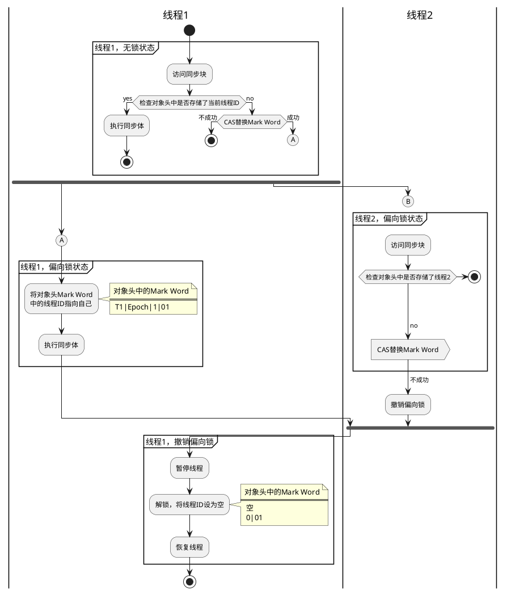
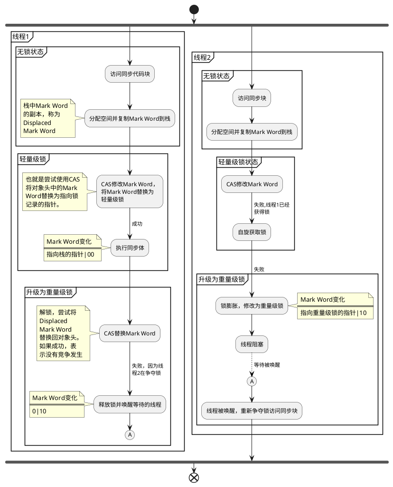

# synchronized的实现原理与应用
## 使用方法
- 修饰实例方法，锁是当前实例对象
- 修饰静态方法，锁是当前类的Class对象
- 同步方法快，锁是Synchronized括号里的对象
## 实现原理
JVM通过进入和退出Monitor对象来实现方法同步和代码块同步。代码块同步使用monitorenter和monitorexit指令实现，方法同步使用ACC_SYNCHRONIZED标识来标记一个方法被声明为同步方法，具体实现细节JVM规范中并未详细描述。（摘自《Java并发编程的艺术》）

### 代码示例
```java
public class synchronizedTest{
    public void method1() {
        synchronized(this) {
            System.out.println("synchronized code block");
        }
    }

    public synchronized void method2() {
        System.out.println("synchronized method");
    }
}
```

首先使用javac synchronizedTest.java编译成.class文件，然后使用javap -c -s -v -l查看字节码文件内容。从下面标红的内容可以看出，同步代码块和同步方法在字节码表示上的不同。
<pre>
Classfile /D:/IdeaProjects/test/synchronizedTest.class
  Last modified 2019-8-17; size 625 bytes
  MD5 checksum b6bdb3614087dd068c1fad88ec267d6e
  Compiled from "synchronizedTest.java"
public class synchronizedTest
  minor version: 0
  major version: 52
  flags: ACC_PUBLIC, ACC_SUPER
Constant pool:
   #1 = Methodref          #7.#20         // java/lang/Object."&lt;init&gt;":()V
   #2 = Fieldref           #21.#22        // java/lang/System.out:Ljava/io/PrintStream;
   #3 = String             #23            // synchronized code block
   #4 = Methodref          #24.#25        // java/io/PrintStream.println:(Ljava/lang/String;)V
   #5 = String             #26            // synchronized method
   #6 = Class              #27            // synchronizedTest
   #7 = Class              #28            // java/lang/Object
   #8 = Utf8               &lt;init&gt;
   #9 = Utf8               ()V
  #10 = Utf8               Code
  #11 = Utf8               LineNumberTable
  #12 = Utf8               method1
  #13 = Utf8               StackMapTable
  #14 = Class              #27            // synchronizedTest
  #15 = Class              #28            // java/lang/Object
  #16 = Class              #29            // java/lang/Throwable
  #17 = Utf8               method2
  #18 = Utf8               SourceFile
  #19 = Utf8               synchronizedTest.java
  #20 = NameAndType        #8:#9          // "&lt;init&gt;":()V
  #21 = Class              #30            // java/lang/System
  #22 = NameAndType        #31:#32        // out:Ljava/io/PrintStream;
  #23 = Utf8               synchronized code block
  #24 = Class              #33            // java/io/PrintStream
  #25 = NameAndType        #34:#35        // println:(Ljava/lang/String;)V
  #26 = Utf8               synchronized method
  #27 = Utf8               synchronizedTest
  #28 = Utf8               java/lang/Object
  #29 = Utf8               java/lang/Throwable
  #30 = Utf8               java/lang/System
  #31 = Utf8               out
  #32 = Utf8               Ljava/io/PrintStream;
  #33 = Utf8               java/io/PrintStream
  #34 = Utf8               println
  #35 = Utf8               (Ljava/lang/String;)V
{
  public synchronizedTest();
    descriptor: ()V
    flags: ACC_PUBLIC
    Code:
      stack=1, locals=1, args_size=1
         0: aload_0
         1: invokespecial #1                  // Method java/lang/Object."&lt;init&gt;":()V
         4: return
      LineNumberTable:
        line 1: 0

  public void method1();
    descriptor: ()V
    flags: ACC_PUBLIC
    Code:
      stack=2, locals=3, args_size=1
         0: aload_0
         1: dup
         2: astore_1
         <strong style='color:red'>3: monitorenter</strong>
         4: getstatic     #2                  // Field java/lang/System.out:Ljava/io/PrintStream;
         7: ldc           #3                  // String synchronized code block
         9: invokevirtual #4                  // Method java/io/PrintStream.println:(Ljava/lang/String;)V
        12: aload_1
        <strong style='color:red'>13: monitorexit</strong>
        14: goto          22
        17: astore_2
        18: aload_1
        19: monitorexit
        20: aload_2
        21: athrow
        22: return
      Exception table:
         from    to  target type
             4    14    17   any
            17    20    17   any
      LineNumberTable:
        line 3: 0
        line 4: 4
        line 5: 12
        line 6: 22
      StackMapTable: number_of_entries = 2
        frame_type = 255 /* full_frame */
          offset_delta = 17
          locals = [ class synchronizedTest, class java/lang/Object ]
          stack = [ class java/lang/Throwable ]
        frame_type = 250 /* chop */
          offset_delta = 4

  public synchronized void method2();
    descriptor: ()V
    flags: ACC_PUBLIC, <strong style='color:red'>ACC_SYNCHRONIZED</strong>
    Code:
      stack=2, locals=1, args_size=1
         0: getstatic     #2                  // Field java/lang/System.out:Ljava/io/PrintStream;
         3: ldc           #5                  // String synchronized method
         5: invokevirtual #4                  // Method java/io/PrintStream.println:(Ljava/lang/String;)V
         8: return
      LineNumberTable:
        line 9: 0
        line 10: 8
}
SourceFile: "synchronizedTest.java"
</pre>


### Java对象头
synchronized用的锁是存在Java对象头里的。如果是数组类型，则虚拟机用3个字长（Word）存储对象头，如果对象是非数组类型，则用2字长存储对象头。在32位虚拟机中，1字长等于4字节，即32bit，如下表所示：
|长度|内容|说明|
|---|---|---|
|32/64bit|Mark Word|存储对象的hashCode或锁信息等|
|32/64bit|Class Metadata Address|存储到对象类型数据的指针|
|32/64bit|Array length|数组的长度（如果当前对象是数组）|

Mark Word里默认存储对象的HashCode、分代年龄和锁标记位，32位JVM的Mark Word存储结构如下：
|锁状态|25bit|4bit|1bit是否是偏向锁|2bit锁标志位|
|---|---|---|---|---|
|无锁状态|对象的hashCode|对象分代年龄|0|01|

在运行期间，Mark Word里的数据会随着锁标志位的变化而变化。如下表所示：
<table width='100%' border="1">
<thead>
<tr>
<th rowspan='2'>锁状态</th><th colspan='2'>25bit</th><th rowspan='2'>4bit</th><th>1bit</th><th>2bit</th>
</tr>
<tr>
<th>23bit</th><th>2bit</th><th>是否是偏向锁</th><th>锁标志位</th>
</tr>
</thead>
<tbody>
<tr>
<td>轻量级锁</td>
<td colspan='4'>指向栈中锁记录的指针</td>
<td>00</td>
</tr>
<tr>
<td>重量级锁</td>
<td colspan='4'>指向互斥量（重量级锁）的指针</td>
<td>10</td>
</tr>
<tr>
<td>GC标记</td>
<td colspan='4'>空</td>
<td>11</td>
</tr>
<tr>
<td>偏向锁</td>
<td>线程ID</td>
<td>Epoch</td>
<td>对象分代年龄</td>
<td>1</td>
<td>01</td>
</tr>
</tbody>
</table>

在64位虚拟机下，Mark Word是64bit，其存储结构如下：

<table width='100%' border="1">
<thead>
<tr>
<th rowspan='2'>锁状态</th>
<th>25bit</th>
<th>31bit</th>
<th>1bit</th>
<th>4bit</th>
<th>1bit</th>
<th>2bit</th>
</tr>
<tr>
<th></th>
<th></th>
<th>cms_free</th>
<th>分代年龄</th>
<th>偏向锁</th>
<th>锁标志位</th>
</tr>
</thead>
<tbody>
<tr>
<td>无锁</td>
<td>unused</td>
<td>hashCode</td>
<td></td>
<td></td>
<td>0</td>
<td>01</td>
</tr>
<td>偏向锁</td>
<td colspan='2'>ThreadId(54bit)Epoch(2bit)</td>
<td></td>
<td></td>
<td>1</td>
<td>01</td>
</tr>
</tbody>
</table>


### 锁的升级与对比
从Java SE 1.6开始引入4中锁状态，从低级到高级依次是：无锁状态、偏向锁状态、轻量级锁状态、重量级锁状态。锁状态会随着竞争情况逐渐升级，但不能降级，目的是提高锁的获取和释放效率。

1. 偏向锁
大多数情况下锁不仅不存在多线程竞争，而且总是由同一个线程多次获得。JVM设置偏向锁：锁：
```text
- XX:- UseBiasedLocking= false，
```
下图为偏向锁的获取和撤销流程。偏向锁使用了一种等到竞争出现才释放锁的机制，所以当其他线程尝试竞争偏向锁时，持有偏向锁的线程才会释放锁。


2. 轻量级锁

因为自旋会消耗CPU，为了避免无用的自旋（比如获得锁的线程被阻塞住了），一旦锁升级成重量级锁，就不会再恢复到轻量级锁状态。当锁处于这个状态 下，其他线程试图获取锁时，都会被阻塞住，当持有锁的线程释放锁之后会唤醒这些线程，被唤醒的线程就会进行新一轮的夺锁之争。 
