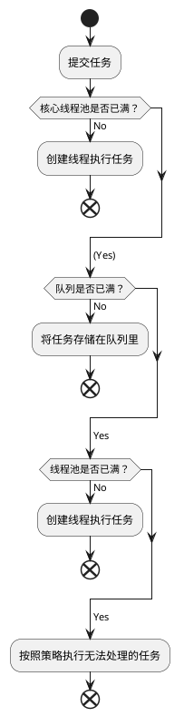

# ThreadPool线程池
线程池带来的好处：
1. 降低资源消耗
通过重复利用已经创建的线程降低线程创建、销毁的消耗。
2. 提高响应速度
任务的执行不需要等线程创建
3. 提高线程的可管理性
线程的创建会消耗系统资源，降低系统的稳定性，而且线程也不能无限制地创建。所以线程池可用来统一分配、调优和监控线程。

## 线程池的原理
线程池提交一个新任务到线程池的基本处理流程如下：


## 线程池的使用
线程池的创建建议使用ThreadPoolExecutor，不建议使用Executors。因为使用Executors创建线程池时会屏蔽一些细节，不合理的使用可能会造成资源耗尽。

> Executors创建线程的弊端：
> - FixedThreadPool和SingleThreadExecutor允许队列的长度为Integer.MAX_VALUE，可能堆积大量的请求，从而导致OOM
> - CachedThreadPool和ScheduledThreadPool允许创建的线程数为Integer.MAX_VALUE，可能会创建大量的线程，导致OOM。

### 使用ThreadPoolExecutor构造函数创建
ThreadPoolExecutor的构造函数：
```java
ThreadPoolExecutor(int corePoolSize, int maximumPoolSize, long keepAliveTime, TimeUnit unit, BlockingQueue<Runnable> wordQueue);
//Creates a new ThreadPoolExecutor with the given initial parameters and default thread factory and rejected execution handler.

ThreadPoolExecutor(int corePoolSize, int maximumPoolSize, long keepAliveTime, TimeUnit unit, BlockingQueue<Runnable> wordQueue, RejectedExecutionHandler handler);
//Creates a new ThreadPoolExecutor with the given initial parameters and default thread factory.

ThreadPoolExecutor(int corePoolSize, int maximumPoolSize, long keepAliveTime, TimeUnit unit, BlockingQueue<Runnable> wordQueue, ThreadFactory threadFactory);
//Creates a new ThreadPoolExecutor with the given initial parameters and default rejected execution handler.

ThreadPoolExecutor(int corePoolSize, int maximumPoolSize, long keepAliveTime, TimeUnit unit, BlockingQueue<Runnable> wordQueue, ThreadFactory threadFactory, RejectedExecutionHandler handler);
//Creates a new ThreadPoolExecutor with the given initial parameters.
```


