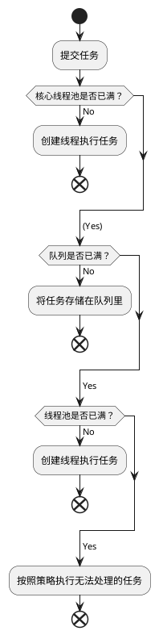

# ThreadPool线程池
线程池带来的好处：
1. 降低资源消耗
通过重复利用已经创建的线程降低线程创建、销毁的消耗。
2. 提高响应速度
任务的执行不需要等线程创建
3. 提高线程的可管理性
线程的创建会消耗系统资源，降低系统的稳定性，而且线程也不能无限制地创建。所以线程池可用来统一分配、调优和监控线程。

## 线程池的原理
线程池提交一个新任务到线程池的基本处理流程如下：


## 线程池的使用
线程池的创建建议使用ThreadPoolExecutor，不建议使用Executors。因为使用Executors创建线程池时会屏蔽一些细节，不合理的使用可能会造成资源耗尽。

> Executors创建线程的弊端：
> - FixedThreadPool和SingleThreadExecutor允许队列的长度为Integer.MAX_VALUE，可能堆积大量的请求，从而导致OOM
> - CachedThreadPool和ScheduledThreadPool允许创建的线程数为Integer.MAX_VALUE，可能会创建大量的线程，导致OOM。

### 使用ThreadPoolExecutor构造函数创建
ThreadPoolExecutor的构造函数：
```java
ThreadPoolExecutor(int corePoolSize, int maximumPoolSize, long keepAliveTime, TimeUnit unit, BlockingQueue<Runnable> wordQueue);
//Creates a new ThreadPoolExecutor with the given initial parameters and default thread factory and rejected execution handler.

ThreadPoolExecutor(int corePoolSize, int maximumPoolSize, long keepAliveTime, TimeUnit unit, BlockingQueue<Runnable> wordQueue, RejectedExecutionHandler handler);
//Creates a new ThreadPoolExecutor with the given initial parameters and default thread factory.

ThreadPoolExecutor(int corePoolSize, int maximumPoolSize, long keepAliveTime, TimeUnit unit, BlockingQueue<Runnable> wordQueue, ThreadFactory threadFactory);
//Creates a new ThreadPoolExecutor with the given initial parameters and default rejected execution handler.

ThreadPoolExecutor(int corePoolSize, int maximumPoolSize, long keepAliveTime, TimeUnit unit, BlockingQueue<Runnable> wordQueue, ThreadFactory threadFactory, RejectedExecutionHandler handler);
//Creates a new ThreadPoolExecutor with the given initial parameters.
```
#### 可以使用的阻塞队列
- ArrayBlockingQueue: FIFO有界阻塞队列
- LinkedBlockingQueue: 基于链表的FIFO阻塞队列，吞吐量通常高于ArrayBlockingQueue。静态工厂方法Executors.newFixedThreadPool使用这个队列。
- SynchronousQueue: 不存储元素的队列，每个插入操作必须等到另一个线程调用移除操作，否则插入操作一直处于阻塞状态。吞吐量通常大于LinkedBlockingQueue，静态工厂方法Executors.newCachedThreadPool使用这个队列。
- PriorityBlockingQueue, 一个具有优先级的无限阻塞队列。

> :warning:
> * 如果使用了无界的队列，那么maximumPoolSize参数无用。

#### 可使用的RejectedExecutionHandler
- AbortPolicy: 直接抛出异常，默认策略
- CallerRunsPolicy: 使用调用者所在的线程执行任务
- DiscardOldestPolicy: 丢弃队列里最近(最先加入的，也就是等待最久的)的一个任务，并执行当前任务。
- DiscardPolicy: 不处理，丢弃掉
- 自定义实现

#### keepAliveTime
该参数定义了线程池中工作线程空闲后，最大的存活时间。
> :warning:
> 当任务很多，且任务的执行时间较短，可以调大这个时间参数，提高线程利用率。

#### 向线程池中提交任务
两个方法：
1. execute()
无返回值，
2. submit()
有返回值，返回一个future类型的对象。可以通过future对象判断任务是否执行成功。

#### 关闭线程池
两个方法，原理都是遍历线程池中的工作线程，然后逐个调用线程的interrupt方法来中断线程。所以无法响应中断的任务可能永远无法停止。
1. shutdown
首先将线程池的状态设置成SHUTDOWN状态，然后中断所有**没有正在执行任务的线程**。

2. shutdownNow
首先将线程池的状态设置成STOP，然后尝试停止所有**正在执行或暂停任务的线程**，并返回等待执行的任务列表。

> :warning:
> 1. 调用上面任意一个方法，然后调用isShutdown总是返回true。
> 2. 当所有任务都关闭后，才表示线程池关闭成功，这时调用isTerminated方法才会返回true。
> 3. 通常调用shutDown关闭线程池。如果任务不一定要执行完，使用shutDownNow。
